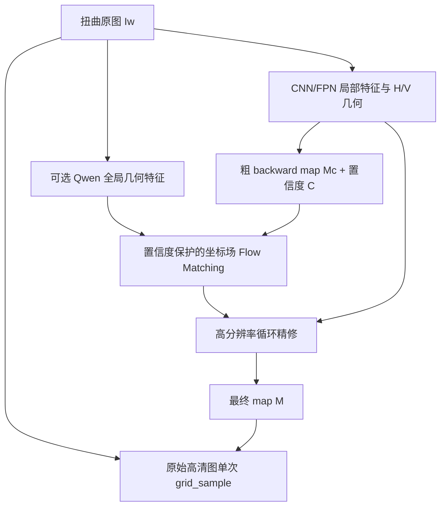

# Diffusion 2 RAFT 文档矫正项目：计划与目标

> 版本：2026-07-30  
> 当前状态：GT backward map 的 oracle warp 已验证通过；问题已从“数据与重采样是否正确”收敛为“如何从单张扭曲图像高精度预测 backward map”。

## 1. 结论先行

后续主线不应继续采用：

```text
Qwen-Image-Edit 生成矫正 RGB
→ FlowHead 从生成图估计光流
→ 再矫正原图
```

建议改为：

```text
扭曲图像
→ 确定性网络预测粗 backward map 与置信度
→ 在二维坐标场中进行置信度保护的连续流匹配
→ WAFT/RAFT 式高分辨率循环精修
→ 输出最终 backward map
→ 从原始高清扭曲图单次采样
```

其中，Qwen 只作为可选的全局几何条件编码器，不再生成最终 RGB，也不经过 VAE Decoder 改写文字。项目的核心创新应凝练为：

> **置信度保护的连续 backward-map 传输：从可靠的粗坐标场出发，只在不确定区域引入生成式建模，再用结构感知的高分辨率循环更新恢复文字与线条附近的局部精度。**

### 1.1 术语约定：“Qwen/diffusion 直接输出”

本文若使用“Qwen/diffusion 直接输出光流并得到最终矫正图”这一简称，严格指生成式坐标分支
直接预测二维 `backward_map`，或预测经 ODE 积分得到该 map 的二维 velocity；“光流”不是一张
由 Qwen VAE Decoder 生成的 RGB 图。最终矫正 RGB 始终由 final backward map 对原始高清扭曲图
执行一次 `grid_sample` 得到。Qwen-Image-Edit 在阶段 4 只是候选的全局几何条件特征源，VAE
Decoder 不参与最终 RGB 输出；如果 Qwen 条件不能通过既定增益门槛，则应从最终模型中删除。

## 2. 当前基线与问题定位

当前验证结果如下：

| 配置 | EPE | EPE P95 | 行 EPE | 直线度误差 | Fold rate | 相对 prior 增益 | Final win rate |
|---|---:|---:|---:|---:|---:|---:|---:|
| Prior | 5.7501 | 未记录，阶段 0 补测 | 未记录，阶段 0 补测 | 未记录，阶段 0 补测 | 未记录，阶段 0 补测 | 0 | 基准 |
| v3.1 Qwen on | 6.6009 | 12.8329 | 6.5550 | 0.1156 | 0.00446 | -0.8509 | 0.3879 |
| v3.1 Qwen off | 7.2050 | 13.9506 | 7.1786 | 0.1265 | 未记录，阶段 0 补测 | 低于 prior | 未记录，阶段 0 补测 |

上述数值的旧 manifest 尚未完成 `label_provenance` 审计，目前只作 historical reference；只有在
verified analytic/renderer GT 集上重算的指标才能用于 Gate 1/3。

这说明：

1. GT map 与 `grid_sample` 链路正确，最终像素来自原图的范式成立。
2. 当前 v3.1 的最终预测反而破坏了 prior 中已经正确的区域。
3. `final_win_rate < 0.5` 表明残差分支并未形成稳定修正能力。
4. 低分辨率 flow、无差别修改整幅坐标场、训练与全页推理的尺度不一致，是文字水波纹和局部拉伸的主要来源。
5. 下一步应先建立一个足够强的确定性上限，再判断 diffusion 和 Qwen 是否真的带来增益。

## 3. 研究问题与目标

### 3.1 核心研究问题

给定一张扭曲文档图像 \(I_w\)，在不存在第二张可观测矫正图的推理条件下，如何预测：

\[
M(u,v)=(x_w,y_w),
\]

使矩形输出位置 \((u,v)\) 能从扭曲原图位置 \((x_w,y_w)\) 采样：

\[
\hat I_r(u,v)
=
\operatorname{grid\_sample}\bigl(I_w,M(u,v)\bigr),
\]

并同时满足：

- 全局页面形状正确；
- 文字行、表格线和页面边缘保持平直；
- 坐标场局部平滑且无折叠；
- 不改写、不生成原图文字；
- 在高分辨率整页推理时仍保持稳定。

### 3.2 最终验收目标

以下目标以当前 prior EPE \(5.7501\) 为基准：

| 指标 | 最低验收目标 | 理想目标 |
|---|---:|---:|
| Final EPE | \(\le 5.18\)，即相对 prior 至少下降 10% | \(<4.50\) |
| EPE P95 | 相对最终确定性基线下降至少 10% | 下降至少 15% |
| Final win rate | \(\ge 0.65\) | \(\ge 0.75\) |
| 直线度误差 | \(\le 0.10\) | \(\le 0.08\) |
| Fold rate | 不高于 0.0045，且不高于确定性基线 | \(<0.002\) |
| 高置信区域破坏率 | \(<5\%\) | \(<2\%\) |
| OCR CER | 不高于 oracle CER 加 1 个百分点 | 尽量接近 oracle |
| 推理步数 | 4-6 次坐标传输 + 4-6 次局部更新 | 在不降精度时进一步减少 |

“高置信区域破坏率”定义为：粗 map 误差已经小于 1 px，但最终 map 误差增加超过 1 px 的像素比例。该指标应成为本项目区别于普通 EPE 的关键评价之一。

## 4. 统一的数据与坐标约定

### 4.1 样本格式

每个样本至少包含：

```text
warped_image
rectified_image
backward_map
valid_mask
input_size
output_size
sample_id
document_id
warp_severity
label_provenance
```

其中：

- `backward_map[v, u] = (x_w, y_w)`；
- 主标注建议保存为输入图像像素坐标下的 `float32` 绝对坐标；
- EPE 在像素坐标中计算；
- 进入 `grid_sample` 前再转换到 \([-1,1]\)；
- 全项目固定 `align_corners=False`；
- 位移形式仅作为网络内部变量：

\[
F=M-P,
\]

其中 \(P\) 是矩形输出网格。

旧数据中的 map 可能来自 corrected↔warped 图像对的 RAFT pseudo label，而不是解析/renderer GT。
Stage 0 必须审计 map 的生成方向、坐标约定和 source/checkpoint identity；manifest 的
`label_provenance` 至少区分 `analytic_gt`、`renderer_gt`、`raft_pseudo` 与 `unknown`。只有来源和
方向均验证通过的 analytic/renderer GT 才能作为 \(M^*\) 计算 Gate 1/3；pseudo 必须单独配置和
报告，未确认的 pseudo/unknown map 不得解锁任何 gate。

### 4.2 必须建立的自动测试

虽然 oracle 已经人工验证通过，仍应将其固定为回归测试：

1. GT map warp 后与 rectified image 的差异必须低于固定阈值；
2. resize、crop、padding、flip 后，图像与 map 必须保持同一坐标变换；
3. 网络输入尺寸变化后，map 的 \(x/y\) 分量必须按对应方向缩放；
4. `grid[..., 0]` 始终为 \(x\)，`grid[..., 1]` 始终为 \(y\)；
5. 训练、验证和推理使用完全相同的 map 定义与 `align_corners` 设置。
6. analytic/renderer GT、RAFT pseudo 与 unknown label 必须按 `label_provenance` fail-closed 分离。

### 4.3 数据划分

训练、验证和测试必须按 `document_id` 或原始文档来源划分，不能让同一文档的不同形变版本跨集合。测试集至少按以下维度报告：

- 轻度、中度、重度形变；
- 小字、普通字号；
- 中文、英文、数字和表格；
- 页面边缘、中心区域；
- 阴影、模糊、低对比度；
- 常规分辨率与超高分辨率；
- 合成数据与真实域外数据。

## 5. 推荐模型结构



### 5.1 确定性粗 map 网络

建议先实现一个不含 Qwen、不含 diffusion 的强基线：

- 多尺度 CNN/ConvNeXt/Swin 编码器；
- FPN 输出 \(1/4、1/8、1/16\) 特征；
- \(1/8\) 分辨率预测全局粗 map；
- 同时预测每像素置信度或 log-variance；
- 通过 convex upsampling 或学习式上采样恢复高分辨率。

这一阶段的目的不是最终创新，而是确定数据能够支持的确定性性能上限。

### 5.2 置信度保护的连续坐标传输

优先采用“从粗 map 到 GT map 的条件传输”，而不是从纯高斯噪声重新生成整幅 flow。训练时定义：

\[
X_0
=
M_c+\sigma_{\max}(1-C)\odot\epsilon,
\qquad
\epsilon\sim\mathcal N(0,I),
\]

\[
X_t=(1-t)X_0+tM^*,
\]

\[
v^*=M^*-X_0.
\]

模型学习：

\[
v_\theta
\left(
X_t,t
\mid
I_w,M_c,C,P,F_{\text{local}},F_{\text{global}},F_{\text{HV}}
\right)
\approx v^*.
\]

其含义是：

- 高置信区域几乎从 \(M_c\) 出发，不重新加大噪声；
- 低置信区域保留更大的搜索空间；
- diffusion/flow matching 负责难区域，而不是重做整幅 map；
- 推理时从 \(X_0\) 出发，用 4-6 步 ODE/Euler 更新得到最终坐标场。

同时加入随时间衰减的 soft anchor，使早期更新稳定、后期允许细化，但不对高置信区域做绝对硬锁定。

### 5.3 高分辨率循环精修

由于推理时只有一张扭曲图，不能直接照搬标准 RAFT 的双帧 all-pairs correlation。建议采用 WAFT 启发的单图循环更新：

1. 用当前 map \(M_k\) 将原图高分辨率特征 warp 到矩形坐标域；
2. 将当前预览特征、H/V 几何特征、Jacobian、置信度和 \(M_k\) 输入共享权重的 ConvGRU；
3. 每次仅预测小残差 \(\Delta M_k\)；
4. 更新：

\[
M_{k+1}=M_k+\Delta M_k;
\]

5. 对全部中间结果施加 sequence loss。

局部更新器建议在 \(1/4\) 分辨率起步，确认收益后再评估 \(1/2\) 分辨率。单步残差幅度应受限，以避免重新产生水波纹。

阶段编号是研发顺序，不是最终拓扑：Stage 2 先在 Stage 1 predicted \(M_c\) 后预训练该 refiner；
Stage 3 再把 coordinate flow matching 插入两者之间。最终拓扑始终为
`Stage 1 coarse → Stage 3 coordinate FM → Stage 2 refiner module`。

### 5.4 Qwen 的正确位置

Qwen 不应再输出矫正 RGB。正确做法是：

- 冻结 Qwen 的图像理解/条件编码部分；
- 提取若干中间层全局特征；
- 使用 DPT/FPN 将其融合到 \(1/8\) 特征；
- 与不经过 VAE 的 CNN 局部特征拼接或门控融合；
- 将融合特征输入坐标 velocity 网络；
- 最终输出层为二维 velocity/map，而不是 RGB latent；
- 原始 VAE Decoder 不参与最终图像生成。

DA-Flow 可借鉴的是“扩散全局特征 + CNN 局部特征 + 循环更新”，不能照搬其跨帧 Q/K 相关体。当前 Qwen-Image-Edit 可先作为冻结特征源；只有在主结构已经有效后，才值得比较更新的 [Qwen-Image-2.0](https://arxiv.org/abs/2605.10730) 特征。不要在基线尚未成立时迁移整个 20B 级模型。

## 6. 损失函数

建议总损失为：

\[
\begin{aligned}
\mathcal L={}&
\lambda_v\mathcal L_{\text{velocity}}
+\lambda_m\mathcal L_{\text{map}}
+\lambda_s\mathcal L_{\text{sequence}}\\
&+\lambda_w\mathcal L_{\text{warp}}
+\lambda_g\mathcal L_{\text{gradient}}
+\lambda_l\mathcal L_{\text{HV}}\\
&+\lambda_b\mathcal L_{\text{bend}}
+\lambda_j\mathcal L_{\text{Jacobian}}
+\lambda_c\mathcal L_{\text{confidence}}
+\lambda_p\mathcal L_{\text{preserve}}.
\end{aligned}
\]

各项作用：

- `velocity loss`：监督连续坐标传输的速度场；
- `map loss`：Charbonnier、SmoothL1 或 mixed-Laplace map 误差；
- `sequence loss`：监督全部循环更新结果；
- `warp loss`：矫正结果与 GT rectified image 的低权重 L1/SSIM；
- `gradient loss`：约束字符边缘和细线；
- `HV loss`：文字行、表格横线与竖边结构；
- `bend loss`：惩罚 map 二阶高频变化，直接抑制水波纹；
- `Jacobian loss`：惩罚折叠、方向翻转和异常缩放；
- `confidence loss`：监督粗 map 的可靠性；
- `preserve loss`：在高置信区域约束最终 map 不无故偏离粗 map。

训练初期应以 `map/sequence/velocity` 为主，RGB warp loss 只作辅助。若扭曲图与 GT 矫正图存在光照或阴影差异，不能让较大的 RGB loss 驱动模型通过错误位移追逐颜色差异。

## 7. 分阶段执行计划

| 阶段 | 建议时长 | 主要工作 | 阶段交付物 | 进入下一阶段的门槛 |
|---|---:|---|---|---|
| 0. 评估、provenance 与坐标固化 | 2-3 天 | 固定 evaluator、审计 label 来源、同步变换和 oracle 回归测试 | 带 `label_provenance` 的数据接口、基线报告 | 坐标测试通过，GT/pseudo 分离，Gate 1/3 verified-GT 集冻结 |
| 1. 确定性粗 map | 1-2 周 | 训练 CNN/FPN 粗 map 与 uncertainty | `det_coarse` checkpoint | EPE 不高于 5.75，fold 不恶化 |
| 2. 循环精修预训练 | 1-2 周 | 在 predicted coarse 后预训练 4-6 次 ConvGRU/WAFT 式更新 | `det_refine` checkpoint | 相对粗 map EPE 至少下降 0.3 px，win rate ≥ 0.60 |
| 3. 置信度坐标传输 | 1-2 周 | 在 coarse/refiner 之间插入 4-6 步 flow matching | `coord_fm` checkpoint | 完整 coarse→FM→refiner 相对确定性精修 EPE 再下降 ≥5% 或 ≥0.2 px |
| 4. Qwen 条件融合 | 1 周 | 冻结 Qwen，DPT/FPN 融合全局特征 | `qwen_cond` checkpoint | 全局至少改善 2%，重形变子集至少改善 5% |
| 5. H/V 与全页联合微调 | 1-2 周 | 加入水平/垂直结构监督和全页高分辨率训练 | 完整模型 | 达到最终验收目标 |
| 6. 消融与论文结果 | 1 周 | 多 seed、分子集、效率与失败案例分析 | 主表、消融表、可视化 | 结论可重复且模块贡献清晰 |

总周期约 7-10 周，前提是现有数据加载、训练与评估代码可以复用。

## 8. 各阶段具体任务

### 阶段 0：评估与工程地基

- 冻结现有 v3.1 checkpoint 和当前 JSON，禁止覆盖；
- 审计现有 map 是否为解析/renderer GT 或 corrected↔warped RAFT pseudo label；
- 为 manifest 增加 `label_provenance`，并按来源、方向和 source identity 隔离 GT/pseudo/unknown；
- Gate 1/3 只使用冻结的 verified analytic/renderer GT 集，pseudo 指标单独报告；
- 补齐 prior 的 P95、line、edge、fold、CER 和分子集指标；
- 将 oracle 验证写成自动测试；
- 为每次实验固定输出：
  - `config.yaml`
  - `metrics.json`
  - `per_sample.csv`
  - `flow_visualization`
  - `warped / prior / final / GT / oracle` 对比图；
- 统一三组随机种子，并固定验证集。

### 阶段 1：确定性粗 map

- 不加载 Qwen；
- 不加入 diffusion；
- 直接监督 \(M_c\) 或 \(F_c=M_c-P\)；
- 同时预测 uncertainty；
- 优先解决全局页面形状和边界；
- 分别报告全图 EPE、边缘 EPE、文字行 EPE 和不同形变强度。

若该阶段仍无法达到 prior 的 5.75 EPE，应停止增加新模块，先检查模型容量、全页上下文、数据划分和 resize/crop 坐标同步。

### 阶段 2：确定性高分辨率精修

该阶段用于预训练最终会复用的 refiner，并不表示它在最终拓扑中位于 flow matching 之前。

- 以 Stage 1 真实预测的 \(M_c\) 初始化；
- 先使用 4 次共享权重更新，再尝试 6 次；
- 每一步都计算 sequence loss；
- 限制局部残差幅度；
- 加入 bend、Jacobian 和 HV 约束；
- 比较 \(1/8\)、\(1/4\) 和可选 \(1/2\) 更新分辨率。

若精修只降低训练 EPE、验证集不改善，优先检查训练 crop 与整页推理不一致，而不是继续增加 GRU 深度。

### 阶段 3：置信度保护的 Flow Matching

- 从 Stage 1 checkpoint 离线缓存或在线生成 predicted \(M_c\)，\(X_0\) 始终由该 \(M_c\) 构造；
- 不允许用 GT coarse map、Stage 2 refined map 或 pseudo map 替代 \(X_0\)；
- 把 flow matching 插入 Stage 1 coarse 与 Stage 2 refiner 之间；
- 初期冻结并复用 Stage 2 refiner，先训练 velocity 网络；稳定后再小学习率联合微调 FM 与 refiner；
- 只用 verified analytic/renderer GT 作为 \(M^*\) 解锁 gate，pseudo-label 训练/结果必须分开；
- 再联合训练 map 与结构损失；
- 训练时均匀采样 \(t\)，推理时固定 4-6 步；
- 对高置信区域降低噪声并增加 preserve loss；
- 比较：
  - 纯噪声生成整幅 map；
  - residual diffusion；
  - 置信度保护的坐标传输。

如果该阶段无法稳定优于阶段 2，就不应进入 Qwen 微调。应先检查置信度校准、残差分布、采样随机性和高置信区域破坏率。

### 阶段 4：Qwen/扩散特征融合

- 首先冻结全部 Qwen 参数；
- 只训练 DPT、adapter、门控融合和坐标输出模块；
- 分别测试：
  - CNN only；
  - Qwen only；
  - CNN + Qwen concat；
  - CNN + Qwen gated fusion；
- 只在冻结特征确有增益后，再使用 LoRA 解冻少量中高层；
- 不恢复 RGB VAE Decoder。

Qwen 必须主要改善大形变、折痕、阴影和全局布局子集；如果只增加计算量而不改善 hard subset，应从最终模型中删除。

### 阶段 5：结构约束与全页训练

- 自动生成文字行、表格线和页面边界伪标注；
- 加入 D2Dewarp 式水平/垂直几何分支；
- 采用“低分辨率全页 + 高分辨率局部块”的双尺度训练；
- 最后进行真实全页微调；
- 最终高清原图只执行一次 `grid_sample`，避免重复插值。

## 9. 必须完成的消融实验

| 编号 | 对照实验 | 要回答的问题 |
|---|---|---|
| A1 | 粗 map vs 粗 map + 循环精修 | RAFT/WAFT 式更新是否真正改善局部精度 |
| A2 | 全图加噪 vs 低置信区域加噪 | 置信度保护是否减少 prior 被改坏 |
| A3 | 无 guidance vs 固定 guidance vs 时间衰减 guidance | 哪种 prior 约束最稳定 |
| A4 | 直接回归 vs residual diffusion vs continuous coordinate FM | 生成式建模是否必要 |
| A5 | CNN only vs Qwen only vs CNN + Qwen | 全局生成特征是否具有互补价值 |
| A6 | 无 H/V vs 水平约束 vs 水平+垂直约束 | 双方向几何是否改善文字和表格 |
| A7 | \(1/8\) vs \(1/4\) vs \(1/2\) 精修 | 水波纹是否来自过低 map 分辨率 |
| A8 | 1、3、4、6、10 个传输步 | 精度、稳定性和速度的最佳平衡 |
| A9 | crop 训练 vs 双尺度训练 vs 全页微调 | 训练—推理尺寸差是否被解决 |
| A10 | 无 preserve loss vs preserve loss | 高置信区域破坏率是否下降 |

所有关键结果至少报告 3 个随机种子的均值与标准差。

## 10. Go / No-Go 决策规则

### Gate 1：确定性模型

Gate 1 只在冻结的 verified analytic/renderer GT 集上计算；未确认的 RAFT pseudo/unknown map
不得作为 \(M^*\)。如果确定性粗 map 无法达到 EPE \(\le 5.75\)，不进入 diffusion 阶段。此时
优先修正数据变换、模型分辨率和全局上下文。

### Gate 2：循环精修

只有在循环精修同时改善 EPE、P95 和直线度，且 fold 不上升时，才将其作为最终结构。仅改善平均 EPE但加剧水波纹，不算通过。

### Gate 3：Flow Matching

Gate 3 同样只接受 verified analytic/renderer GT 的 \(M^*\)，pseudo-label 指标不能替代 gate 证据。
只有当完整 `coarse → coordinate FM → high-resolution refiner` 相对确定性模型：

- EPE 至少降低 5% 或 0.2 px；
- final win rate 至少达到 0.60；
- 高置信区域破坏率低于 5%；
- 三个随机种子方差可接受；

才能证明 diffusion 对任务有实质贡献。

### Gate 4：Qwen

Qwen 条件只有在 hard subset 至少改善 5%，同时全局指标不下降时才保留。否则最终模型应使用更轻量的视觉 Transformer 或纯 CNN 全局分支。

## 11. 风险与应对

| 风险 | 表现 | 应对 |
|---|---|---|
| 坐标变换不一致 | crop 训练好、全页推理差 | 所有增广统一走同一 map transform，并做回归测试 |
| prior 被 diffusion 改坏 | `epe_gain < 0`、win rate < 0.5 | 低置信区域加噪、preserve loss、时间衰减 guidance |
| 文字出现水波纹 | line error、bend error 高 | \(1/4\) 高分辨率更新、二阶平滑、限制单步残差 |
| Qwen 语义强但定位弱 | 全局形状改善、字符附近 EPE 上升 | CNN 高频分支、门控融合、Qwen 只作条件 |
| RGB loss 误导几何 | 阴影区域产生错误位移 | 降低 RGB loss，强化 flow、gradient 和结构损失 |
| diffusion 采样不稳定 | 不同噪声种子结果差异大 | masked noise、固定推理种子、缩短为 4-6 步 |
| 多模块同时训练不稳定 | loss 波动、模块互相追逐 | 严格分阶段训练，再小学习率联合微调 |

## 12. 近期方法的借鉴边界

| 方法 | 应借鉴 | 不应照搬 |
|---|---|---|
| [DvD](https://arxiv.org/abs/2505.21975) | coordinate-level diffusion 与 backward mapping 范式 | 低分辨率 map 直接上采样不足以保证小字局部精度 |
| [FlowDiffuser](https://openaccess.thecvf.com/content/CVPR2024/papers/Luo_FlowDiffuser_Advancing_Optical_Flow_Estimation_with_Diffusion_Models_CVPR_2024_paper.pdf) | 将两通道 flow 作为生成对象、少步去噪 | 从纯噪声重建整幅 flow 的负担过大 |
| [FlowPainter](https://arxiv.org/abs/2607.10140) | 粗 flow、置信度、soft inpainting、时间衰减 guidance、6 步采样 | 其双帧运动置信度定义需改为单图 map 误差与结构不确定性 |
| [Optical Flow Matching](https://openaccess.thecvf.com/content/CVPR2026/html/Luo_Optical_Flow_Matching_Reframing_Optical_Flow_as_Continuous_Transport_Dynamics_CVPR_2026_paper.html) | 在坐标域学习连续 velocity、用 ODE 积分得到 flow | 原论文针对双帧运动，公开代码仍不完整，需改成 canonical grid 到 warped source 的传输 |
| [DA-Flow](https://arxiv.org/abs/2603.23499) | 多层 diffusion 特征经 DPT 上采样，与 CNN 局部特征融合，再循环更新 | 它最终由 RAFT 输出 flow；跨帧 Q/K cost volume 不适用于单图矫正 |
| [WAFT](https://arxiv.org/abs/2506.21526) | 高分辨率 feature warping 与共享权重循环更新 | 仍需改造成单图、当前 backward map 条件下的结构精修 |
| [D2Dewarp](https://openaccess.thecvf.com/content/CVPR2026/html/Li_D2Dewarp_Dual_Dimensions_Geometric_Representation_Learning_Based_Document_Image_Dewarping_CVPR_2026_paper.html) | 水平与垂直双方向几何监督 | 不应只依赖线条分支代替 dense map 监督 |

其中，截至 2026 年 7 月，与当前失败模式最直接相关的新工作是 FlowPainter：它明确指出从纯噪声生成整幅 dense flow 会增加训练负担和不稳定性，并采用“可靠区域保留、困难区域生成”的路线。这应成为 v3.1 后续重构的首要原则。

## 13. 现在立即执行的任务清单

1. 冻结 v3.1 代码、checkpoint、配置和完整评估 JSON。
2. 审计 corrected↔warped RAFT pseudo labels，为 manifest 增加 `label_provenance`，冻结 verified-GT gate set。
3. 仅在 verified analytic/renderer GT 上补齐 prior 指标并建立分子集评估；pseudo 单独报告。
4. 将 oracle、resize、crop、padding 和 `align_corners=False` 写成自动测试。
5. 实现不含 Qwen/diffusion 的确定性粗 map 网络。
6. 在 Stage 1 predicted \(M_c\) 后预训练 4 次 \(1/4\) 分辨率循环 refiner。
7. 训练并校准 uncertainty/confidence，新增“高置信区域破坏率”。
8. 只有阶段 2 通过后，才在 coarse/refiner 之间插入 continuous coordinate flow matching；
   \(X_0\) 始终来自 Stage 1 predicted \(M_c\)，先冻结 refiner 训练 FM，再联合微调。
9. 只有完整 coarse→FM→refiner 稳定优于确定性模型后，才接入冻结 Qwen 特征。
10. 最后加入 H/V 结构分支和全页高分辨率联合微调。
11. 按消融矩阵完成论文主表、失败案例和可视化。

### 13.1 2026-07-30 工程实现状态

`cp_docflow_v1` 已把第 5-10 项所需模块实现为同一张可运行计算图：CNN/FPN coarse、confidence-
protected coordinate FM、4/6-step Euler、1/4 shared ConvGRU refiner、H/V/Jacobian condition、冻结
Qwen hidden/QK token 抽取、DPT/FPN adapter、gated fusion、完整 loss/checkpoint/evaluation 与 native
single-sample inference。正式训练入口仍按本节顺序由 Gate receipt fail closed；工程存在不等于
verified-GT Gate 已通过。当前 CPU 环境没有安装可加载 20B 权重的 `diffusers`，因此只完成真实
Qwen hook 路径的模拟回归和完整 `lite` smoke；实际权重运行必须在 Qwen 训练环境中完成。

## 14. 最终项目定位

最终模型建议暂命名为：

> **CP-DocFlow：Confidence-Protected Continuous Coordinate Flow for Document Rectification**

论文或项目表述可凝练为：

> 本项目将单图文档矫正重新定义为从 canonical grid 到 warped source coordinates 的连续传输问题。模型以确定性粗 backward map 为可靠锚点，仅在低置信区域引入 flow-matching 生成能力，再通过高分辨率结构感知循环更新获得像素级局部精度。最终图像完全由原始高清输入采样，避免生成模型改写文档文字。

这一定位比“Qwen 后面增加一个 FlowHead”更统一，也能清晰解释 diffusion、RAFT/WAFT 式更新与文档几何约束分别解决什么问题。
