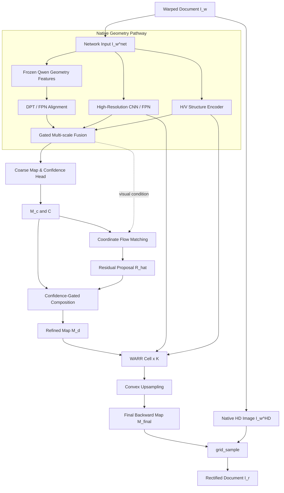

# DocGrid-Flow：Diffusion 2 RAFT 文档矫正项目技术计划与目标

> 版本：2.0
>
> 日期：2026-07-29
>
> 项目类型：单张图像文档矫正 / 二维 backward map 预测
>
> 当前主线：确定性粗坐标场 + 置信度保护的残差坐标 Flow Matching + WARR 循环精修
>
> 当前状态：GT backward map 的 oracle warp 已验证；下一阶段重点是提高从单张扭曲图像预测 backward map 的精度与稳定性。

---

## 摘要

本项目的目标是将一张扭曲文档图像矫正为规则矩形，同时严格保留原图中的文字、表格线和细粒度纹理。现有 Qwen-Image-Edit 图像编辑路线虽然能够理解全局页面形变，但其最终结果由生成模型和 VAE Decoder 重建，容易改写或模糊小字；旧版“Qwen 生成矫正 RGB，再由 FlowHead 反推光流”的路线还会把生成误差传入光流预测，导致水波纹、局部拉伸和 EPE 恶化。

DocGrid-Flow 不再生成矫正 RGB，而是把任务重新定义为：

> 从规则矩形输出网格到扭曲原图坐标的二维连续传输问题。

模型只预测二维 backward map：

\[
M_{\mathrm{final}}\in\mathbb{R}^{H_r\times W_r\times 2},
\]

最终图像由该 map 对原始高清扭曲图像执行一次 `grid_sample` 得到：

\[
\hat I_r
=
\operatorname{grid\_sample}
\left(I_w^{HD},M_{\mathrm{final}}\right).
\]

完整模型由五个核心部分构成：

1. 冻结的 Qwen 全局几何编码路径；
2. 高分辨率 CNN/FPN 局部特征路径；
3. H/V 文档结构编码路径；
4. 确定性粗 backward map 与 confidence 预测；
5. 置信度保护的残差坐标 Flow Matching 和 WARR 循环精修。

其中：

- Qwen 只提供全局布局和长程形变特征；
- CNN/FPN 保留文字笔画、页面边缘和表格线的局部定位；
- H/V Encoder 提供水平文字行、垂直边界和表格结构；
- Flow Matching 只生成粗模型尚未解决的坐标残差；
- WARR 在高分辨率特征上进行共享权重的局部循环修正；
- VAE Decoder 不参与最终输出；
- 原始高清图像在所有学习模块之外旁路到最终采样器；
- 训练虽然分阶段进行，但最终推理是一套统一模型的一次前向过程。

---

# 1. 项目背景与当前问题

## 1.1 任务背景

给定一张存在弯曲、透视、折痕或非刚性形变的文档图像 \(I_w\)，模型需要恢复一个规则矩形文档 \(I_r\)。对每一个矫正后输出像素 \((u,v)\)，模型预测它应从扭曲原图中的哪个位置 \((x_w,y_w)\) 取值：

\[
M(u,v)=(x_w,y_w).
\]

因此，\(M\) 是一个 backward map，而不是传统视频场景中“第一帧到第二帧”的前向运动光流。

这种定义有三个直接优势：

1. 最终像素全部取自原始扭曲图，不会由生成模型重写；
2. 可以直接用 GT backward map 进行像素级监督；
3. 坐标场的平滑、折叠、边缘和直线结构都可以被显式约束。

## 1.2 旧路线的问题

旧路线可概括为：

```text
Warped Image
→ Qwen-Image-Edit
→ Generated Rectified RGB
→ FlowHead
→ Predicted Flow
→ Warp Original Image
```

该路线存在以下结构性问题：

- Qwen 生成的 RGB 已经含有文字重写和 VAE 信息损失；
- FlowHead 学到的是“生成图与目标图之间的误差”，而不是纯几何形变；
- 低分辨率 flow 直接上采样容易把误差表现为周期性水波纹；
- 残差分支会无差别修改 prior 已经正确的区域；
- 训练 crop 与整页推理的尺度差异会放大坐标误差；
- 多个模块同时学习同一个最终 map，容易互相追逐和震荡。

## 1.3 当前基线

当前已记录的验证指标如下：

| 配置 | EPE | EPE P95 | Line EPE | Straightness Error | Fold Rate | 相对 Prior 增益 | Final Win Rate |
|---|---:|---:|---:|---:|---:|---:|---:|
| Stage-A Prior | 5.7501 | 待补测 | 待补测 | 待补测 | 待补测 | 0 | 基准 |
| v3.1 Qwen on | 6.6009 | 12.8329 | 6.5550 | 0.1156 | 0.00446 | -0.8509 | 0.3879 |
| v3.1 Qwen off | 7.2050 | 13.9506 | 7.1786 | 0.1265 | 待补测 | 低于 Prior | 待补测 |

这些结果说明：

1. GT map、坐标转换和 `grid_sample` 的基本范式成立；
2. 当前最终模型没有稳定修正 prior，反而改坏了大量已正确区域；
3. `final_win_rate=0.3879<0.5`，说明残差模型缺乏可靠的选择性更新能力；
4. Qwen 特征本身可能提供了一定信息，但当前融合与输出方式不正确；
5. 下一步必须先建立强确定性模型，再验证生成式坐标建模是否带来真实增益。

---

# 2. 研究问题、总体目标与边界

## 2.1 核心研究问题

本项目需要回答：

> 在推理阶段只有一张扭曲图像、没有第二帧、没有矫正参考图的条件下，如何同时利用生成模型的全局几何理解、确定性网络的局部定位能力和 RAFT 式循环优化能力，预测高精度、平滑且无折叠的 backward map？

该问题可以分解为四个子问题：

1. 如何让 Qwen 参与几何理解，但不让它生成或改写 RGB？
2. 如何让生成式模型只处理确定性模型不确定的区域？
3. 如何在没有第二帧相关体的情况下使用 RAFT 式循环精修？
4. 如何在全页高分辨率推理中保留小字、线条和页面边缘的局部精度？

## 2.2 总体研究目标

构建一个统一的单图文档矫正模型：

```text
Warped Document
→ Multi-branch Geometry Encoding
→ Coarse Backward Map + Confidence
→ Confidence-Protected Coordinate Flow Matching
→ WARR Recurrent Refinement
→ Final Backward Map
→ Single grid_sample on Native HD Image
→ Rectified Document
```

模型的核心输出必须是二维 backward map，不是生成的 RGB 图像。

## 2.3 定量目标

以下目标以当前 prior EPE \(5.7501\) 为参考。

| 指标 | 最低验收目标 | 理想目标 |
|---|---:|---:|
| Final EPE | \(\le 5.18\)，相对 prior 至少下降 10% | \(<4.50\) |
| EPE P95 | 相对最终确定性模型下降至少 10% | 下降至少 15% |
| Final Win Rate | \(\ge 0.65\) | \(\ge 0.75\) |
| Line EPE | 相对确定性模型下降至少 8% | 下降至少 15% |
| Straightness Error | \(\le 0.10\) | \(\le 0.08\) |
| Edge EPE | 不高于全图 EPE 的 1.15 倍 | 尽量接近全图 EPE |
| Fold Rate | 不高于确定性模型且 \(\le 0.0045\) | \(<0.002\) |
| 高置信区域破坏率 | \(<5\%\) | \(<2\%\) |
| OCR CER | 不高于 oracle CER 加 1 个百分点 | 尽量接近 oracle |
| 坐标 ODE 步数 | 4-6 步 | 在不降精度时减少到 2-4 步 |
| WARR 更新次数 | 4 次 | 在不降精度时减少到 2-3 次 |

高置信区域破坏率定义为：

\[
\operatorname{DamageRate}
=
\frac{
\#\{p:E_c(p)<1\text{ px},\ E_f(p)-E_c(p)>1\text{ px}\}
}{
\#\{p:E_c(p)<1\text{ px}\}
}.
\]

其中 \(E_c\) 和 \(E_f\) 分别表示粗 map 与最终 map 的像素误差。

## 2.4 非目标与禁止项

本项目不采用以下设计：

- 不让 Qwen 输出最终矫正 RGB；
- 不使用 Qwen VAE Decoder 生成最终图像；
- 不把矫正图像或 GT map 作为推理输入；
- 不构造第二张参考图；
- 不照搬标准 RAFT 的双帧 all-pairs correlation volume；
- 不从纯高斯噪声重新生成整幅 backward map；
- 不让低分辨率 residual flow 直接跳过精修进入最终上采样；
- 不对原始高清图像进行多次 warp；
- 不默认把确定性模型输出当作教师标签。

---

# 3. 总体设计原则

## 3.1 以 backward map 为唯一主状态

整个模型只维护一条清晰的坐标状态演化链：

\[
M_c
\rightarrow
M_d
\rightarrow
M_1
\rightarrow\cdots\rightarrow
M_K
\rightarrow
M_{\mathrm{final}}.
\]

任何模块都不能并行生成另一个语义不一致的“最终光流”。

## 3.2 确定性优先，生成式补难点

先由确定性网络解决大部分可预测的页面形变，再由 Flow Matching 处理低置信、强弯曲、多解或遮挡区域。生成式模块不是替代确定性模型，而是对其残差分布建模。

## 3.3 全局与局部职责分离

- Qwen：全局布局、长程形变、语义和页面整体结构；
- CNN/FPN：字符笔画、局部边缘、细线和空间定位；
- H/V Encoder：文字行、表格横纵线、页面边界方向；
- Coordinate Flow Transformer：全局一致的残差坐标传输；
- WARR：局部高分辨率几何纠错。

## 3.4 置信度必须真正控制更新

置信度 \(C\) 不是只用于可视化，而应控制：

- Flow Matching 初始噪声幅度；
- Coordinate Flow Block 中残差更新强度；
- 粗 map 与生成残差的组合；
- preserve loss 的空间权重。

为防止 confidence head 通过输出全 0 或全 1 规避损失，早期训练中应对进入 Flow Matching 的 \(C\) 使用 `stop_gradient`，并单独校准。

## 3.5 高频几何必须在高分辨率修正

全局生成分支可以工作在 \(1/8\) 分辨率，但文字和线条附近的最终修正至少在 \(1/4\) 分辨率进行。不能期待低分辨率 map 的普通双线性上采样自动恢复小字附近的准确坐标。

## 3.6 原图只采样一次

所有中间模块更新的是坐标场或特征，不反复重采样 RGB。最终仅执行：

\[
\hat I_r
=
\operatorname{grid\_sample}
\left(I_w^{HD},M_{\mathrm{final}}\right).
\]

---

# 4. 数据、符号与坐标规范

## 4.1 训练样本

每个样本建议包含：

```text
warped_image_hd
rectified_image_gt
backward_map_gt
valid_mask
source_size
target_size
network_resize_transform
sample_id
document_id
warp_severity
structure_annotations_or_pseudo_labels
```

其中：

- `warped_image_hd`：原始高清扭曲图；
- `rectified_image_gt`：矫正 GT，只作监督；
- `backward_map_gt`：GT backward map，只作监督；
- `valid_mask`：有效采样区域；
- `network_resize_transform`：从高清图到网络输入的 resize、crop 和 padding 变换；
- 结构标注可以包含文字行、表格线和页面边界。

## 4.2 核心符号

| 符号 | 含义 | 典型空间分辨率 |
|---|---|---|
| \(I_w^{HD}\) | 原始高清扭曲图 | 原始分辨率 |
| \(I_w^{net}\) | 网络输入图 | \(H_n\times W_n\) |
| \(I_r^*\) | GT 矫正图 | \(H_r\times W_r\) |
| \(P\) | 规则矩形 canonical grid | 与当前 map 网格一致 |
| \(M^*\) | GT backward map | 训练监督 |
| \(F_c\) | 粗位移 | \(1/8\) |
| \(M_c=P+F_c\) | 粗 backward map | \(1/8\) |
| \(C\) | 粗 map 置信度 | \(1/8\) |
| \(R_t\) | 时间 \(t\) 的残差坐标状态 | \(1/8\) |
| \(v_\theta\) | Flow Matching velocity | \(1/8\) |
| \(\hat R\) | ODE 积分后的残差提议 | \(1/8\) |
| \(M_d\) | 与残差组合后的 map | \(1/8\) |
| \(M_k\) | 第 \(k\) 次 WARR 更新的 map | \(1/4\) |
| \(M_{\mathrm{final}}\) | 最终高清 backward map | \(H_r\times W_r\) |

## 4.3 坐标约定

数据集中的 GT backward map 建议保存为原始 source 图像像素坐标：

```text
map[..., 0] = source x
map[..., 1] = source y
```

网络内部的低分辨率 map 虽然只在 \(1/8\) 或 \(1/4\) 网格上取样，但其数值仍表示完整网络输入图中的 source 像素坐标。这样可以避免在每次空间上采样时错误地重复缩放 flow 分量。

进入 `grid_sample` 前，若使用 `align_corners=False`，转换公式固定为：

\[
x_{\mathrm{norm}}
=
2\frac{x+0.5}{W_s}-1,
\qquad
y_{\mathrm{norm}}
=
2\frac{y+0.5}{H_s}-1.
\]

全项目固定：

```text
align_corners = False
padding_mode = "border" or a project-wide fixed choice
grid[..., 0] = x
grid[..., 1] = y
```

## 4.4 网络坐标到高清坐标

如果 \(I_w^{net}\) 是由 \(I_w^{HD}\) resize、crop 或 padding 得到，则最终 map 必须通过已记录的逆变换 \(T_{\mathrm{net}\rightarrow HD}\) 转回高清 source 坐标：

\[
M_{\mathrm{final}}^{HD}
=
T_{\mathrm{net}\rightarrow HD}
\left(M_{\mathrm{final}}^{net}\right).
\]

空间网格的上采样和坐标数值的变换必须分开处理：

1. 将 map 的空间采样网格上采样到目标输出分辨率；
2. 使用逆 resize/crop/pad 变换修正 \(x/y\) 坐标值；
3. 按高清 source 尺寸归一化到 \([-1,1]\)；
4. 对 \(I_w^{HD}\) 执行一次 `grid_sample`。

这一步是避免“训练 crop 正常、整页推理水波纹”的关键工程约束。

---

# 5. 模型总体架构

## 5.1 三条主路径

模型包含三条职责清晰的路径：

1. **蓝色视觉特征路径**：提取全局、局部和 H/V 几何特征；
2. **紫色残差坐标路径**：通过 Flow Matching 生成残差坐标提议；
3. **橙色 backward-map 路径**：维护实际 map 状态并进行 WARR 精修；
4. **深灰色高清旁路**：原始高清图只进入最终 `grid_sample`。



## 5.2 主数据流

完整主链为：

```text
Warped Document I_w
→ Input Split
→ Multi-branch Geometry Encoding
→ DPT/FPN Alignment
→ Gated Multi-scale Fusion
→ Coarse Map & Confidence Head
→ M_c, C
→ Confidence-Protected Coordinate Flow Matching
→ R_hat
→ Confidence-Gated Composition
→ M_d
→ WARR Cell × 4
→ Convex Upsampling
→ M_final
→ grid_sample(I_w^HD, M_final)
→ Rectified Document
```

---

# 6. 各模块架构与交互方式

## 6.1 输入分流与高清旁路

输入 \(I_w\) 在进入模型时复制为两条路径：

```text
I_w
├── I_w^net → 所有学习模块
└── I_w^HD  → 最终 grid_sample
```

### 网络输入 \(I_w^{net}\)

经过固定的 resize、crop 和 padding 后进入 Qwen、CNN/FPN 和 H/V Encoder。其作用是提供网络可处理的统一尺寸。

### 原始高清图 \(I_w^{HD}\)

不进入 Qwen、Coordinate Flow Transformer 或 WARR，也不参与任何中间 RGB warp。它只在最后与 \(M_{\mathrm{final}}\) 一起进入 `grid_sample`。

### 交互原则

- 学习模块只修改坐标，不修改高清图像；
- 高清图像不向模型提供额外捷径；
- 最终文字保真由“原图单次采样”保证，而不是由生成模型重建。

---

## 6.2 Native Geometry Pathway

该路径由三个并行分支组成。

### 6.2.1 冻结 Qwen 全局几何分支

#### 作用

Qwen 分支负责：

- 页面整体形状；
- 长距离折弯；
- 页面四角和边界关系；
- 大范围透视；
- 阴影、遮挡和复杂背景下的全局文档理解。

它不负责最终字符级定位。

#### 对 Qwen-Image-Edit 的修改

保留：

1. 输入图像的视觉条件编码；
2. 必要的 VAE Encoder，仅用于把输入图像转换为 Qwen 内部条件 latent；
3. 冻结的 MMDiT/DiT 主干；
4. 选定中间层的 Query、Key 或 hidden features。

删除或弃用：

1. 原始 RGB latent 输出；
2. 完整的 RGB 生成轨迹；
3. VAE Decoder；
4. 生成的矫正 RGB；
5. `Generated RGB → FlowHead` 路径。

新增：

1. 中间特征 hook；
2. 层选择器；
3. DPT/FPN 特征对齐头；
4. 面向坐标预测的 adapter。

#### 实际特征提取流程

Qwen MMDiT 不是普通 CNN Encoder，因此不能简单写成“一次 encoder 输出”。建议采用确定性的 feature-probe 流程：

```text
I_w^net
→ Qwen visual condition encoder / VAE Encoder
→ Construct fixed probe latent z_probe
→ Frozen Qwen MMDiT at fixed probe timestep
→ Extract selected Q/K or hidden features
→ Reshape tokens to spatial feature maps
→ DPT/FPN Alignment
→ F_qwen
```

第一版建议：

- 使用固定 timestep；
- 使用固定噪声种子或由输入 latent 构造确定性 probe；
- 只做 1 次 feature-probe forward；
- 从 3-4 个中高层提取特征；
- Qwen 参数全部冻结。

只有在单次 probe 明确有效后，才比较 2-4 个 probe timestep 的特征融合。Qwen 的 feature-probe 步数与后面的坐标 ODE 步数是两套独立过程。

#### 与 DA-Flow 的关系

[DA-Flow](https://arxiv.org/abs/2603.23499) 从扩散模型多个层提取 Q/K 特征，使用独立 DPT 头上采样到 \(1/8\)，再与 CNN 特征融合。该设计证明扩散中间特征和卷积局部特征具有互补性。

本项目只借鉴：

```text
Diffusion Intermediate Features
→ DPT Upsampling
→ CNN Feature Fusion
→ Iterative Refinement
```

不照搬：

- 多帧 spatio-temporal attention；
- 两帧 Query/Key 相关体；
- RAFT all-pairs correlation；
- 10 步 RGB latent 去噪；
- VAE Decoder 输出。

### 6.2.2 高分辨率 CNN/FPN 分支

#### 作用

CNN/FPN 分支负责保留：

- 小字笔画；
- 字符边缘；
- 页面边界；
- 表格横线和竖线；
- 局部纹理；
- 像素级空间定位。

#### 输出

\[
F_{1/4},F_{1/8},F_{1/16}
=
E_{\mathrm{cnn}}(I_w^{net}).
\]

建议：

- \(F_{1/16}\)：参与全局上下文融合；
- \(F_{1/8}\)：与 Qwen/DPT 特征对齐并生成 \(F_{\mathrm{fused}}\)；
- \(F_{1/4}\)：直接保留给 WARR 的 Feature Warping。

为了避免 Qwen 的低分辨率全局特征覆盖局部信息，\(F_{1/4}\) 不经过 Qwen 融合后再送入 WARR，而是保持独立高分辨率路径。

### 6.2.3 H/V Structure Encoder

#### 作用

H/V Encoder 显式编码：

- 水平文字行；
- 表格横线；
- 垂直表格线；
- 左右页面边界；
- 页面上下边缘；
- 局部方向和曲率。

其输出可以表示为：

\[
F_{\mathrm{HV}}^{1/4},
F_{\mathrm{HV}}^{1/8},
S_H,
S_V,
S_B.
\]

其中：

- \(S_H\)：水平结构概率或方向场；
- \(S_V\)：垂直结构概率或方向场；
- \(S_B\)：页面边界概率。

H/V 特征的三个消费者为：

1. Gated Multi-scale Fusion；
2. Coordinate Flow Block 中的 H/V-Gated FFN；
3. WARR 的 Geometry/Jacobian Encoder。

该分支借鉴 [D2Dewarp](https://openaccess.thecvf.com/content/CVPR2026/html/Li_D2Dewarp_Dual_Dimensions_Geometric_Representation_Learning_Based_Document_Image_Dewarping_CVPR_2026_paper.html) 对水平和垂直几何的联合建模思想，但最终仍以 dense backward map 为主监督。

### 6.2.4 DPT/FPN Alignment

Qwen token 特征通常比 CNN 特征更低分辨率，且不同层的通道数不同。DPT/FPN Alignment 负责：

1. 将选定 Qwen 层投影到统一通道数；
2. 将 token 恢复为空间网格；
3. 聚合多个层级；
4. 上采样到 \(1/8\)；
5. 与 \(F_{1/8}\) 和 \(F_{\mathrm{HV}}^{1/8}\) 对齐。

输出：

\[
F_{\mathrm{qwen}}^{1/8}
=
\operatorname{DPT}
\left(\{Q_l,K_l,H_l\}_{l\in\mathcal S}\right).
\]

### 6.2.5 Gated Multi-scale Fusion

简单 concat 容易让高维 Qwen 特征压制 CNN 局部特征。建议使用门控融合：

\[
\begin{aligned}
\tilde F_q &= \phi_q(F_{\mathrm{qwen}}^{1/8}),\\
\tilde F_c &= \phi_c(F_{1/8}),\\
\tilde F_h &= \phi_h(F_{\mathrm{HV}}^{1/8}),\\
\alpha &= \operatorname{softmax}
\left(g([\tilde F_q,\tilde F_c,\tilde F_h])\right),\\
F_{\mathrm{fused}}
&=
\alpha_q\odot\tilde F_q
+\alpha_c\odot\tilde F_c
+\alpha_h\odot\tilde F_h.
\end{aligned}
\]

\(F_{\mathrm{fused}}\) 只有两个直接消费者：

1. Coarse Map & Confidence Head；
2. Coordinate Flow Transformer 的视觉条件交叉注意力。

WARR 不直接依赖 \(F_{\mathrm{fused}}\)，而使用独立的 \(F_{1/4}\) 和 H/V 结构特征，以保留高频定位。

---

## 6.3 Coarse Map & Confidence Head

### 输入

\[
F_{\mathrm{fused}}\in
\mathbb{R}^{B\times C_f\times H_n/8\times W_n/8}.
\]

### 输出

```text
Coarse displacement F_c: 2 channels
Confidence logits s_c: 1 channel
```

\[
M_c=P+F_c,
\qquad
C=\sigma(s_c).
\]

### 职责

该模块负责快速确定：

- 页面整体位置；
- 大尺度弯曲；
- 页面边界；
- 大部分确定性区域；
- 每个位置的粗预测可靠性。

### Confidence 定义

建议将 \(C(p)\) 校准为：

\[
C(p)
\approx
\Pr
\left(
\left\|M_c(p)-M^*(p)\right\|_2<\tau
\right),
\]

其中 \(\tau\) 第一版取 1-2 px。

可以同时使用：

1. heteroscedastic Laplace/Gaussian NLL；
2. 误差阈值的 BCE calibration loss；
3. ECE 或 reliability diagram 进行离线校准。

Confidence head 必须只由粗预测模块产生。后续模块不能重新定义另一张语义不同的 confidence map。

---

## 6.4 Confidence-Protected Residual Coordinate Flow Matching

### 6.4.1 为什么预测残差而不是整幅 map

若直接从纯噪声生成整幅 map，模型必须重新学习大量已经由 \(M_c\) 正确确定的区域，容易造成：

- 收敛慢；
- 高置信区域被改坏；
- 推理结果依赖随机种子；
- 局部坐标出现高频振荡；
- final win rate 低于 0.5。

[FlowPainter](https://arxiv.org/abs/2607.10140) 在 2026 年 7 月提出的 confidence-guided flow completion 与本项目最接近：可靠区域由轻量模型保留，扩散模型聚焦困难区域。本项目将这一思想从双帧运动光流改造成单图 backward-map 残差传输。

### 6.4.2 目标残差

\[
R^*=M^*-M_c.
\]

为与置信度门控组合保持数学一致，定义：

\[
G(C)
=
g_{\min}+(1-g_{\min})(1-C),
\]

其中建议 \(g_{\min}\in[0.25,0.50]\)，避免高置信区域的修正能力完全归零。

Coordinate Flow Transformer 学习一个残差提议：

\[
R_{\mathrm{prop}}^*
=
\operatorname{clip}
\left(
\frac{R^*}{G(C)+\varepsilon},
-r_{\max},
r_{\max}
\right).
\]

在实现初期，对该式中的 \(C\) 使用 `stop_gradient`，避免 confidence head 通过改变 \(C\) 逃避 map loss。

### 6.4.3 置信度保护的初始状态

\[
A(C)
=
\sigma_{\min}
+(\sigma_{\max}-\sigma_{\min})(1-C),
\]

\[
R_0=A(C)\odot\epsilon,
\qquad
\epsilon\sim\mathcal N(0,I).
\]

高置信区域噪声接近 \(\sigma_{\min}\)，低置信区域保留较大的生成搜索空间。

训练时采样：

\[
t\sim U(0,1),
\]

并构造线性传输路径：

\[
R_t=(1-t)R_0+tR_{\mathrm{prop}}^*.
\]

目标 velocity 为：

\[
v^*
=
\frac{dR_t}{dt}
=
R_{\mathrm{prop}}^*-R_0.
\]

### 6.4.4 Flow Tokenizer

Flow Tokenizer 的输入包括：

```text
Residual state R_t
Time t
Canonical grid P
Coarse map M_c
Confidence C
Visual condition F_fused
H/V structure condition
```

其中主坐标输入可以拼接为：

\[
X_t
=
[R_t,\ M_c-P,\ P,\ C].
\]

经过卷积投影和二维位置编码后得到 coordinate tokens：

\[
Z_0
=
\operatorname{Tokenizer}(X_t).
\]

Flow Tokenizer 只出现一次，不为不同 timestep 重复建立独立 tokenizer。

### 6.4.5 Coordinate Flow Block

每个 block 的固定顺序为：

```text
Coordinate Tokens Z_l
→ AdaLN + Time Conditioning
→ Coordinate Self-Attention
→ Multi-scale Visual Cross-Attention
→ Confidence-Gated Residual
→ H/V-Gated Feed-Forward Network
→ Output Tokens Z_l+1
```

各操作职责如下：

| 操作 | 输入 | 作用 |
|---|---|---|
| AdaLN + Time | \(Z_l,t\) | 让同一网络处理不同传输时间 |
| Coordinate Self-Attention | 坐标 tokens | 建模整页 map 的长程一致性 |
| Visual Cross-Attention | \(Z_l,F_{\mathrm{fused}}\) | 根据图像内容决定坐标变化 |
| Confidence-Gated Residual | \(Z_l,C\) | 限制高置信区域被无故修改 |
| H/V-Gated FFN | \(Z_l,F_{\mathrm{HV}}\) | 强化文字行、表格线和页面边界方向 |

建议第一版使用：

```text
L = 8 blocks
hidden dimension = 512 or a compute-compatible setting
attention at 1/8 resolution
window/global hybrid attention
```

只有在显存与速度允许且 8 层不足时，再扩展到 12 层。

### 6.4.6 2-D Velocity Head

最后的 velocity head 输出：

\[
v_\theta
\left(
R_t,t
\mid
M_c,C,P,F_{\mathrm{fused}},F_{\mathrm{HV}}
\right)
\in
\mathbb{R}^{B\times 2\times H_n/8\times W_n/8}.
\]

必须区分：

- \(v_\theta\)：传输路径上的瞬时二维速度；
- \(\hat R\)：ODE 积分后的残差提议；
- \(M_d\)：与粗 map 组合后的实际 backward map。

\(v_\theta\) 不是最终光流，也不能直接用于 `grid_sample`。

### 6.4.7 ODE 积分

推理时从 \(R_0\) 出发，用 4-6 步 Euler 或 Heun 积分：

\[
R_{j+1}
=
R_j
+\Delta t\,
v_\theta
\left(
R_j,t_j
\mid
\mathrm{condition}
\right).
\]

最终得到：

\[
\hat R=R_{N_{\mathrm{ODE}}}.
\]

第一版推荐：

```text
训练：随机 t 的单步 velocity supervision
验证：固定 4 步和 6 步
正式推理：选择验证集最优步数
噪声：固定 seed，保证可重复
```

同时测试 \(\epsilon=0\) 的确定性起点，以判断随机初值是否真的带来收益。

---

## 6.5 Confidence-Gated Composition

该节点有三个输入：

1. 左侧输入 \(M_c\)；
2. 上方输入 \(\hat R\)；
3. 下方输入 \(C\)。

组合公式为：

\[
M_d
=
M_c+G(C)\odot\hat R.
\]

其目标是：

- 高置信区域以 \(M_c\) 为主；
- 低置信区域允许更大的残差修正；
- \(g_{\min}>0\) 保证高置信区域仍有小范围纠错能力；
- 最终 WARR 可以继续处理局部剩余误差。

必须完成一个关键消融：

```text
A. C 只控制噪声与 attention，组合时 M_d = M_c + R_hat
B. C 同时控制组合，M_d = M_c + G(C) * R_hat
```

如果 B 出现欠修正或训练不稳定，则保留 A，避免“初始化和输出双重门控”。最终选择必须由 EPE、win rate 和高置信区域破坏率共同决定。

---

## 6.6 WARR：Warp-Aware Recurrent Refinement

WARR 是单图文档矫正版的 RAFT/WAFT 式更新器。它借鉴循环共享权重和 feature warping，但不使用第二帧或 all-pairs cost volume。

### 6.6.1 输入与初始化

先把 \(M_d\) 以坐标保持方式上采样到 \(1/4\)：

\[
M_0
=
\operatorname{MapUp}_{1/8\rightarrow1/4}(M_d).
\]

每个 WARR Cell 接收：

```text
Current map M_k
High-resolution feature F_1/4
H/V structure feature
Hidden state h_k
```

Confidence \(C\) 不直接输入 WARR。它已经通过 \(M_d\) 间接影响 WARR 的初始状态。

### 6.6.2 Feature Warping

用当前 map 将原始高分辨率特征采样到规则矩形坐标域：

\[
\tilde F_k
=
\operatorname{grid\_sample}
\left(
F_{1/4},
\operatorname{ScaleMap}(M_k)
\right).
\]

如果当前 map 正确，文字行和表格线在 \(\tilde F_k\) 中应趋于水平或垂直；如果 map 仍有局部弯曲，warped feature 中会保留可被更新器识别的结构误差。

### 6.6.3 Geometry/Jacobian Encoder

构造几何状态：

\[
G_k
=
\operatorname{GeoEnc}
\left[
M_k-P,\,
\nabla_xM_k,\,
\nabla_yM_k,\,
\det J(M_k),\,
\nabla^2M_k,\,
\tilde F_k,\,
\tilde F_{\mathrm{HV},k}
\right].
\]

其中：

- \(M_k-P\)：当前位移；
- 一阶导数：局部尺度和方向；
- \(\det J\)：折叠和方向翻转；
- 二阶导数：水波纹和弯曲；
- warped H/V feature：文字行和边界的残余结构误差。

### 6.6.4 ConvGRU 与 Delta Map Head

\[
h_{k+1}
=
\operatorname{ConvGRU}
\left(
h_k,[G_k,\tilde F_k]
\right).
\]

Delta Map Head 输出：

\[
\Delta M_k
=
H_\Delta(h_{k+1}),
\]

同时预测 update gate：

\[
g_k=\sigma(H_g(h_{k+1})).
\]

更新规则：

\[
M_{k+1}
=
M_k
+g_k\odot s_{\max}\tanh(\Delta M_k).
\]

其中 \(s_{\max}\) 限制单步最大坐标修改，防止循环更新重新产生水波纹。

### 6.6.5 共享权重与迭代次数

第一版固定：

```text
K = 4 iterations
all iterations share weights
all intermediate maps receive sequence supervision
```

通过消融比较 \(K\in\{1,2,4,6\}\)。若第 5-6 次更新不再改善，最终模型保留 4 次或更少。

### 6.6.6 与 RAFT、WAFT 的区别

| 模型 | 匹配对象 | 核心证据 | 更新方式 |
|---|---|---|---|
| RAFT | 两帧 | 4D all-pairs correlation | ConvGRU |
| WAFT | 两帧 | 高分辨率 feature warping | 循环更新 |
| DocGrid-Flow WARR | 单张扭曲图与 canonical geometry | 当前 map 下的 warped feature、H/V、Jacobian | ConvGRU + gated delta map |

[WAFT](https://arxiv.org/abs/2506.21526) 证明了循环光流模型可以不依赖显式 cost volume，而通过高分辨率 feature warping 更新。WARR 进一步把该思想改造成单图几何规范化。

---

## 6.7 Convex Upsampling

WARR 输出的 \(M_K\) 仍位于 \(1/4\) 网格。Convex Upsampling 预测每个高分辨率位置对邻域 map 值的非负权重：

\[
\omega_{p,q}\ge 0,
\qquad
\sum_{q\in\mathcal N(p)}\omega_{p,q}=1.
\]

\[
M_{\mathrm{final}}(p)
=
\sum_{q\in\mathcal N(p)}
\omega_{p,q}M_K(q).
\]

相较双线性上采样，该模块可以利用局部图像结构，在字符边缘、表格线和页面边界附近选择更合适的坐标组合。

Convex Upsampling 只输出一个张量：

\[
M_{\mathrm{final}}
\in
\mathbb{R}^{H_r\times W_r\times2}.
\]

---

## 6.8 最终坐标变换与单次采样

完整后处理为：

```text
M_final at network coordinates
→ Spatial resize to target output resolution
→ T_net→HD for source coordinate values
→ Normalize x/y to [-1, 1]
→ grid_sample(I_w^HD, M_final)
→ Rectified Document
```

\[
\hat I_r
=
\operatorname{grid\_sample}
\left(
I_w^{HD},
M_{\mathrm{final}}^{HD}
\right).
\]

`grid_sample` 必须只有两个输入：

1. \(I_w^{HD}\)；
2. \(M_{\mathrm{final}}^{HD}\)。

---

## 6.9 模块接口总表

| 模块 | 主输入 | 主输出 | 直接消费者 | 是否训练 |
|---|---|---|---|---:|
| Input Split | \(I_w\) | \(I_w^{net},I_w^{HD}\) | 编码器、最终采样 | 否 |
| Frozen Qwen Encoder | \(I_w^{net}\) | 中间 Q/K/hidden | DPT/FPN | 初期冻结 |
| DPT/FPN Alignment | Qwen 多层特征 | \(F_{\mathrm{qwen}}^{1/8}\) | Gated Fusion | 是 |
| CNN/FPN | \(I_w^{net}\) | \(F_{1/4},F_{1/8},F_{1/16}\) | Fusion、WARR | 是 |
| H/V Encoder | \(I_w^{net}\) | \(F_{\mathrm{HV}},S_H,S_V,S_B\) | Fusion、CFT、WARR | 是 |
| Gated Fusion | 三路特征 | \(F_{\mathrm{fused}}\) | Coarse Head、CFT | 是 |
| Coarse Head | \(F_{\mathrm{fused}}\) | \(M_c,C\) | CFT、Composition | 是 |
| Flow Tokenizer | \(R_t,M_c,C,P\) | \(Z_0\) | Coordinate Blocks | 是 |
| Coordinate Blocks | \(Z_l,t,F_{\mathrm{fused}},C,F_{\mathrm{HV}}\) | \(Z_{l+1}\) | Velocity Head | 是 |
| Velocity Head | 最终 tokens | \(v_\theta\) | ODE Solver | 是 |
| ODE Solver | \(v_\theta,R_0\) | \(\hat R\) | Composition | 否 |
| Composition | \(M_c,\hat R,C\) | \(M_d\) | WARR | 部分可学习 gate |
| WARR | \(M_d,F_{1/4},F_{\mathrm{HV}}\) | \(M_K\) | Convex Upsampling | 是 |
| Convex Upsampling | \(M_K\) 与局部上下文 | \(M_{\mathrm{final}}\) | `grid_sample` | 是 |
| `grid_sample` | \(I_w^{HD},M_{\mathrm{final}}\) | \(\hat I_r\) | 损失/输出 | 否 |

---

# 7. 完整训练流程

## 7.1 训练输入与监督

训练数据读取：

```text
Warped image I_w
GT rectified image I_r*
GT backward map M*
Valid mask V
Optional H/V structure labels
```

真正作为图像条件送入模型的只有：

```text
Warped image I_w
```

GT rectified image 和 GT backward map 只用于：

- 构造 Flow Matching 训练路径；
- map、sequence 和结构监督；
- 最终 warp/reconstruction loss；
- 评估。

它们不作为模型条件输入，也不会在推理阶段出现。

## 7.2 一次完整训练前向

```text
1. 读取 I_w^HD, I_r*, M*, V
2. 同步 resize/crop/pad，得到 I_w^net 和坐标变换元数据
3. Qwen feature probe → multi-layer global features
4. CNN/FPN → F_1/4, F_1/8, F_1/16
5. H/V Encoder → H/V structure features
6. DPT/FPN 对齐 Qwen 特征
7. Gated Fusion → F_fused
8. Coarse Head → M_c, C
9. 计算 R* = M* - M_c
10. 根据 C 构造 R_0、R_t 和 velocity target
11. Coordinate Flow Transformer → v_theta
12. 训练期短程 ODE 或 endpoint prediction → R_hat
13. M_d = M_c + G(C) * R_hat
14. WARR 迭代 4 次 → M_1...M_4
15. Convex Upsampling → M_final
16. 转换为高清 source 坐标
17. grid_sample(I_w^HD, M_final) → predicted rectified image
18. 计算所有损失并反向传播
```

## 7.3 训练伪代码

```python
Iw_hd, Ir_gt, M_gt, valid, meta = batch
Iw_net, M_gt_net, Ir_gt_net = synchronized_transform(
    Iw_hd, M_gt, Ir_gt, meta
)

F_qwen_raw = frozen_qwen_feature_probe(Iw_net)
F_qwen = dpt_fpn_alignment(F_qwen_raw)

F_1_4, F_1_8, F_1_16 = cnn_fpn(Iw_net)
F_hv_1_4, F_hv_1_8, hv_pred = hv_encoder(Iw_net)

F_fused = gated_fusion(F_qwen, F_1_8, F_hv_1_8)
M_c, C = coarse_confidence_head(F_fused)

R_gt = M_gt_net - M_c
R_target = build_confidence_consistent_residual(R_gt, stopgrad(C))
t, R_t, v_gt = sample_coordinate_flow_path(R_target, stopgrad(C))
v_pred = coordinate_flow_transformer(
    R_t, t, M_c, C, canonical_grid, F_fused, F_hv_1_8
)

R_hat = short_ode_integrate(v_pred, conditions)
M_d = M_c + confidence_gate(C) * R_hat

M_seq = warr_refine(M_d, F_1_4, F_hv_1_4, iterations=4)
M_final = convex_upsample(M_seq[-1])
M_final_hd = map_to_native_hd_coordinates(M_final, meta)

Ir_pred = grid_sample(Iw_hd, M_final_hd)
loss = compute_all_losses(
    M_c, C, v_pred, v_gt, M_seq, M_final_hd,
    M_gt, Ir_pred, Ir_gt, valid, hv_pred
)
loss.backward()
```

## 7.4 梯度与冻结策略

### 初始联合阶段

| 模块 | 状态 |
|---|---|
| Qwen 主干 | 冻结 |
| Qwen VAE Encoder / visual condition encoder | 冻结 |
| DPT/FPN Adapter | 训练 |
| CNN/FPN | 训练 |
| H/V Encoder | 训练 |
| Gated Fusion | 训练 |
| Coarse/Confidence Head | 训练 |
| Coordinate Flow Transformer | 训练 |
| WARR | 训练 |
| Convex Upsampler | 训练 |

### 后期可选 LoRA

只有当冻结 Qwen 特征在 hard subset 上已经显示明确增益后，才允许：

- 对少量中高层 attention projection 加 LoRA；
- 使用比坐标模块小 10-20 倍的学习率；
- 保持 VAE Decoder 永久关闭；
- 对 Qwen 特征使用较强正则，避免局部定位退化。

---

# 8. 完整推理流程

推理时只有一张扭曲图像：

```text
1. 输入 I_w
2. 分成 I_w^net 和 I_w^HD
3. 生成 canonical grid P
4. Qwen feature probe 提取全局几何特征
5. CNN/FPN 提取局部多尺度特征
6. H/V Encoder 提取结构特征
7. DPT/FPN 对齐并门控融合
8. Coarse Head 预测 M_c 和 C
9. 根据 C 初始化残差状态 R_0
10. Coordinate Flow Transformer 执行 4-6 步 ODE
11. 得到 R_hat
12. M_d = M_c + G(C) * R_hat
13. WARR 执行 4 次循环更新
14. Convex Upsampling 得到 M_final
15. 将 map 转换到原始高清 source 坐标
16. grid_sample(I_w^HD, M_final)
17. 输出矫正图和最终 backward map
```

建议推理输出：

```text
rectified.png
final_backward_map.npy
coarse_backward_map.npy
confidence.png
fold_mask.png
runtime.json
```

推理过程中不存在：

- GT rectified image；
- GT backward map；
- 第二帧；
- Qwen RGB 输出；
- VAE Decoder；
- RAFT correlation volume。

---

# 9. 损失函数设计

## 9.1 总损失

\[
\begin{aligned}
\mathcal L={}&
\lambda_c\mathcal L_{\mathrm{coarse}}
+\lambda_u\mathcal L_{\mathrm{confidence}}
+\lambda_v\mathcal L_{\mathrm{velocity}}\\
&+\lambda_m\mathcal L_{\mathrm{final-map}}
+\lambda_s\mathcal L_{\mathrm{sequence}}
+\lambda_w\mathcal L_{\mathrm{warp}}\\
&+\lambda_g\mathcal L_{\mathrm{gradient}}
+\lambda_h\mathcal L_{\mathrm{HV}}
+\lambda_b\mathcal L_{\mathrm{bend}}\\
&+\lambda_j\mathcal L_{\mathrm{Jacobian}}
+\lambda_p\mathcal L_{\mathrm{preserve}}.
\end{aligned}
\]

## 9.2 Coarse map loss

\[
\mathcal L_{\mathrm{coarse}}
=
\frac{
\sum_p V(p)\rho(M_c(p)-M^*(p))
}{
\sum_pV(p)+\varepsilon
}.
\]

\(\rho\) 建议使用 Charbonnier、SmoothL1 或 mixed-Laplace NLL，避免少量极端形变主导全部梯度。

## 9.3 Confidence loss

可以使用异方差 NLL：

\[
\mathcal L_{\mathrm{NLL}}
=
\exp(-s)\|M_c-M^*\|_1+s,
\]

同时加入阈值校准：

\[
y_C(p)=
\mathbf 1
\left[
\|M_c(p)-M^*(p)\|_2<\tau
\right],
\]

\[
\mathcal L_{\mathrm{calib}}
=
\operatorname{BCE}(C,y_C).
\]

## 9.4 Velocity loss

\[
\mathcal L_{\mathrm{velocity}}
=
\frac{
\sum_pV(p)w_v(p)
\left\|
v_\theta(p)-v^*(p)
\right\|_1
}{
\sum_pV(p)w_v(p)+\varepsilon
},
\]

其中：

\[
w_v(p)=w_{\min}+1-C(p),
\]

使低置信区域得到更高的生成式学习权重。

## 9.5 Final map loss

\[
\mathcal L_{\mathrm{final-map}}
=
\operatorname{RobustEPE}
\left(
M_{\mathrm{final}},M^*
\right).
\]

该项必须在正确还原到像素坐标后计算，不能直接把 \([-1,1]\) 归一化坐标误差当作跨分辨率 EPE。

## 9.6 WARR sequence loss

\[
\mathcal L_{\mathrm{sequence}}
=
\sum_{k=1}^{K}
\gamma^{K-k}
\operatorname{RobustEPE}
\left(
M_k,M^*
\right).
\]

建议 \(\gamma\in[0.8,0.9]\)，让后期结果权重更高，同时保证前几次迭代具有可解释的收敛趋势。

## 9.7 Warp loss

\[
\mathcal L_{\mathrm{warp}}
=
\|V\odot(\hat I_r-I_r^*)\|_1
+\lambda_{\mathrm{ssim}}
\left(1-\operatorname{SSIM}(\hat I_r,I_r^*)\right).
\]

该项只作辅助。若源图和 GT 存在光照、曝光或阴影差异，应降低权重，避免模型通过错误位移追逐颜色差异。

## 9.8 Gradient 与 H/V loss

\[
\mathcal L_{\mathrm{gradient}}
=
\|\nabla\hat I_r-\nabla I_r^*\|_1.
\]

\[
\mathcal L_{\mathrm{HV}}
=
\mathcal L_H+\mathcal L_V+\mathcal L_B
+\mathcal L_{\mathrm{straight}}.
\]

其中 \(\mathcal L_{\mathrm{straight}}\) 对预测矫正结果中的文字基线和表格线拟合直线，并惩罚剩余弯曲。

## 9.9 Bend loss

\[
\mathcal L_{\mathrm{bend}}
=
\left\|
\frac{\partial^2M}{\partial x^2}
\right\|_1
+2
\left\|
\frac{\partial^2M}{\partial x\partial y}
\right\|_1
+
\left\|
\frac{\partial^2M}{\partial y^2}
\right\|_1.
\]

该项直接抑制 map 中的高频水波纹，但权重不能过高，否则会过度平滑真实的局部形变。

## 9.10 Jacobian 与 anti-fold loss

\[
J_M=
\begin{bmatrix}
\partial_xM_x & \partial_yM_x\\
\partial_xM_y & \partial_yM_y
\end{bmatrix}.
\]

\[
\mathcal L_{\mathrm{fold}}
=
\operatorname{ReLU}
\left(
\delta-\det J_M
\right).
\]

同时可以约束异常尺度：

\[
\mathcal L_{\mathrm{scale}}
=
\operatorname{ReLU}
\left(
s_{\min}-\sigma_{\min}(J_M)
\right)
+
\operatorname{ReLU}
\left(
\sigma_{\max}(J_M)-s_{\max}
\right).
\]

## 9.11 Preserve loss

在粗 map 已经可靠的区域：

\[
\Omega_{\mathrm{safe}}
=
\{p:C(p)>\tau_C\}.
\]

\[
\mathcal L_{\mathrm{preserve}}
=
\frac{
\sum_{p\in\Omega_{\mathrm{safe}}}
C(p)\|
M_{\mathrm{final}}(p)-M_c(p)
\|_1
}{
|\Omega_{\mathrm{safe}}|+\varepsilon
}.
\]

该项不能完全锁死高置信区域，因此只作为软约束，并保留 \(g_{\min}\) 与 WARR 的小幅纠错能力。

## 9.12 初始权重建议

以下仅作为启动配置，最终应根据各项梯度范数和验证指标调整：

| 损失 | 阶段 1 | 阶段 2 | 阶段 3-5 |
|---|---:|---:|---:|
| Coarse map | 1.0 | 0.5 | 0.25 |
| Confidence | 0.1 | 0.1 | 0.1 |
| Velocity | 0 | 0 | 1.0 |
| Final map | 0 | 1.0 | 1.0 |
| Sequence | 0 | 0.5 | 0.5 |
| Warp | 0.05 | 0.10 | 0.10 |
| Gradient/HV | 0.05 | 0.20 | 0.20 |
| Bend | 0.01 | 0.02 | 0.02 |
| Jacobian | 0.02 | 0.05 | 0.05 |
| Preserve | 0 | 0.10 | 0.20 |

---

# 10. 确定性模型的角色

确定性模型默认不是教师模型。其主要作用包括：

## 10.1 性能基线

它回答：

> 不使用 Qwen 和 Flow Matching，仅使用确定性几何网络时，数据和架构可以达到什么水平？

所有生成式模块必须稳定优于这一基线，否则不能证明复杂度是必要的。

## 10.2 权重初始化

确定性模型训练得到的：

- CNN/FPN；
- H/V Encoder；
- Coarse Head；
- Confidence Head；
- WARR；
- Convex Upsampler；

用于初始化完整模型，避免所有模块同时从零开始震荡。

## 10.3 粗几何锚点

确定性分支输出 \(M_c\) 和 \(C\)。Flow Matching 学习：

\[
M^*-M_c,
\]

而不是从头重建整个 backward map。

## 10.4 高置信保护

确定性模型的 confidence 决定：

- 哪些区域几乎不加噪；
- 哪些区域需要更强生成修正；
- 哪些区域应由 preserve loss 保护。

## 10.5 何时才作为教师

只有以下情况才考虑教师监督：

1. 大量无 GT map 数据需要伪标签；
2. 存在明显更强的确定性 ensemble；
3. 将完整 DocGrid-Flow 蒸馏成轻量部署模型。

默认监督仍然来自 GT map 和 GT rectified image，而不是确定性模型预测。

---

# 11. 分阶段训练计划

分阶段训练是优化和验证策略，不代表推理时串联多个独立模型。完成后，所有保留模块组成一套统一模型。

## 11.1 总体阶段表

| 阶段 | 建议时长 | 可训练模块 | 核心目标 | 进入下一阶段的门槛 |
|---|---:|---|---|---|
| 0. 坐标与评估固化 | 2-3 天 | 无 | 固定数据、map、oracle 和 evaluator | 所有坐标测试通过 |
| 1. 确定性粗 map | 1-2 周 | CNN/FPN、Coarse、Confidence | 建立强确定性锚点 | EPE \(\le5.75\)，fold 不恶化 |
| 2. H/V + WARR | 1-2 周 | H/V、WARR、Upsampler | 提高局部与直线精度 | EPE 降 \(\ge0.3\) px，win rate \(\ge0.60\) |
| 3. Coordinate Flow Matching | 1-2 周 | Tokenizer、CFT、Velocity Head | 低置信残差建模 | 相对阶段 2 降 \(\ge5\%\) 或 \(\ge0.2\) px |
| 4. 冻结 Qwen 特征融合 | 1 周 | DPT、Adapter、Fusion | 增强全局形变理解 | hard subset 改善 \(\ge5\%\)，全局不降 |
| 5. 全页联合微调 | 1-2 周 | 除 Qwen 外全部模块 | 解决 train-test 尺度差 | 达到最终最低验收目标 |
| 6. 消融、效率与论文结果 | 1 周 | 按实验配置 | 证明各模块贡献 | 多 seed 结论稳定 |

预计总周期约 7-10 周。

## 11.2 阶段 0：坐标与评估固化

任务：

1. 冻结 v3.1 checkpoint、配置和原始 JSON；
2. 补齐 prior 的 P95、line、edge、fold 和 OCR 指标；
3. 固定训练、验证和测试的 `document_id` 划分；
4. 建立 oracle warp 自动回归测试；
5. 测试 resize、crop、padding 和 flip 后 map 同步；
6. 测试网络坐标到高清坐标的逆变换；
7. 固定三组随机种子；
8. 每次实验保存 per-sample 指标。

阶段交付物：

```text
coordinate_tests/
evaluator_v2/
baseline_metrics.json
prior_per_sample.csv
oracle_visualizations/
```

## 11.3 阶段 1：确定性粗 map

启用：

```text
CNN/FPN
Coarse Map Head
Confidence Head
Basic Convex Upsampling
```

关闭：

```text
Qwen
Coordinate Flow Matching
WARR
```

训练重点：

- 全局页面形状；
- 页面四角和边界；
- map EPE；
- confidence 校准；
- anti-fold。

Gate 1：

- EPE \(\le5.75\)；
- fold 不高于 prior；
- confidence 与实际误差具有单调关系；
- 全页推理无系统性尺度漂移。

若未通过，不增加新模块，先检查数据变换、感受野、输出坐标和训练分辨率。

## 11.4 阶段 2：H/V 与 WARR 确定性精修

新增：

```text
H/V Structure Encoder
WARR Cell × 4
Convex Upsampling
Sequence Loss
```

训练策略：

1. 从阶段 1 checkpoint 初始化；
2. 前 10%-20% steps 冻结 coarse head，训练 WARR；
3. 再以较小学习率联合训练；
4. 限制单步 \(\Delta M_k\)；
5. 每次迭代都记录 EPE、fold 和 straightness。

Gate 2：

- 相对 coarse EPE 至少下降 0.3 px；
- P95、Line EPE 和 straightness 同时改善；
- final win rate \(\ge0.60\)；
- fold 不上升；
- 第 1-4 次迭代误差总体单调下降。

## 11.5 阶段 3：置信度保护的 Coordinate Flow Matching

步骤：

1. 从阶段 2 checkpoint 初始化；
2. 先冻结 deterministic path；
3. 使用真实预测 \(M_c\) 构造残差，禁止用 GT coarse map；
4. 单独训练 velocity 网络；
5. 加入短程 ODE endpoint 和 final map loss；
6. 最后小学习率联合训练 coarse、confidence、CFT 和 WARR。

Gate 3：

- 相对阶段 2 EPE 至少降低 5% 或 0.2 px；
- final win rate \(\ge0.60\)，最终目标 \(\ge0.65\)；
- 高置信区域破坏率 \(<5\%\)；
- 三个随机种子结果稳定；
- 固定推理 seed 后输出可重复；
- 4-6 步 ODE 的收益高于计算成本。

若未通过，不进入 Qwen LoRA；优先检查：

- confidence 校准；
- 残差 target 与组合 gate 是否一致；
- 是否发生双重门控；
- residual clip 是否过强；
- train/inference ODE 不一致。

## 11.6 阶段 4：冻结 Qwen 条件融合

步骤：

1. Qwen 全部冻结；
2. 先使用单个固定 feature-probe timestep；
3. 训练 DPT/FPN、adapter 和 gated fusion；
4. 比较 CNN only、Qwen only、concat 和 gated fusion；
5. 分别报告轻度与重度形变。

Gate 4：

- hard subset EPE 至少改善 5%；
- 全局 EPE 不下降；
- Line EPE 和 Edge EPE 不恶化；
- 额外延迟和显存可接受。

若 Qwen 只改善视觉主观效果、却不改善 map 指标，则从最终模型中移除。

## 11.7 阶段 5：全页高分辨率联合微调

训练组成：

```text
低分辨率完整页面
+ 高分辨率局部结构块
+ 真实全页微调
```

重点：

- 保持完整页面上下文；
- 增加小字、表格、边缘区域采样比例；
- 确保 crop 中的 map 坐标仍引用完整 source；
- 最后使用与部署完全一致的 resize/pad 和输出尺寸。

## 11.8 阶段 6：效率与模型收敛

完成：

- ODE 步数消融；
- WARR 迭代次数消融；
- 单 feature-probe 与多 probe 对比；
- Qwen-Image-Edit 与更新 Qwen backbone 的可选对比；
- 速度、显存和参数量报告；
- 可选的一步或少步蒸馏。

---

# 12. 评估体系

## 12.1 Map 指标

1. **EPE**：平均像素端点误差；
2. **EPE P95**：最差 5% 区域的误差水平；
3. **Line EPE**：文字行和表格线附近的 map 误差；
4. **Edge EPE**：页面边界和字符边缘附近误差；
5. **Residual EPE**：残差预测误差；
6. **Final Win Rate**：最终 map 优于 coarse map 的像素/样本比例；
7. **High-confidence Damage Rate**：已正确区域被改坏的比例。

## 12.2 几何指标

1. Straightness Error；
2. 页面四边直线拟合误差；
3. Jacobian determinant 分布；
4. Fold Rate；
5. 局部尺度异常率；
6. 二阶弯曲能量；
7. 横纵线正交性误差。

## 12.3 图像与 OCR 指标

1. L1/PSNR/SSIM，仅作辅助；
2. LPIPS，仅用于感知参考，不作为主要几何指标；
3. OCR CER/WER；
4. 字符边缘保持率；
5. 表格线连通率。

## 12.4 效率指标

1. 总参数量；
2. 可训练参数量；
3. 单页推理时间；
4. Qwen feature-probe 时间；
5. ODE 时间；
6. WARR 时间；
7. 峰值显存；
8. 高分辨率 map 上采样时间。

## 12.5 测试子集

测试集必须按 `document_id` 划分，并分别报告：

- 轻度、中度和重度形变；
- 小字与普通字号；
- 中文、英文、数字和混合文本；
- 表格、段落、票据和复杂版式；
- 页面中心与边缘；
- 阴影、模糊、低对比度；
- 常规分辨率与超高分辨率；
- 合成数据与真实域外数据。

---

# 13. 必须完成的消融实验

| 编号 | 对照实验 | 要回答的问题 |
|---|---|---|
| A1 | Coarse vs Coarse + WARR | 循环精修是否真正提高局部坐标精度 |
| A2 | 双线性上采样 vs Convex Upsampling | 小字和边缘误差是否来自普通上采样 |
| A3 | \(1/8\) vs \(1/4\) WARR | 高分辨率更新是否抑制水波纹 |
| A4 | WARR 1/2/4/6 次 | 精度、稳定性和速度的平衡 |
| A5 | 全图纯噪声 vs residual FM | 是否需要从头生成整幅 map |
| A6 | residual FM vs confidence-protected FM | confidence 是否减少正确区域被破坏 |
| A7 | C 只控噪声 vs C 也控组合 | 是否存在双重门控或欠修正 |
| A8 | 无 preserve vs preserve loss | 高置信区域破坏率是否下降 |
| A9 | Direct regression vs diffusion vs flow matching | 生成式坐标建模是否必要 |
| A10 | ODE 1/2/4/6/10 步 | 最少有效采样步数 |
| A11 | CNN only vs Qwen only | 两类特征各自解决什么问题 |
| A12 | concat vs gated fusion | 门控是否防止全局特征压制局部定位 |
| A13 | hidden vs Q/K features | 哪种 Qwen 中间特征更适合几何 |
| A14 | 单 probe vs 多 timestep probe | 多次 Qwen 前向是否值得 |
| A15 | 无 H/V vs H only vs H+V | 双方向结构是否改善文字和表格 |
| A16 | 无 Jacobian vs anti-fold | 折叠约束是否必要 |
| A17 | crop vs 双尺度 vs 全页微调 | train-test 尺度差是否被解决 |
| A18 | 固定 seed vs 随机 seed vs \(R_0=0\) | 生成随机性是否产生真实收益 |
| A19 | Qwen-Image-Edit vs 更新 Qwen 特征源 | 新 backbone 是否有可测几何收益 |
| A20 | 单次 RGB 采样 vs 中间多次 warp | 单次采样是否改善字符保真 |

所有关键结果至少报告 3 个随机种子的均值和标准差。

---

# 14. Go / No-Go 决策

## Gate 1：确定性粗模型

若 EPE 无法达到 \(5.75\)，停止增加 diffusion 和 Qwen，先修复：

- 坐标变换；
- 网络分辨率；
- 全页上下文；
- map 定义；
- 数据划分。

## Gate 2：WARR

只有当 WARR 同时改善：

- EPE；
- P95；
- Line EPE；
- Straightness；

且 fold 不上升时，才保留。

## Gate 3：Flow Matching

只有当相对确定性 WARR：

- EPE 降低至少 5% 或 0.2 px；
- final win rate \(\ge0.60\)；
- 高置信区域破坏率 \(<5\%\)；
- 多 seed 方差可接受；

才能证明生成式坐标建模有实质贡献。

## Gate 4：Qwen

只有当 Qwen：

- hard subset 改善至少 5%；
- 全局指标不下降；
- 文字行和边缘指标不恶化；

才进入最终模型。否则使用更轻的视觉 Transformer 或 CNN 全局分支。

## Gate 5：最终模型

最终模型至少满足：

- EPE \(\le5.18\)；
- final win rate \(\ge0.65\)；
- straightness error \(\le0.10\)；
- fold rate 不高于确定性模型；
- OCR CER 接近 oracle；
- 完整推理结果可重复。

---

# 15. 风险、症状与诊断顺序

| 风险 | 典型症状 | 首要检查 | 处理方式 |
|---|---|---|---|
| 坐标变换不一致 | crop 好、全页差 | map resize 和逆变换 | 统一 transform API 与回归测试 |
| \(x/y\) 交换 | 图像严重扭转 | grid 通道定义 | 固定 `[...,0]=x` |
| `align_corners` 不一致 | 边缘系统偏移 | train/infer sampler | 全项目固定 False |
| Coarse 不够强 | 后续模块都不稳定 | deterministic EPE | 先提高基线 |
| Confidence 未校准 | 好区域也大量加噪 | reliability diagram | NLL+BCE 校准 |
| 双重门控 | hard 区域欠修正 | residual target 与 \(G(C)\) | 做 A7 消融 |
| Flow Matching 发散 | 不同 seed 差异大 | ODE、target 和尺度 | 固定 seed、缩短步数 |
| 水波纹 | bend/line error 高 | map 分辨率和单步幅度 | \(1/4\) WARR、限幅、bend |
| Fold 增加 | 局部翻转 | Jacobian determinant | anti-fold 与 update gate |
| Qwen 压制局部特征 | 全局好、字符差 | fusion gate | 独立 CNN 高分辨率路径 |
| RGB loss 误导 | 阴影处错误位移 | photometric mismatch | 降低 RGB loss |
| 多模块互相追逐 | loss 波动、无稳定增益 | 同时解冻模块数量 | 严格分阶段训练 |
| WARR 无参考信号 | 迭代不收敛 | warped H/V 与 Jacobian | 强化 canonical geometry |
| 推理过慢 | Qwen 占主要时间 | feature-probe 次数 | 单 probe、缓存或蒸馏 |

推荐诊断顺序：

```text
Oracle/坐标
→ Deterministic Coarse
→ Confidence Calibration
→ WARR Monotonicity
→ Flow Matching Endpoint
→ ODE Train-Test Consistency
→ Qwen Feature Contribution
→ Full-page Generalization
```

---

# 16. 与近期方法的关系和借鉴边界

截至 2026-07-29，与本项目最相关的方法如下。

| 方法 | 核心启发 | 本项目采用 | 本项目不采用 |
|---|---|---|---|
| [RAFT](https://arxiv.org/abs/2003.12039) | 共享权重循环更新和 sequence loss | WARR 迭代更新 | 双帧 all-pairs correlation |
| [SEA-RAFT](https://arxiv.org/abs/2405.14793) | 初始 flow、简化更新、mixed-Laplace loss | 强初值和 robust loss | 双帧运动假设 |
| [FlowDiffuser](https://openaccess.thecvf.com/content/CVPR2024/papers/Luo_FlowDiffuser_Advancing_Optical_Flow_Estimation_with_Diffusion_Models_CVPR_2024_paper.pdf) | 把二维 flow 作为生成对象 | 坐标域生成 | 从纯噪声重建整幅 flow |
| [DvD](https://arxiv.org/abs/2505.21975) | 文档矫正的 coordinate-level diffusion | 直接生成 mapping 的范式 | 低分辨率 map 直接结束 |
| [WAFT](https://arxiv.org/abs/2506.21526) | 不使用 cost volume 的高分辨率 warping 更新 | WARR Feature Warping | 两帧 matching |
| [Optical Flow Matching](https://openaccess.thecvf.com/content/CVPR2026/html/Luo_Optical_Flow_Matching_Reframing_Optical_Flow_as_Continuous_Transport_Dynamics_CVPR_2026_paper.html) | 时间相关 velocity 与 ODE 连续传输 | residual coordinate FM | 双帧完整运动建模 |
| [DA-Flow](https://arxiv.org/abs/2603.23499) | 扩散 Q/K + DPT + CNN + 循环更新 | 全局/局部特征融合 | 多帧 lifting、相关体、RGB 去噪 |
| [D2Dewarp](https://openaccess.thecvf.com/content/CVPR2026/html/Li_D2Dewarp_Dual_Dimensions_Geometric_Representation_Learning_Based_Document_Image_Dewarping_CVPR_2026_paper.html) | H/V 双方向文档几何 | H/V Encoder 和结构 loss | 仅靠线结构替代 dense map |
| [FlowPainter](https://arxiv.org/abs/2607.10140) | 粗 flow、confidence、soft inpainting、衰减 guidance | 可靠区域保留、困难区域生成 | 双帧运动 confidence 定义 |
| [Qwen-Image-2.0](https://arxiv.org/abs/2605.10730) | 更新的视觉条件与 MMDiT 能力 | 后期 backbone 对比候选 | 直接生成矫正 RGB |

当前最新、与 v3.1 失败模式最直接相关的是 2026 年 7 月的 FlowPainter。它支持本项目的核心判断：

> 不应让扩散模型从噪声重建整幅 dense flow；应先保留可靠粗结果，再将生成能力集中在困难区域。

DA-Flow 原文则支持另一个关键判断：

> 扩散中间特征适合提供全局、退化感知的表示，但需要 DPT 上采样和 CNN 局部特征补充，最终 flow 应由专门的几何更新器输出。

---

# 17. 预期创新点

## 17.1 置信度保护的连续 backward-map 传输

不是简单把 diffusion 接在光流头后面，而是把单图矫正定义为：

\[
\text{coarse coordinate field}
\rightarrow
\text{confidence-aware continuous residual transport}
\rightarrow
\text{high-resolution recurrent correction}.
\]

生成式建模只处理不确定残差，减少对可靠区域的破坏。

## 17.2 单图 WARR

将 RAFT/WAFT 的循环更新思想从“双帧匹配”改造成“单图当前 map 与 canonical geometry 的一致性优化”，使用：

- warped high-resolution features；
- H/V structure；
- Jacobian；
- bounded delta map；
- shared ConvGRU。

## 17.3 Qwen 从生成器变为几何条件编码器

Qwen 不再生成矫正图，而只提供长程几何先验。最终坐标和像素分别由专门的 map decoder 与原始高清图负责。

## 17.4 统一的几何保真机制

以下设计共同服务于同一目标，而不是相互独立的附加模块：

```text
Confidence
→ 控制 residual uncertainty
→ 控制 coordinate transport
→ 保护可靠区域

H/V Geometry
→ 条件化 Coordinate Flow
→ 指导 WARR 局部更新
→ 约束直线与 Jacobian

Native HD Bypass
→ 避免生成文字
→ 避免多次插值
→ 保证最终像素来源可追踪
```

因此，创新点可以概括为：

> 一种以可靠粗 backward map 为锚点、在不确定区域执行连续残差坐标传输，并通过单图结构感知循环更新获得高分辨率几何精度的统一文档矫正框架。

---

# 18. 工程交付物

## 18.1 模型与代码

```text
models/
  native_geometry_pathway.py
  qwen_feature_probe.py
  dpt_alignment.py
  gated_fusion.py
  coarse_confidence_head.py
  coordinate_flow_transformer.py
  warr.py
  convex_upsampler.py
  docgrid_flow.py

geometry/
  coordinate_system.py
  map_transforms.py
  jacobian.py
  grid_sample_utils.py

training/
  train_deterministic.py
  train_warr.py
  train_coordinate_fm.py
  train_qwen_condition.py
  finetune_full_page.py

evaluation/
  evaluator.py
  subset_metrics.py
  confidence_calibration.py
  visualization.py
```

## 18.2 每次实验固定产物

```text
config.yaml
checkpoint.pt
metrics.json
per_sample.csv
confidence_calibration.json
runtime.json
warped_coarse_final_gt_oracle_panel/
map_error_heatmaps/
fold_masks/
line_visualizations/
```

## 18.3 论文结果

最终需要形成：

1. 主结果表；
2. 分形变强度结果表；
3. 小字和表格结果表；
4. 模块消融表；
5. ODE/WARR 效率表；
6. confidence calibration 图；
7. EPE 与 straightness 收敛图；
8. 高置信区域保护可视化；
9. 失败案例；
10. 推理速度与显存分析。

---

# 19. 近期执行清单

## 第 1 周

1. 冻结当前 v3.1 代码、配置和 checkpoint；
2. 补齐 Stage-A prior 的完整指标；
3. 实现坐标与高清逆变换回归测试；
4. 固定 per-sample evaluator；
5. 建立 deterministic coarse baseline 的统一训练入口。

## 第 2 周

1. 训练并校准 Coarse + Confidence；
2. 绘制 confidence reliability diagram；
3. 统计残差分布 \(M^*-M_c\)；
4. 分析低置信区域是否与大形变、边缘和小字区域重合；
5. 决定 Stage 1 是否通过 Gate 1。

## 第 3-4 周

1. 实现 H/V Encoder；
2. 实现 \(1/4\) WARR；
3. 验证 4 次迭代的误差是否逐步下降；
4. 加入 convex upsampling；
5. 通过 Gate 2 后冻结确定性 checkpoint。

## 第 5-6 周

1. 实现 residual coordinate Flow Matching；
2. 完成 confidence-consistent target；
3. 比较 4 步与 6 步 ODE；
4. 完成双重门控消融；
5. 通过 Gate 3 后再接入 Qwen。

## 第 7 周以后

1. 接入冻结 Qwen feature probe；
2. 训练 DPT/FPN 和 gated fusion；
3. 完成 Qwen contribution 消融；
4. 全页高分辨率联合微调；
5. 完成多 seed、论文表格和可视化。

---

# 20. 最终完成标准

项目只有在以下条件同时成立时才视为完成：

- 推理输入只有一张扭曲图像；
- 模型直接输出二维 backward map；
- VAE Decoder 不参与最终图像生成；
- 最终 RGB 全部由原始高清图单次采样；
- 确定性、Flow Matching、Qwen 和 WARR 的贡献均有独立消融；
- 完整模型稳定优于确定性模型；
- 高置信区域破坏率低于 5%；
- EPE、P95、straightness、fold 和 OCR 指标同时满足最低门槛；
- 全页推理不再出现明显水波纹；
- 不同随机种子和不同推理噪声设置下结果稳定；
- 训练流程虽然分阶段，但部署为一套统一端到端模型。

最终模型的核心定位为：

> **DocGrid-Flow 是一个面向单图文档矫正的置信度保护坐标生成与循环优化框架。它以确定性粗 backward map 为可靠锚点，使用 Flow Matching 对低置信残差进行连续传输，再通过 WARR 在高分辨率结构特征上完成局部精修，最终从原始高清图像中单次采样得到不改写文字的矫正结果。**
