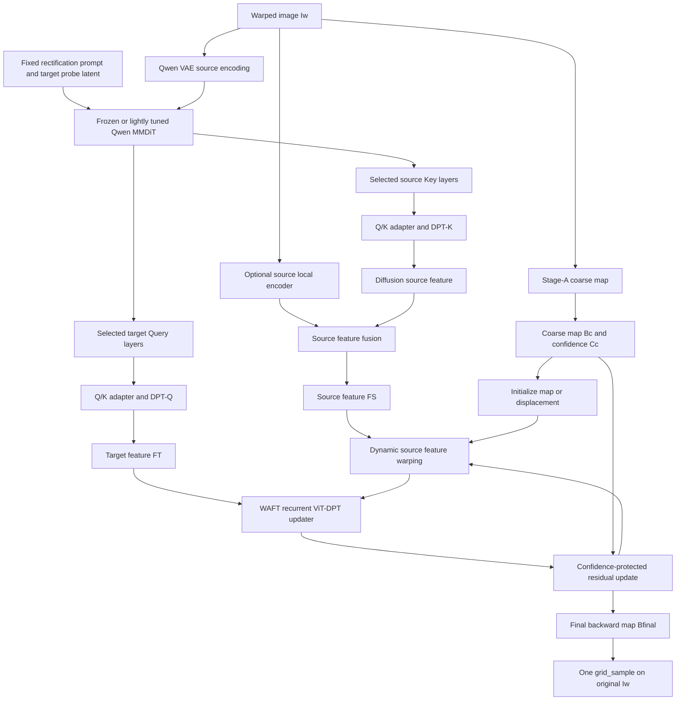
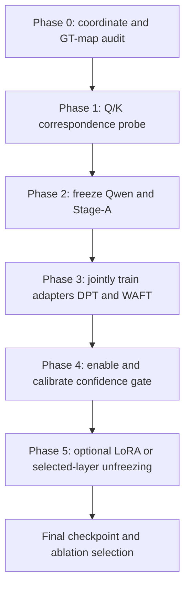

# Qwen-QK-WAFT 文档图像矫正模型：架构与训练方案

> 版本：v1.0  
> 日期：2026-08-06  
> 任务：输入单张扭曲文档图像，直接预测从规则矩形目标平面到原始扭曲图像的二维 backward map；最终只对原始 RGB 做一次重采样，不由扩散模型生成矫正后的文字。

## 0. 结论先行

本项目推荐采用以下主架构：

$$
\boxed{
I_w
\rightarrow
\text{Fine-tuned Qwen MMDiT Q/K}
\rightarrow
\mathrm{DPT}_Q/\mathrm{DPT}_K
\rightarrow
\text{Stage-A initialized WAFT}
\rightarrow
B_{\mathrm{final}}
}
$$

其中：

- **Qwen-Image-Edit 不再负责生成最终 RGB 图像**，只作为冻结或轻量微调的几何特征编码器；
- **DPT-Q 与 DPT-K** 将 MMDiT 多层、低分辨率的 target Query 和 source Key 恢复成可供稠密匹配使用的二维特征；
- **Stage-A** 提供粗 backward map $B_c$ 与置信度 $C_c$，作为 WAFT 的 warm start；
- **WAFT** 在当前 map 指定的位置动态采样 source feature，并通过共享的 ViT-DPT 更新器反复预测 map residual；
- 最终使用 $B_{\mathrm{final}}$ 对原始扭曲图像 $I_w$ 做一次 `grid_sample`，因此原始文字像素被保留，不再承受扩散生成和 VAE Decoder 带来的字符重写错误。

训练方面，不建议把所有模块从第一步开始整体端到端训练。推荐原则是：

> **结构上组成一个完整 forward；优化上分阶段训练；最后只做受控的小范围联合微调。**

具体而言：

1. 现有微调 Qwen 和 Stage-A 先作为独立的预训练模块复用；
2. 冻结二者，联合训练 Q/K adapter、DPT-Q/K、WAFT updater、预测头和上采样器；
3. WAFT 主干稳定后再训练 confidence gate；
4. 只有冻结 Qwen 的性能明确触顶时，才解冻 LoRA 或少量选中层，绝不直接全量解冻 20B Qwen；
5. 原始 zero-shot Qwen 不是主起点，而是必须保留的对照组和必要时的回退权重。

对于当前“几何能矫正，但生成文字仍会出错”的 Qwen checkpoint，推荐答案是：

> **优先复用，但先冻结并做 Q/K 对应性探针；不要从 zero-shot 重新开始整个训练，也不要继续依赖它生成的 RGB 作为最终结果。**

---

## 1. 问题定义

### 1.1 训练数据

每个训练样本包含：

- 扭曲图像：$I_w \in \mathbb{R}^{H_s\times W_s\times3}$；
- 真实矫正图像：$I_t \in \mathbb{R}^{H_t\times W_t\times3}$；
- 真实 backward map：$B_{gt} \in \mathbb{R}^{H_t\times W_t\times2}$；
- 有效像素掩码：$M_{valid}$，用于排除越界、不可见或无标注区域；
- 可选辅助标注：文字行、页面边缘、前景区域、折叠区域等。

需要强调：$I_t$ 只用于构造监督损失和评估，**不能作为 Qwen target 分支的输入**。否则训练时使用真实矫正图，推理时却没有该图，会产生严重的信息泄漏和 train-test mismatch。

### 1.2 推理输入与输出

推理时只有：

$$
I_w.
$$

模型输出绝对 backward map：

$$
B_{\mathrm{final}}(p)=q,
$$

其中 $p$ 是规则矩形 target canvas 上的像素坐标，$q$ 是原始扭曲图像中的采样坐标。最终矫正结果为：

$$
\hat I_t(p)=I_w\bigl(B_{\mathrm{final}}(p)\bigr).
$$

因此模型学习的是“**目标位置应该去源图哪里取像素**”，而不是生成新的目标像素。

### 1.3 坐标约定

内部建议统一使用像素坐标进行 map 更新，最终调用 `grid_sample` 前再转换到 $[-1,1]$：

$$
x_n=2\frac{x}{W_s-1}-1,\qquad
y_n=2\frac{y}{H_s-1}-1.
$$

需要在数据、Stage-A、WAFT 和重采样代码中统一：

- backward map 方向；
- $(x,y)$ 或 $(y,x)$ 通道顺序；
- `align_corners=True/False`；
- resize 后坐标值的缩放方式；
- source 与 target 分辨率不相等时的尺度变换。

这部分应通过 identity map、平移 map 和 GT map 三个单元测试固定下来。

---

## 2. 总体架构



该架构不是把 DINOv3、Qwen 和 WAFT 三套前端叠加，而是用：

$$
\text{Qwen MMDiT Q/K}+\mathrm{DPT}_Q/\mathrm{DPT}_K
$$

替换 WAFT-DINOv3 的输入特征编码器，仅保留 WAFT 后半部分的高分辨率动态 warping 和循环 ViT-DPT 更新机制。

---

## 3. 各模块的具体作用

### 3.1 Stage-A：确定性粗几何先验

Stage-A 输入扭曲图像，输出：

$$
(B_c,C_c)=S_{\phi}(I_w),
$$

其中：

- $B_c$：粗 backward map；
- $C_c\in[0,1]$：逐像素可靠性；
- $B_c$ 负责解决页面整体弯曲、旋转、透视与大尺度位移；
- 后续 WAFT 只需学习仍未解决的局部残差。

Stage-A 不是普通的第三路 image feature，也不应与 $F_T,F_S$ 简单拼接后一起送入 Qwen。它首先决定 WAFT 第一次应该从 source feature 的什么位置采样。

设 target 规则坐标网格为 $G$，则半分辨率初始位移为：

$$
d_0=\operatorname{MapToDisp}_{1/2}(B_c)=B_c^{1/2}-G^{1/2}.
$$

注意：resize 绝对坐标图时不仅要插值，还必须同步改变坐标数值的尺度。

数值精度契约：特征卷积、ViT 和 DPT 可以在 BF16 autocast 下运行，但
$B_c$、pixel grid、$d_i$、$\Delta d_i$、normalized sampling grid、convex
upsampling 后的 map，以及 Jacobian/fold/bending 计算必须始终使用 FP32。
否则 512px 轴上的 BF16 identity grid 会产生重复像素坐标和伪 fold。

### 3.2 Qwen：从 RGB 生成器改造成几何特征编码器

现有微调 Qwen 已经学会把弯曲页面变成矩形，这说明其 MMDiT 内部大概率已经形成了“源图弯曲结构—目标矩形布局”的中间表征。新模型不再使用其最终 RGB，而是在去噪轨迹中提取：

- target/noisy-output token 对应的 Query：$Q_T^{l,t}$；
- warped condition-image token 对应的 Key：$K_S^{l,t}$。

这里 $l$ 表示 MMDiT 层，$t$ 表示去噪时间步。

#### Target probe 是什么

推理时没有真实 rectified target image，因此 target 特征不能来自 $I_t$。target probe 应来自现有 Qwen 矫正过程中的 target latent 轨迹：

$$
z_T^{(t)}=\text{QwenRectificationTrajectory}(I_w,\text{fixed prompt},t).
$$

第一版建议采用“准确性优先”的方案：

1. 使用现有微调 Qwen 的固定矫正 prompt；
2. 固定 scheduler、随机种子或初始噪声协议；
3. 在候选去噪步中抓取 Q/K；
4. 通过对应性探针选择最佳 $t^*$ 和最佳层集合；
5. 只把这些中间特征送给 DPT，不调用 VAE Decoder。

后续如果完整 Qwen 轨迹太慢，再把选定特征蒸馏到少步 probe 或轻量学生编码器。第一轮实验不应同时改变 backbone、采样器和 WAFT 接口。

#### Token 切分要求

当前官方 Diffusers 实现先构造：

```python
latent_model_input = torch.cat([latents, image_latents], dim=1)
```

即 target/noisy latent 在前、source condition-image latent 在后；同时，VAE 的 8 倍压缩还要结合 $2\times2$ latent packing，因此 image token 的典型空间步长为输入的 $1/16$。但是，本项目仍应根据实际使用的 Qwen/Diffusers 版本记录 `img_shapes` 和 token metadata，不能只依赖这一默认顺序。

需要根据实际 Qwen forward 中记录的 token metadata 切分，而不能在代码中假设固定区间：

$$
Q_T^{l,t}=Q_{img}^{l,t}[\mathcal I_T],\qquad
K_S^{l,t}=K_{img}^{l,t}[\mathcal I_S].
$$

其中 $\mathcal I_T$、$\mathcal I_S$ 分别是 target latent 与 source condition latent 的真实 token index。必须用单元测试验证：

- 没有混入 text token；
- 没有误取 Qwen2.5-VL 的非二维语义序列；
- token 数量能恢复为正确的二维网格；
- 多宽高比输入下的 grid shape 与 padding 一致。

#### Q/K 版本

第一阶段至少比较：

- pre-RoPE Q/K；
- post-RoPE Q/K；
- pre/post 拼接后再投影；
- Query/Key 与 post-AdaNorm hidden feature。

不要直接假设 post-RoPE K 最适合双线性 warping，因为对带相位的位置编码做插值可能混合不同相位。最终以 GT map 上的对应性指标决定。

### 3.3 Q/K adapter 与独立 DPT-Q/DPT-K

不同注意力 head 中可能编码不同类型的对应关系，因此不建议直接对 head 求平均。对每个选中层分别执行：

$$
\bar Q_T^l=P_Q^l\!\left(\operatorname{LN}_Q^l(\operatorname{ConcatHeads}(Q_T^l))\right),
$$

$$
\bar K_S^l=P_K^l\!\left(\operatorname{LN}_K^l(\operatorname{ConcatHeads}(K_S^l))\right).
$$

然后使用两个不共享参数的 DPT：

$$
F_T=\mathrm{DPT}_Q\left(\{\bar Q_T^l\}_{l\in\mathcal L}\right),
$$

$$
F_S^{diff}=\mathrm{DPT}_K\left(\{\bar K_S^l\}_{l\in\mathcal L}\right).
$$

两侧使用独立 DPT 的原因是 Query 与 Key 的统计分布和语义职责不同。DA-Flow 同样使用独立的 $\mathrm{DPT}_Q$ 和 $\mathrm{DPT}_K$，并发现 diffusion feature 需要 DPT 恢复空间分辨率后再与局部 CNN feature 融合。

推荐的空间契约为：

| 接口 | 典型空间尺度 | 说明 |
|---|---:|---|
| Qwen image token grid | $H/16\times W/16$ | 以实际 VAE packing 和 padding 为准 |
| DPT-Q/K 输出 | $H/2\times W/2$ | 与 WAFT 高分辨率索引对齐 |
| WAFT hidden state | $H/2\times W/2$ | 五轮共享 updater |
| 最终 backward map | $H\times W$ | convex upsampling 后的绝对 map |

通道数不应写死为某一个值；建议让 adapter 将 Qwen 通道统一投影到 WAFT 的 feature contract，例如 64 或 96 通道，并通过配置文件管理。

### 3.4 Source local encoder：补充真实像素边界

Qwen 的“细粒度”主要指描述符判别能力和内容理解能力，不等于其 $H/16$ token 中包含完整的像素级文字笔画带宽。DPT 可以恢复空间尺寸，但不能凭空恢复所有高频边缘。

因此最终版本建议增加 source-only local encoder：

$$
F_S=P_S\left[ F_S^{diff},E_{local}(I_w)\right].
$$

其职责是补充：

- 文字笔画边缘；
- 页面边界；
- 细线与表格线；
- 小尺度局部纹理；
- DPT 上采样难以恢复的相位信息。

推理时没有真实 target RGB，因此不能照搬 WAFT-DINOv3 的对称双图 ResNet。target 侧仍由 $F_T$ 和 canonical positional encoding 表示；source 侧允许额外加入原图局部特征。

为了严格验证“Qwen 替换 DINOv3”本身，第一组主实验应先关闭 local encoder；确认 Qwen-Q/K 有效后，再将 local encoder 作为独立增量加入。

### 3.5 WAFT：动态读取 source feature 并迭代修正 map

第 $i$ 轮根据当前位移 $d_i$ 采样 source feature：

$$
\hat F_S^{(i)}(p)=F_S\bigl(G^{1/2}(p)+d_i(p)\bigr).
$$

由于 Stage-A 给出非零 warm start，hidden state 必须使用已经按 $d_0$ 对齐的 source feature 初始化：

$$
h_0=\operatorname{InitConv}\left[F_T,\hat F_S^{(0)}\right].
$$

不能继续使用未 warp 的 $F_S$ 初始化，否则 hidden state 与当前 map 不一致。

WAFT 的共享 ViT-DPT updater 在每一轮预测隐藏状态和 map residual：

$$
(h_{i+1},\Delta d_i,u_i)=U_{\theta}\left(F_T,\hat F_S^{(i)},h_i,d_i\right),
$$

其中 $u_i$ 可表示 Mixture-of-Laplace uncertainty 或其他预测置信度。

为了严格兼容 WAFT-A2 预训练权重，保留官方 updater 的完整输入契约：$d_i$ 一方面用于动态 warp source feature，另一方面作为 2 通道 current-flow 与 $F_T$、$\hat F_S^{(i)}$、$h_i$ 一起输入 `warp_linear`。Stage-A confidence 仍放在官方 updater 外部，仅用于任务适配 gate。

### 3.6 Confidence-protected residual update

门控建议使用：

$$
g_i=\sigma\!\left(
G_{gate}\left[
h_{i+1},
C_c,
\left|F_T-\hat F_S^{(i)}\right|,
u_i
\right]
\right).
$$

map 更新为：

$$
d_{i+1}=d_i+g_i\odot\Delta d_i.
$$

门控的语义是：

- Stage-A 高置信且两侧特征一致：$g_i\rightarrow0$，保护正确粗解；
- Stage-A 低置信或特征不一致：$g_i\rightarrow1$，允许 WAFT 大幅修正；
- 不设置固定最低修改量，例如不强制 $g_i\ge0.35$。

最终：

$$
B_{\mathrm{final}}=G+\operatorname{ConvexUp}(d_T).
$$

---

## 4. 训练方式：哪些分开训，哪些必须一起训

### 4.1 总原则

| 模块 | 是否已有预训练 | 第一阶段状态 | 后续状态 |
|---|---|---|---|
| 现有微调 Qwen MMDiT | 有 | 冻结 | 必要时仅解冻 LoRA/少量 QK 投影 |
| Qwen VAE Encoder | 有 | 冻结 | 始终冻结 |
| Qwen VAE Decoder | 有 | 不进入主图 | 不训练、不用于最终输出 |
| Qwen2.5-VL 条件编码器 | 有 | 冻结 | 始终冻结 |
| Stage-A | 有或单独训练 | 冻结 | 最后可选解冻输出头 |
| Q/K adapters | 新建 | 训练 | 训练 |
| DPT-Q / DPT-K | 新建或由 DPT 初始化 | 训练 | 训练 |
| Source local encoder | 新建/预训练 | 按消融加入 | 训练 |
| WAFT recurrent updater | 可加载 WAFT 初始化 | 训练 | 训练 |
| Confidence gate | 新建 | 先关闭 | WAFT 稳定后再训练 |
| Convex upsampler / flow head | 新建或部分初始化 | 训练 | 训练 |

最重要的边界是：

- **Qwen 与 Stage-A 可以先各自训练好再接入；**
- **DPT-Q/K 与 WAFT 不能完全独立训练后再机械拼接。**它们之间存在强烈的 feature distribution 和 map-update 接口依赖，应在 Qwen、Stage-A 冻结的前提下作为一个下游系统联合训练；
- 最终联合微调也不是“所有参数一起更新”，而是对已经稳定的系统进行分组学习率、小范围解冻。

### 4.2 推荐训练阶段



#### Phase 0：数据与坐标审计

目标：先证明监督信号本身是正确的。

执行：

1. 用 $B_{gt}$ 对 $I_w$ 重采样，确认结果与 $I_t$ 近乎一致；
2. 检查坐标方向、通道顺序、边界与 `align_corners`；
3. 建立 Stage-A only 指标；
4. 固定 train/val split、resize 和 crop 协议；
5. 保存同一批可视化样本用于全部后续 checkpoint 对比。

若 GT map 本身不能稳定重建 $I_t$，不要进入后续训练。

#### Phase 1：Q/K 对应性探针，不训练完整 flow 网络

必须比较三组 Qwen：

1. 原始 zero-shot Qwen-Image-Edit；
2. 当前文档矫正微调 Qwen；
3. 若当前微调为 LoRA，则测试 $\alpha\in\{0.25,0.5,0.75,1.0\}$ 的 LoRA scale。

对每个 checkpoint 扫描：

- 候选层 $l$；
- 候选去噪步 $t$；
- pre/post-RoPE；
- Q/K、hidden feature 等候选位置。

使用 $B_{gt}$ 取得真实 target-source 对应点，评估：

- nearest-neighbor feature EPE；
- PCK@1、PCK@3、PCK@5；
- true-match similarity margin；
- forward-backward cycle consistency；
- 文字行、页面边缘和内部区域的分组结果。

最终选出 top-$L$ 层和固定 $t^*$。通常可以从 top-4 层开始，但应由本任务数据决定，而不是直接复制其他论文的层号。

这一阶段直接回答“现有微调 Qwen 能否复用”：

- 若微调权重明显优于 zero-shot，则作为正式 encoder；
- 若几何生成更好但 Q/K 对应性没有提升，则保留 base Qwen 或降低 LoRA scale；
- 若不同区域各有优势，可在 adapter 中做双 checkpoint feature fusion，但这应作为后续消融，不是第一版。

#### Phase 2：Stage-A 独立准备

如果现有 Stage-A 已经达到稳定 coarse-map 效果，直接冻结复用。如果仍需训练，应先单独完成：

$$
\mathcal L_{A}=
\lambda_{epe}\mathcal L_{epe}
+\lambda_{line}\mathcal L_{line}
+\lambda_{bend}\mathcal L_{bend}
+\lambda_{fold}\mathcal L_{fold}
+\lambda_{rec}\mathcal L_{rec}.
$$

同时训练 $C_c$ 对“当前 coarse map 是否可靠”进行校准。置信度监督可由 coarse error、有效区域和局部折叠情况构造。

#### Phase 3：冻结 Qwen 和 Stage-A，联合训练 DPT 与 WAFT

此阶段是主训练阶段。

冻结：

- Qwen MMDiT；
- Qwen VAE Encoder；
- Qwen2.5-VL；
- Stage-A。

训练：

- Q/K projection adapters；
- DPT-Q、DPT-K；
- 可选 source local encoder；
- feature fusion；
- WAFT recurrent ViT-DPT updater；
- hidden initializer；
- residual/MoL head；
- convex upsampler。

建议先令 $g_i=1$ 或使用不学习的可靠性规则，避免 gate 在 updater 尚未学会纠错时提前收缩为零。迭代轮数可采用：

$$
1\rightarrow3\rightarrow5
$$

的课程训练，最终与 WAFT 一样使用五轮共享 updater。

对每轮绝对 map 进行 sequence supervision：

$$
\mathcal L_{seq}=\sum_{i=1}^{T}\gamma^{T-i}
\rho\left(B_i-B_{gt}\right).
$$

不要只监督 $B_{gt}-B_c$ 的 residual。只做 residual loss 容易让最终模型被 prior 主导，而 sequence absolute-map loss 可以直接惩罚“残差看似合理但最终 map 仍然错误”的情况。

总损失建议为：

$$
\mathcal L=
\lambda_{seq}\mathcal L_{seq}
+\lambda_{line}\mathcal L_{line}
+\lambda_{edge}\mathcal L_{edge}
+\lambda_{rec}\mathcal L_{rec}
+\lambda_{bend}\mathcal L_{bend}
+\lambda_{fold}\mathcal L_{fold}
+\lambda_{unc}\mathcal L_{unc}.
$$

其中：

- $\mathcal L_{seq}$：每轮 map 的 robust EPE/Charbonnier；
- $\mathcal L_{line}$：文字行或规则直线的几何一致性；
- $\mathcal L_{edge}$：页面边缘与内容边界区域加权 EPE；
- $\mathcal L_{rec}$：用预测 map warp 原始 $I_w$ 后与 $I_t$ 比较，只在 $M_{valid}$ 内计算；
- $\mathcal L_{bend}$：二阶平滑，仅约束不应出现高频水波纹的区域；
- $\mathcal L_{fold}$：Jacobian 反折惩罚；
- $\mathcal L_{unc}$：若保留 WAFT 的 MoL 头，则使用其不确定性似然损失。

#### Phase 4：开启 confidence gate

在 WAFT 已经具有可靠纠错能力后，再训练 gate。可以构造软目标：

$$
g^*(p)=\operatorname{clip}
\left(
\frac{\|B_c(p)-B_{gt}(p)\|}{\tau},0,1
\right).
$$

并加入：

$$
\mathcal L_{gate}=\operatorname{BCE}(g,g^*),
$$

以及两类约束：

- **保护损失**：Stage-A 已正确的位置不应被大幅改坏；
- **纠错损失**：Stage-A 错误位置不能因 gate 过小而拒绝更新。

需要同时监控 gate histogram，防止其塌缩到全 0 或全 1。

#### Phase 5：受控解冻 Qwen

仅当 Phase 3-4 已收敛，且证据表明 frozen Qwen descriptor 是主要瓶颈时才执行。

优先级为：

1. 解冻现有文档矫正 LoRA；
2. 解冻选中层的 Q/K projection；
3. 解冻少量相邻 MMDiT block；
4. 不建议全量解冻 Qwen。

学习率建议按比例设置：

$$
\eta_{Qwen}=\frac{1}{20}\sim\frac{1}{100}\eta_{downstream},
$$

并使用梯度裁剪。为了避免破坏已有生成/编辑表征，可加入冻结教师特征蒸馏：

$$
\mathcal L_{distill}
=\sum_{l\in\mathcal L}
\left\|F_{Qwen}^{l}-\operatorname{sg}(F_{teacher}^{l})\right\|_1.
$$

如果仍需保留原 Qwen 编辑能力，应在单独副本上进行此阶段，并保留少量原扩散/flow-matching 目标；不要覆盖当前已能完成几何矫正的 checkpoint。

#### Phase 6：可选的 Stage-A 小范围联合微调

最后只可尝试解冻 Stage-A 输出头或最后一层，学习率低于下游模块约一个数量级。Stage-A 主干和 Qwen 不应同时大范围解冻，否则容易出现：

- prior 和 residual updater 互相追逐；
- confidence 失去可解释性；
- Qwen feature 分布持续漂移；
- 已稳定的 warm start 被破坏。

---

## 5. 现有微调 Qwen 是否复用

### 5.1 推荐结论

当前 checkpoint 已能把扭曲页面生成成矩形，说明它学习到了任务相关的 canonicalization prior。文字仍然错误可能来自：

- VAE 压缩与解码损失；
- 生成模型对字形的概率性重绘；
- 多步去噪中内容发生语义替换；
- 几何目标与逐字符保真目标并不完全一致。

这些问题不直接否定 MMDiT 中间 Q/K 的几何价值。新模型最终使用：

$$
\hat I_t=\operatorname{grid\_sample}(I_w,B_{\mathrm{final}}),
$$

不会使用 Qwen 生成的文字像素，因此“字符写错”这一主问题从输出路径上被移除。

所以：

> **现有微调 Qwen 应作为首选 feature encoder checkpoint；原始 zero-shot Qwen 只作为探针对照，而不是要求整套模型重新从 zero-shot 训练。**

### 5.2 何时改用 zero-shot 或混合权重

| 探针结果 | 处理方式 |
|---|---|
| 微调 Qwen 的 Q/K EPE、PCK、line/edge 指标均优于 base | 直接冻结复用微调 checkpoint |
| RGB 几何更好，但 Q/K correspondence 与 base 相近 | 优先保留 base，或测试较低 LoRA scale |
| 微调 Qwen 在全局几何好、文字边缘差 | 使用微调 Qwen + source local encoder |
| 微调 Qwen 的 source/target 特征出现内容幻觉或错配 | 回退 base，或只复用部分中层特征 |
| base 与 fine-tuned 在不同层各自占优 | 选择跨 checkpoint 的少量层融合，作为后续实验 |
| 无论哪个 Qwen 都无法提供有效 correspondence | 暂停 WAFT 主训练，重新设计 target probe 或显式对应性微调 |

### 5.3 不建议的做法

- 不从随机权重重新训练 Qwen；
- 不仅因为文字生成错误就丢弃微调 checkpoint；
- 不用 Qwen 生成的矫正 RGB 作为 WAFT 的真实 target image；
- 不把 GT rectified image 输入 Qwen target 分支；
- 不在第一轮实验同时升级到 Qwen-Image-2.0、重写 WAFT、修改 Stage-A 和更换训练数据；
- 不覆盖原微调 checkpoint，应始终保留可回退副本。

---

## 6. 完整训练 forward

每个 batch 的执行顺序如下：

1. 读取 $I_w,I_t,B_{gt},M_{valid}$；
2. Stage-A 前向得到 $B_c,C_c$，默认 `no_grad`；
3. 现有微调 Qwen 在固定 prompt 和 probe 协议下运行；
4. 从选中层/步提取 $Q_T,K_S$，不执行 VAE Decoder；
5. Q/K adapters 与 DPT-Q/K 生成 $F_T,F_S^{diff}$；
6. 可选 local encoder 生成 $F_S^{local}$，融合为 $F_S$；
7. 将 $B_c$ 正确转换为半分辨率位移 $d_0$；
8. 用 $d_0$ warp $F_S$，初始化 $h_0$；
9. WAFT 循环 $T=5$ 次，每轮动态重采样 source feature 并更新 map；
10. convex upsampling 得到每轮全分辨率 $B_i$；
11. 在每轮 $B_i$ 上计算 sequence loss，在最终结果上计算 line、edge、reconstruction、anti-fold 等损失；
12. 反向传播时只更新当前阶段允许训练的模块。

当 Qwen 完全冻结时，可将固定层、固定步、固定增强协议下的 Q/K 缓存到磁盘，以显著降低下游训练成本。若训练中使用随机几何增强，则缓存必须在增强之后生成，或者只缓存未增强特征并确保 feature-space transform 严格正确。

---

## 7. 完整推理流程

1. 输入单张扭曲图像 $I_w$；
2. Stage-A 预测 $B_c,C_c$；
3. Qwen 使用固定矫正 prompt 运行 target probe；
4. 从选定层和时间步提取 $Q_T,K_S$；
5. DPT-Q/K 输出 $F_T,F_S$；
6. 用 $B_c$ 初始化 WAFT 位移与 hidden state；
7. WAFT 进行五轮动态 source feature warping 和 residual update；
8. convex upsampling 得到 $B_{\mathrm{final}}$；
9. 将 map 转成 `grid_sample` 的规范化坐标；
10. 对原始高分辨率 $I_w$ 只采样一次，得到最终矫正图像；
11. 输出 $B_{\mathrm{final}}$、矫正图、最终置信度与 invalid/fold mask。

推理流程中明确不包含：

- Qwen VAE Decoder；
- Qwen 生成 RGB 作为最终结果；
- 真实 target image；
- DINOv3；
- 全量 cost volume。

---

## 8. 推荐的最小可执行实验

为了最快验证核心假设，第一版只做以下内容：

### Experiment A：checkpoint 与 Q/K probe

- A0：原始 zero-shot Qwen；
- A1：当前微调 Qwen；
- A2：不同 LoRA scale；
- 输出 layer-time heatmap、PCK、feature EPE、line/edge 子集结果；
- 选出正式 feature checkpoint、top-4 层和 $t^*$。

### Experiment B：纯 Qwen 替换 WAFT 前端

$$
\text{Frozen Qwen Q/K}
\rightarrow
\mathrm{DPT}_Q/\mathrm{DPT}_K
\rightarrow
\text{Stage-A warm-start WAFT}.
$$

- Stage-A 冻结；
- Qwen 冻结；
- local encoder 关闭；
- gate 关闭；
- 联合训练 DPT 与 WAFT；
- 验证 $\mathrm{epe\_gain}>0$ 和 `final_win_rate` 是否超过 0.5。

### Experiment C：加入 source local encoder

只在 B 有效后加入 source CNN/HV detail branch，验证文字边缘、细线和页面边界是否改善。

### Experiment D：加入 confidence gate

只在 updater 已能稳定修正 Stage-A 后开启，检查：

- 高置信正确区域是否被保护；
- 低置信错误区域是否仍能被修正；
- gate 是否塌缩；
- fold rate 是否下降。

### Experiment E：Qwen 轻量解冻

仅当 B-D 已经稳定后，比较 frozen、LoRA unfreeze 和 selected-QK unfreeze。若收益很小，则正式模型保持 Qwen 冻结。

---

## 9. 评估与 checkpoint 选择

不能只按平均 EPE 选模型。建议至少记录：

| 类别 | 指标 |
|---|---|
| 全局几何 | EPE、EPE-P95、prior EPE、EPE gain、final win rate |
| 文字与直线 | line EPE、line straightness error、OCR 字符保持率 |
| 页面边界 | edge EPE、四角误差、边界直线度 |
| 拓扑稳定 | fold rate、Jacobian 最小值、越界率 |
| 残差行为 | residual EPE、每轮 $\Delta B$ 幅度、更新收敛曲线 |
| 置信度 | ECE/Brier score、gate histogram、高低置信区域分组 EPE |
| 最终图像 | 与 GT-flow warp 的 PSNR/SSIM、文字区域 LPIPS 或 OCR 一致性 |

最低成功判据建议为：

- `epe_gain > 0`；
- `final_win_rate > 0.5`；
- line EPE 与 straightness 同时优于 Stage-A；
- fold rate 不高于 Stage-A，且不能通过过度平滑换取低 EPE；
- 最终文字保持率接近使用 $B_{gt}$ warp 原图的上限；
- 五轮更新的误差总体下降，而不是后几轮重新恶化。

若平均 EPE 改善但文字直线度、边缘或 OCR 明显变差，不应选为最终 checkpoint。

---

## 10. 关键消融矩阵

| 编号 | Qwen | Stage-A warm start | Local branch | Gate | Qwen 解冻 | 目的 |
|---|---|---:|---:|---:|---:|---|
| M0 | 无 | 是 | 无 | 无 | 否 | Stage-A 基线 |
| M1 | Base Q/K | 是 | 无 | 无 | 否 | zero-shot encoder 对照 |
| M2 | Fine-tuned Q/K | 是 | 无 | 无 | 否 | 验证现有微调权重价值 |
| M3 | Fine-tuned Q/K | 否 | 无 | 无 | 否 | 验证 Stage-A warm start |
| M4 | Fine-tuned Q/K | 是 | 是 | 无 | 否 | 验证局部细节互补 |
| M5 | Fine-tuned Q/K | 是 | 是 | 是 | 否 | 完整冻结 Qwen 版本 |
| M6 | Fine-tuned Q/K | 是 | 是 | 是 | LoRA | 验证受控联合微调 |

实验决策顺序应为：

$$
M0\rightarrow(M1,M2)\rightarrow M3\rightarrow M4\rightarrow M5\rightarrow M6.
$$

---

## 11. 三个最容易出现的实现错误

### 11.1 把 Qwen 生成图当 target image

如果用 $B_c$ 或 Qwen 自己生成的矫正图构造 target feature，再用同一 map 对 source feature 采样，模型可能形成“即使 map 错了，两侧仍自洽”的闭环。target 必须来自固定的 Qwen target latent 协议，而不是由当前 map 重采样出来的伪 target RGB。

### 11.2 非零 warm start 仍用未对齐特征初始化 hidden state

官方 WAFT 从零 flow 开始，未 warp 的第二图特征恰好等价于初次采样。使用 Stage-A 后必须先按 $B_c$ warp source feature，再初始化 $h_0$。

### 11.3 Qwen token grid 与 WAFT padding 错位

Qwen 的 VAE packing、MMDiT token grid、DPT 输出和 WAFT padder 必须共享同一几何元数据。输入已经是某个合法倍数时，不应被 padder 额外扩展；否则 token feature 与 map 坐标会整体错位。

---

## 12. 截至 2026-08-06 的相关工作核对

### WAFT

[WAFT v3](https://arxiv.org/html/2506.21526v3) 将 RAFT 类方法中的 cost volume 替换为高分辨率 feature warping，并使用共享 DPT-Small 作为五轮循环更新器。论文同时表明：预训练输入 backbone、可训练 DPT head/side tuning、高分辨率索引和 Transformer 更新器都很重要。这支持“替换输入编码器，但保留 WAFT updater”的设计。

### DA-Flow

[DA-Flow](https://arxiv.org/abs/2603.23499) 是与本方案最接近的扩散特征—光流工作。它从图像恢复扩散模型中提取 Query/Key，经独立 DPT-Q、DPT-K 上采样，再与 CNN 局部特征融合，并送入 RAFT correlation/update operator。其消融显示 diffusion feature 与 CNN 细节具有互补性。本文档采用其“Q/K 分流 + DPT + 局部特征”的思想，但把 RAFT cost volume 更换为 WAFT 动态 warping，并加入 Stage-A warm start。

### FlowPainter

[FlowPainter](https://arxiv.org/html/2607.10140v1) 是 2026 年 7 月的新近 diffusion optical-flow 工作。它以粗 flow 和置信度作为可靠先验，只让 diffusion refinement 重点处理困难区域。它不等同于本项目的 Qwen feature encoder，但支持“高置信粗解应被保护、低置信区域重点残差修正”的总体原则。

### Qwen-Image 系列

[Qwen-Image-Edit](https://huggingface.co/Qwen/Qwen-Image-Edit) 使用 Qwen2.5-VL 提供语义控制、VAE 提供外观控制，并由 20B MMDiT 完成编辑；这使其中间 image-token Q/K 成为可研究的对应特征来源。当前更新的开放编辑 checkpoint 包括 [Qwen-Image-Edit-2511](https://huggingface.co/Qwen/Qwen-Image-Edit-2511)。[Qwen-Image-2.0 Technical Report](https://arxiv.org/abs/2605.10730) 则报告了更新的 Qwen3-VL + MMDiT 统一生成/编辑模型。

第一轮实验仍应使用已经验证过的当前微调 Qwen，不应同时切换到 Qwen-Image-2.0。后续只需让 `QwenQKFeatureEncoder` 遵守统一输出接口，即可单独替换 backbone 做对照。

---

## 13. 最终推荐配置

第一版正式实现建议固定为：

> **当前文档矫正微调 Qwen（冻结） + 通过探针选出的 top-4 target-Q/source-K + 独立 DPT-Q/K + Stage-A coarse backward map warm start + 五轮 WAFT ViT-DPT 动态 warping + 最终原图单次 grid_sample。**

训练顺序固定为：

1. 坐标与 GT-map 审计；
2. base/fine-tuned/LoRA-scale Q/K probe；
3. 冻结 Qwen 和 Stage-A，联合训练 DPT 与 WAFT；
4. 加入 source local encoder；
5. 加入 confidence gate；
6. 必要时仅解冻 Qwen LoRA 或选中 Q/K 投影；
7. 依据几何、直线、边缘、拓扑和文字保持指标联合选择 checkpoint。

这条路线既复用了现有 Qwen 已学到的文档矩形化能力，又从最终输出路径上彻底绕开其文字生成错误，是当前风险最低、实验可解释性最强的实现方案。

---

## 参考资料

1. Jaewon Min et al. [DA-Flow: Degradation-Aware Optical Flow Estimation with Diffusion Models](https://arxiv.org/abs/2603.23499), 2026.
2. [WAFT: Warping-Alone Field Transforms for Optical Flow, v3](https://arxiv.org/html/2506.21526v3), 2026 revision.
3. Qwen Team. [Qwen-Image Technical Report](https://arxiv.org/abs/2508.02324), 2025.
4. Qwen Team. [Qwen-Image-Edit model card](https://huggingface.co/Qwen/Qwen-Image-Edit).
5. Qwen Team. [Qwen-Image-Edit-2511 model card](https://huggingface.co/Qwen/Qwen-Image-Edit-2511), 2025.
6. Qwen Team. [Qwen-Image-2.0 Technical Report](https://arxiv.org/abs/2605.10730), 2026.
7. Yuang Meng et al. [FlowPainter: Inpainting Optical Flow via Confidence-Guided Completion](https://arxiv.org/html/2607.10140v1), 2026.
8. Hugging Face Diffusers. [QwenImageEditPipeline source](https://github.com/huggingface/diffusers/blob/main/src/diffusers/pipelines/qwenimage/pipeline_qwenimage_edit.py).
