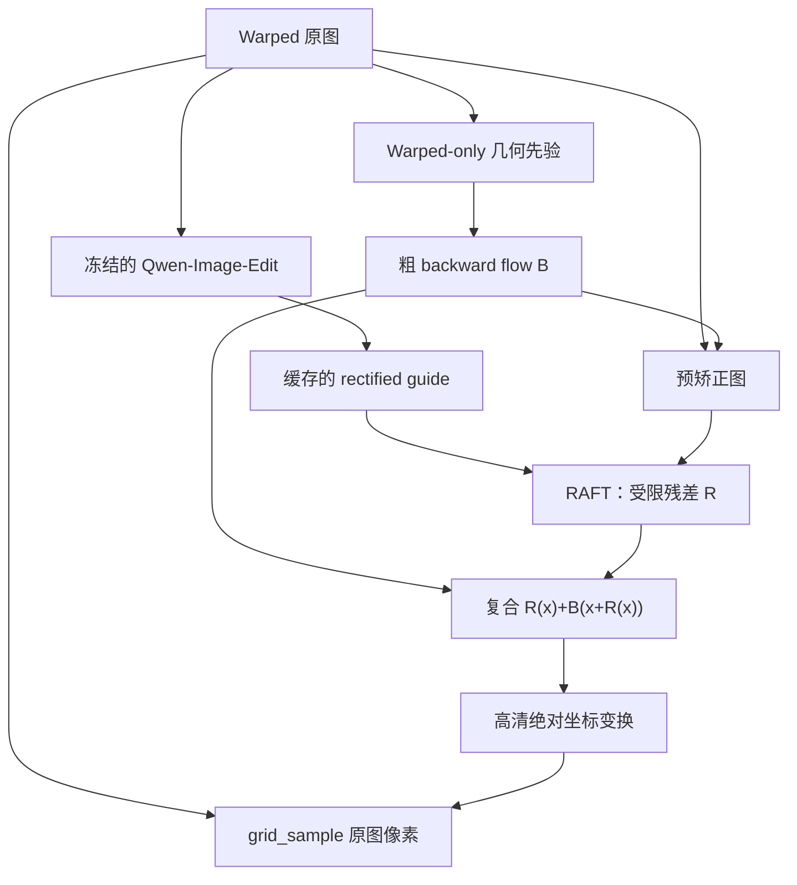

# Diffusion 2 RAFT：保持原文字像素的文档矫正

这个实现保留了原方案“扩散模型理解几何、光流负责像素采样”的核心，但修正了会造成错流和水波纹的部分。最终图像中的每个像素都来自原始 warped 图，Qwen 生成图只作为低分辨率几何参考。

## 结论：原 README 哪些对，哪些需要改

正确的部分：

- 用后向光流把最终输出坐标映射回原始高清图，可以绕过 VAE 对小字的损失。
- Qwen 的矫正结果可提供全局页面形状、边界和直线方向等语义几何先验。
- 流的方向应为 `rectified/output -> warped/source`。

必须修正的部分：

1. **普通 RAFT 的输入顺序不能写反。** torchvision RAFT 输出第一张图到第二张图的流，所以应输入 `RAFT(guide_rectified, source_or_pre_rectified)`，才能直接给 `grid_sample(warped, flow)` 使用。
2. **Qwen 生成图不能作为像素级真值。** 错字、重绘、缩放和局部漂移都会污染 RAFT 的相关体；训练监督只能来自真实 backward-flow 和真实 rectified target。
3. **粗流和残差不能直接相加。** 正确复合为 `R(x) + B(x + R(x))`。空间变化的粗流若直接相加，会产生系统性局部偏差。
4. **高清 flow 不能一律“插值后乘倍率”。** 当源图和目标画布缩放不同或发生非等比 resize 时，应先转成绝对源坐标 map，分别缩放源坐标，再减去新的目标网格。本项目已实现这一转换。
5. **仅靠一阶 smoothness 会把真实透视形变也抹平。** 本项目使用二阶 bending loss，并增加 Jacobian 防折叠损失。
6. **README 中的 DA-Flow V3 不能直接照搬。** DA-Flow 对图像复原 DiT 加入了跨帧全时空注意力，经过专门训练后才从实验证明有效的层提取 Q/K；随后用独立 DPT-Q、DPT-K、DPT-context 上采样到 1/8，再与 RAFT CNN 特征融合。Qwen-Image-Edit 原始 top-4 Q/K 没有这些保证。
7. **Qwen 不应放进每个 flow training step。** 它应冻结并离线生成固定 guide，否则成本、随机性和显存占用都会妨碍稳定训练。

## 已实现的架构



关键安全阀：

- 单图 U-Net 先预测大尺度几何，即使 guide 局部错字，系统仍有可用的回退流。
- 粗流先在默认 1/8 控制网格上预测再连续上采样，限制其产生文字尺度的高频波纹。
- RAFT 只预测默认不超过 32 px 的残差，避免追逐生成文本而形成大幅涟漪。
- guide artifact augmentation 随机模拟局部错字、块移位、擦除和模糊。
- guide dropout 时用当前预矫正图替代 guide，强制模型学会依赖粗流。
- `L_flow + L_reconstruction + L_gradient + L_bending + L_anti-fold` 联合约束。

## 光流数据约定

项目只使用一个明确约定：

```text
flow shape: [H_target, W_target, 2]
flow[..., 0]: x displacement
flow[..., 1]: y displacement

source_coordinate(x, y) = (x, y) + flow(x, y)
rectified(x, y) = warped(source_coordinate(x, y))
```

这是后向位移，不是 warped 到 rectified 的前向运动流。若现有 GT 是绝对 map 或 `grid_sample` 的归一化 grid，在 manifest 里分别写 `absolute_map` 或 `normalized_grid`，数据加载器会转换。

JSONL 数据清单示例见 `examples/manifest.example.jsonl`。路径相对于 manifest 所在目录：

```json
{"id":"001","warped":"images/001_w.png","target":"images/001_t.png","guide":"guides/001.png","flow":"flows/001.npy","valid":"masks/001.npy","flow_format":"displacement"}
```

`guide` 在 prior 阶段可缺省，在 joint 阶段必须存在。`valid` 可缺省，此时自动使用源图边界和有限数值生成有效掩码。

## 安装

```bash
cd diffusion2raft
python -m venv .venv
source .venv/bin/activate
pip install -e .
```

Qwen-Image-Edit-2511 需要 `QwenImageEditPlusPipeline`。如果已发布的 diffusers 版本尚未包含它，按官方模型卡安装最新 Git 版本：

```bash
pip install git+https://github.com/huggingface/diffusers
pip install -U transformers accelerate safetensors
```

## 训练流程

### 1. 先核验 flow 方向

在开始训练前，随机抽取 20 个样本，直接用 GT flow warp 原图。结果必须与 target 重合且文字方向正确；否则先转换 flow，不能寄希望于模型自动修正方向。

```bash
python scripts/inspect_flow_sample.py \
  --manifest data/train.jsonl --index 0 --output-dir tmp/flow_check_0
```

几何实现的依赖轻量验证：

```bash
python scripts/validate_geometry_numpy.py
python -m unittest discover -s tests -v
```

正式训练机上的 1-batch smoke test 可先生成自带精确 homography flow 的小数据：

```bash
python scripts/make_synthetic_smoke_data.py --output tmp/smoke_data
d2r-train --config configs/smoke.yaml --stage prior
d2r-train --config configs/smoke.yaml --stage joint \
  --resume runs/smoke/prior/latest.pt
```

### 2. 离线生成 Qwen guides

配置 `configs/base.yaml` 中的 `work_size`、Qwen 模型和 prompt。不要把非方形数据无条件拉成 1024×1024；训练、guide 生成和推理必须使用同一尺寸策略。

```bash
d2r-generate-guides \
  --config configs/base.yaml \
  --manifest data/train_without_guides.jsonl \
  --output-dir data/qwen_guides/train \
  --output-manifest data/train.jsonl
```

Qwen-Image-Edit-2511 是目前更合适的 Qwen 版本，因为官方说明它改善了图像漂移、一致性和几何推理；但它仍不是像素保持模型，不能删除后续 flow 路径。

### 3. Stage A：训练 warped-only 粗流

```bash
d2r-train --config configs/base.yaml --stage prior --epochs 20
```

先确认验证集：

- EPE 持续下降；
- fold rate 接近 0；
- 预矫正图整体页面边界和行方向正确；
- 小字可以模糊，但不能出现密集水波纹。

### 4. Stage B：微调 RAFT 残差

把 prior checkpoint 填进 `train.resume`，再运行：

```bash
d2r-train \
  --config configs/base.yaml \
  --stage joint \
  --resume runs/d2r/prior/latest.pt \
  --epochs 20
```

首次实验建议只解冻 RAFT 后半部分或使用很小的 RAFT 学习率；当前默认 `2e-5`，prior 为 `2e-4`。若 fold rate 上升，先降低 `max_residual_px` 和 `lr_raft`，而不是提高 smoothness 到很大。

## 推理

Qwen guide 可以提前生成，也可以在单独进程里生成后释放 Qwen 显存，再加载 RAFT。不要让 20B Qwen 和 RAFT 长期同时驻留显存。

```bash
d2r-infer \
  --config configs/base.yaml \
  --checkpoint runs/d2r/joint/latest.pt \
  --warped examples/page_warped.png \
  --guide examples/page_qwen_guide.png \
  --output-dir outputs/page
```

输出包括：

- `*_rectified.png`：只从原始 warped 图采样的高清结果；
- `*_backward_flow.npy`：高清后向位移场；
- `*_valid.png`：落在原图范围内的采样区域；
- `*_metadata.json`：方向、尺寸和有效比例。

## 推荐损失与消融顺序

总损失为：

```text
L = L_sequence-flow
  + 0.5 L_prior-flow
  + 0.15 L_pixel-reconstruction
  + 0.10 L_gradient
  + 0.02 L_second-order-bending
  + 0.20 L_anti-fold
  + 0.002 L_residual-magnitude
```

建议依次做四组：

1. warped-only prior；
2. 直接 `RAFT(guide, warped)`；
3. prior + bounded residual RAFT；
4. 第 3 组 + guide artifact/dropout + anti-fold。

主要指标不要只用 PSNR/SSIM，应至少包含：flow EPE、Jacobian fold rate、OCR CER、文字边缘重投影误差、直线弯曲度和无效采样比例。

## 关于 FlowDiffuser、DA-Flow 和最新方法

- **FlowDiffuser** 是专门对二维 flow 加噪并从噪声逐步生成 flow，RGB 图像对只作为条件。它不是让通用图像扩散 VAE 解码出 flow。如果以后采用这条路线，应新建 flow encoder/decoder 或在像素 flow 空间做条件扩散。
- **DA-Flow** 使用扩散中间特征增强 RAFT，并不让扩散模型最终直接输出 flow。它最适合“退化的两帧之间仍存在真实对应”的场景；本任务的 Qwen guide 包含生成内容，因此需要额外的错字鲁棒训练。
- **Optical Flow Matching (CVPR 2026)** 把光流重写为连续像素传输动力学，是比 FlowDiffuser 更新的方向，但官方仓库目前标注 code coming soon。现阶段 RAFT 仍是更可复现的主干，后续可把本项目的 bounded residual backend 替换成 OFM。

## 暂不实现原 README 的 Q/K V3 的原因

Qwen-Image-Edit 在去噪 token 与条件图像 token 间确实有联合注意，但“能取出 Q/K”不等于“Q/K 是可靠几何对应”。在加入 V3 前至少需要完成：

1. 明确拆分 target-noise token 与 source-image token；
2. 在每一层、每个 denoising step 上用 GT flow 做 zero-shot EPE 排名；
3. 对选中层分别训练 Q/K/context 上采样头；
4. 与 CNN 特征在同一 1/8 网格融合；
5. 证明加入 Q/K 后 OCR CER、EPE 和 fold rate均改善。

未完成这些实验时，把 top-4 Q/K 直接拼进 FlowHead 很可能增加通道，却不增加可用的对应信息。

## 当前实现边界

- 本仓库提供完整训练、推理、Qwen guide 缓存、坐标变换和损失实现，但不包含 Qwen、RAFT 权重或你的 GT flow 数据。
- 当前运行环境没有安装 PyTorch/GPU，因此这里完成的是语法和纯 NumPy 几何验证；在正式训练机上还需运行一次 1-batch CUDA smoke test。
- 如果原始项目还有未上传的 V2/V3 代码，需要逐文件迁移；你上传的 README 在第 107 行中途结束，因此无法对旧代码做兼容补丁。
