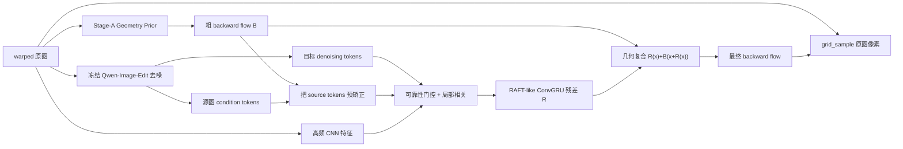

# Diffusion 2 RAFT：统一的文档矫正光流模型

本项目把 Stage A 的 warped-only 几何先验、Qwen-Image-Edit 的内部生成特征和
RAFT-like 残差迭代整合为一个单图模型。推理接口只有一张 warped 图，模型最终
输出后向光流；矫正 RGB 始终从 warped 原图采样，因此 Qwen 不会重新书写小字。

## 新的 unified 阶段

旧版 `joint` 是级联基线：离线生成 Qwen RGB guide，再执行
`prior -> RGB 预矫正 -> torchvision RAFT`。它仍被保留用于消融，但不是最终方案。

新版 `unified` 不生成、不缓存，也不读取 Qwen guide RGB：



统一模型的关键性质：

- Qwen 在模型内部运行，只抽取 Transformer hidden tokens，`output_type=latent`，
  不执行最终 VAE decode。
- target denoising tokens 表示模型正在形成的“平整页面”；source condition tokens
  保留 warped 输入信息，两者在特征层匹配。
- Stage A prior 是 Qwen/flow 解码器的粗坐标初始化，不再是独立后处理模型。
- Qwen token 只有约 1/16 空间分辨率，残差头工作在 1/8，且残差默认限制在
  24 px，从结构上阻止文字尺度水波纹。
- 可靠性门控在 Qwen token 与源图特征不一致的位置退回当前 prior，而不是追随
  可能错误的生成文字。
- 训练时默认以 10% 概率完全丢弃 Qwen 分支，确保最终模型在生成特征失效时仍能
  回退到 Stage A prior，而不会崩溃。
- 所有 residual 与 prior 使用
  `R(x) + B(x + R(x))` 复合，绝不直接相加。

当前实现冻结 Qwen 20B 主干，联合优化 Stage-A prior、Qwen token 投影器、可靠性
门控和 RAFT-like refiner。这已经是单一输入、单一前向和单一光流 checkpoint；
同时避免在第一轮联合训练中破坏 Qwen。Qwen LoRA 应在该版本稳定后作为后续消融，
不能与第一轮联合训练同时贸然开启。

## 光流约定

项目统一使用目标到源图的后向位移：

```text
flow: [B, 2, H_target, W_target]
flow[:, 0]: x displacement
flow[:, 1]: y displacement

source_coordinate(x, y) = (x, y) + flow(x, y)
rectified(x, y) = warped(source_coordinate(x, y))
```

如果 GT 是绝对 map 或归一化 `grid_sample` grid，在 manifest 中分别填写
`absolute_map` 或 `normalized_grid`。数据加载器会转换为上述 displacement。

## 数据清单

Unified 阶段不需要 `guide`：

```json
{"id":"001","warped":"images/001_w.png","target":"images/001_t.png","flow":"flows/001.npy","valid":"masks/001.npy","flow_format":"displacement"}
```

路径相对于 JSONL 所在目录。`valid` 可以省略。旧 `joint` 消融才需要 `guide`。

训练前必须抽样验证 GT flow：

```bash
python scripts/inspect_flow_sample.py \
  --manifest data/train.jsonl --index 0 --output-dir tmp/flow_check_0
```

GT-flow warp 必须与 target 对齐，否则不能开始联合训练。

## 安装

```bash
cd diffusion2raft
python -m venv .venv
source .venv/bin/activate
pip install -e '.[qwen,dev]'
```

Qwen-Image-Edit-2511 需要包含 `QwenImageEditPlusPipeline` 的新版 diffusers；若已
安装版本没有该类，安装 Hugging Face 官方最新源码版本。

## 训练

### 1. Stage A

已经完成的 Stage A checkpoint 可以直接使用，无需重训：

```bash
torchrun --nproc_per_node=8 -m diffusion2raft.train \
  --config configs/base.yaml \
  --stage prior \
  --epochs 20
```

### 2. Unified joint training

```bash
torchrun --nproc_per_node=8 -m diffusion2raft.train \
  --config configs/unified.yaml \
  --stage unified \
  --resume runs/d2r/prior/latest.pt \
  --epochs 20
```

Checkpoint 迁移会严格加载全部 `prior.*` 参数，新建并训练 token projectors、fusion
和 refiner。默认前 2 个 epoch 将 prior 学习率设为 0；随后以 `2e-5` 小学习率联合
微调，避免刚开始就破坏 Stage A 已学到的安全流。

Qwen-Image-Edit-Plus 当前每次只接受一张图，所以 production 配置要求每个 rank
的 `data.batch_size=1`。8 个进程的全局 batch 为 8。训练脚本已经实现
DistributedSampler、DDP 指定本地 GPU、跨 rank 验证指标归并以及仅 rank 0 存盘；
不要再启动 8 个互不通信、同时写同一 checkpoint 的独立进程。

### 3. 轻量 smoke test

`configs/smoke.yaml` 使用 `feature_backend: lite`，只用于验证统一图的梯度、尺寸和
checkpoint 迁移，不代表 Qwen 实验：

```bash
python scripts/make_synthetic_smoke_data.py --output tmp/smoke_data
d2r-train --config configs/smoke.yaml --stage prior --epochs 1
d2r-train --config configs/smoke.yaml --stage unified \
  --resume runs/smoke/prior/latest.pt --epochs 1
python -m unittest discover -s tests -v
```

## 推理

Unified 推理只有 warped 输入，不再有 `--guide`：

```bash
d2r-infer \
  --config configs/unified.yaml \
  --checkpoint runs/d2r/unified/latest.pt \
  --stage unified \
  --warped examples/page_warped.png \
  --output-dir outputs/page
```

输出包括：

- `*_rectified.png`：只由 warped 原图像素采样的矫正结果；
- `*_prior_rectified.png`：同一次前向中的 Stage-A 粗矫正，便于判断 joint 是否真有增益；
- `*_backward_flow.npy`：原生输出尺寸的后向光流；
- `*_feature_confidence.png`：Qwen 特征可靠性门控热图（unified 阶段）；
- `*_valid.png`：有效采样区域；
- `*_metadata.json`：尺寸、方向、fold rate、Jacobian 分位数和 backend。

## 联合损失

默认目标为：

```text
L = 1.00 L_sequence_final_flow
  + 0.25 L_prior_flow
  + 0.15 L_pixel_reconstruction
  + 0.10 L_image_gradient
  + 0.02 L_second_order_bending
  + 0.20 L_anti_fold
  + 0.002 L_residual_magnitude
```

`L_sequence_final_flow` 监督每次 recurrent refinement 经过几何复合后的完整 flow，
而不是直接监督一个错误的 `GT - prior` 残差。后者在空间变化的 prior 下并不成立。

## 建议的训练观察项

至少同时记录：

- final EPE 与 prior EPE；
- fold rate、Jacobian p01；
- reconstruction 与文字边缘重投影误差；
- OCR CER；
- feature confidence 均值；
- residual 的 p50、p95 和最大值。

如果 unified EPE 一开始高于 prior，先检查 Stage-A checkpoint 是否完整加载；如果
fold rate 上升，先把 `max_residual_px` 从 24 降到 16、把 `lr_unified` 降至 `5e-5`，
不要用很大的平滑损失强行压平所有几何。

## 显存与实现边界

- Qwen 主干是外部冻结权重，不写入每个 joint checkpoint；checkpoint 保存的是
  prior、token projectors、fusion 和 refiner。推理时仍需能加载配置中的 Qwen 模型。
- BF16 Qwen 权重和中间激活显存很大。显存不足时可设置 `qwen.cpu_offload: true`，
  但速度会显著下降；也可以安装 `pip install -e '.[qwen,memory]'` 后设置
  `qwen.feature_quantization: 4bit`。量化只作用于冻结的 transformer，先保持 4 个
  feature denoising steps，不要直接恢复 40/50 步。
- 当前运行环境没有 PyTorch/GPU，因此仓库内只能执行语法、NumPy 几何和跳过式
  单元测试；真正的 Qwen forward 必须在训练机做 1-batch CUDA smoke test。
- `joint` 与 `d2r-generate-guides` 仅作为旧 RGB-guide 消融保留；最终实验和部署应
  使用 `unified`。
