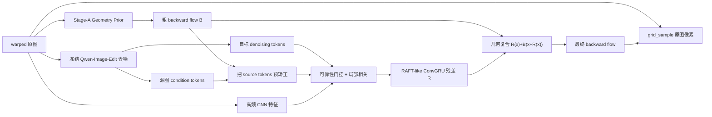
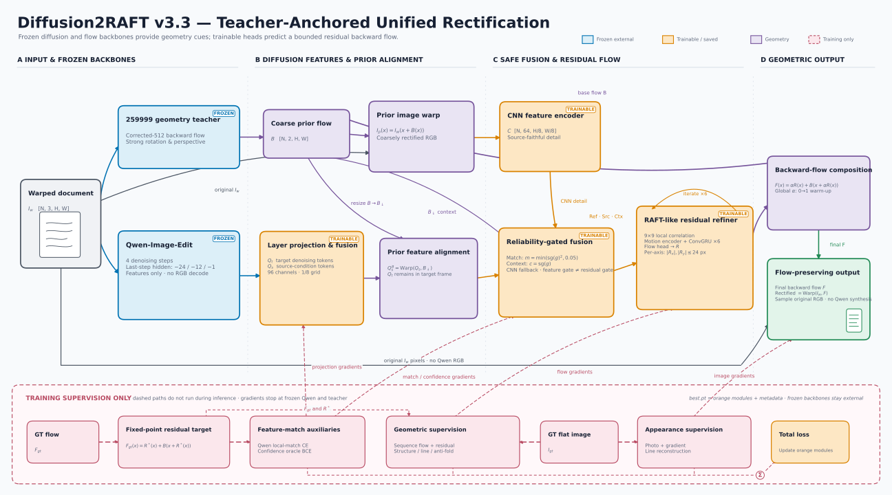

# Diffusion 2 RAFT：统一的文档矫正光流模型

本项目把 Stage A 的 warped-only 几何先验、Qwen-Image-Edit 的内部生成特征和
RAFT-like 残差迭代整合为一个单图模型。推理接口只有一张 warped 图，模型最终
输出后向光流；纯几何输出始终从 warped 原图采样，因此 Qwen 不会重新书写小字。
部署若显式启用 LAMA，最终 PNG 只会在标记出的无效边界及其膨胀环内使用生成像素。

## v3.1 针对“EPE 下降但表格线仍弯”的修订

v2/v3 的全局 EPE 会被大面积白底主导，`fold_rate≈0` 也只说明没有发生翻折，二者都
不能保证表格线或文字基线笔直。v3.1 因此在**不新增模型参数**的前提下加入：

- target 边缘和长横/竖线上的结构加权 flow/reconstruction 监督；
- GT 相对的一阶梯度、二阶曲率监督，避免绝对平滑把真实卷曲也压掉而造成欠矫正；
- 只约束线条法向误差沿切向变化的 straightness loss，直接惩罚“波浪线”；
- `epe_p95`、`edge_epe`、`line_epe`、`line_normal_mae`、`line_bend` 指标，并按
  验证集 `line_epe` 保存 `best.pt`；
- 对 flow grid 与 source-coordinate canvas 做显式校验，杜绝 1024 flow / 512 图像
  被错误缩放但仍能正常训练的静默问题。

由于模型参数键没有改变，可以直接恢复 v2 unified epoch 8 的 model 与 Adam moments；
只是 loss 数量和定义改变，v3.1 的 `total` 不能与旧日志横向比较。

## 新的 unified 阶段

旧版 `joint` 是级联基线：离线生成 Qwen RGB guide，再执行
`prior -> RGB 预矫正 -> torchvision RAFT`。它仍被保留用于消融，但不是最终方案。

新版 `unified` 不生成、不缓存，也不读取 Qwen guide RGB：



统一模型的关键性质：

- Qwen 在模型内部运行，只抽取 Transformer 特征，`output_type=latent`，不执行最终
  VAE decode。默认 `feature_type: hidden` 保持已有 checkpoint 的特征语义；另提供
  `feature_type: qk`，可抽取 attention Q/K 做独立消融。
- target denoising tokens 表示模型正在形成的“平整页面”；source condition tokens
  保留 warped 输入信息，两者在特征层匹配。
- Stage A prior 是 Qwen/flow 解码器的粗坐标初始化，不再是独立后处理模型。
- Qwen token 只有约 1/16 空间分辨率，残差头工作在 1/8，且残差默认限制在
  24 px，从结构上阻止文字尺度水波纹。
- 可靠性门控在 Qwen token 与源图特征不一致的位置退回当前 prior，而不是追随
  可能错误的生成文字。
- 训练时默认以 10% 概率完全丢弃 Qwen 分支，确保最终模型在生成特征失效时仍能
  回退到 Stage A prior，而不会崩溃。
- 所有 residual 与 prior 使用
  `R(x) + B(x + R(x))` 复合，绝不直接相加。

当前实现冻结 Qwen 20B 主干，联合优化 Stage-A prior、Qwen token 投影器、可靠性
门控和 RAFT-like refiner。这已经是单一输入、单一前向和单一光流 checkpoint；
同时避免在第一轮联合训练中破坏 Qwen。Qwen LoRA 应在该版本稳定后作为后续消融，
不能与第一轮联合训练同时贸然开启。

### Correlation/Qwen/residual 消融协议

`correlation_temperature` 在 epoch 9–11 按 `9.797959 → 3.130169 → 1.0`
调度。旧的 epoch-9 Qwen on/off 作业在模型构造后直接使用了配置终值 `1.0`，因此其
`EPE=6.601/7.205` 与高 fold rate 不属于训练时协议，不能用于判断 Qwen 或 residual。
当前推理与消融会优先读取 checkpoint 新增的实际 runtime temperature；旧 checkpoint
则从其自身 `config + epoch` 精确恢复。两者同时存在时必须一致，否则拒绝评估。

8 卡训练验证也不再用会把 300 张补齐为 304 张的默认 DistributedSampler；每张验证图
现在严格只计一次。固定 snapshot 的第一优先重跑为：

```bash
# epoch_0009.pt，自动恢复 corr_t=9.797959；同一单卡评估器比较 on/off
bash scripts/ablate_qwen_off.sh

# 8 个可恢复 cell：3 温度 × both/none，再在训练温度补 matching/context-only
bash scripts/ablate_residual_qwen_sweep.sh
```

第二个脚本默认只运行去重后的 8 个 temperature/Qwen cell；每个 cell 只执行一次
昂贵 Qwen+GRU 前向，再按
`λR(x) + B(x + λR(x))` 离线复合 `λ=0/.1/.25/.5/.75/1`，并把 checkpoint SHA256、
epoch、实际温度、Qwen 文件 manifest identity、验证 manifest 和全部协议逐 cell 原子写入
JSON，抢占后只会严格续跑完全相同的协议。`λ=0` 时 EPE 应与 prior EPE
完全一致；此时 `final_win_rate` 因定义使用严格 `<` 而为 0，不能将它解释为 prior 失败。

## 光流约定

项目统一使用目标到源图的后向位移：

```text
flow: [B, 2, H_target, W_target]
flow[:, 0]: x displacement
flow[:, 1]: y displacement

source_coordinate(x, y) = (x, y) + flow(x, y)
rectified(x, y) = warped(source_coordinate(x, y))
```

如果 GT 是绝对 map 或归一化 `grid_sample` grid，在 manifest 中分别填写
`absolute_map` 或 `normalized_grid`。数据加载器会转换为上述 displacement。

## 数据清单

Unified 阶段不需要 `guide`：

```json
{"id":"001","warped":"images/001_w.png","target":"images/001_t.png","flow":"flows/001.npy","valid":"masks/001.npy","flow_format":"displacement","flow_source_size":[1024,1024]}
```

路径相对于 JSONL 所在目录。`valid` 可以省略。旧 `joint` 消融才需要 `guide`。
`flow_source_size=[H,W]` 表示 flow 数值所使用的**源图坐标画布**，不是简单地表示
`.npy` 的数组尺寸。如果 flow grid 与 target 图像尺寸不同，该字段为必填；loader 会
在绝对坐标图上插值并缩放到 `work_size`，不会直接对 displacement 乘一个模糊比例。
可选的 `flow_target_size` 必须与 `.npy` 的空间网格严格相同，否则会立即报错。

### v3.2 任意朝向 source-only 几何增强（opt-in）

当前训练 flow 的全局旋转统计只有 `p90=2.23°、max=4.57°`，而 `typical` 中存在接近
90° 的横置拍摄，这是明确的训练/真实域缺口。新增的
`configs/unified_v3_2_bigrot_data.yaml` 是一份**仅描述数据侧**的完整配置：以 70% 概率
对 warped/source 施加 `[-180°, 180°]` 旋转，并附带轻量 scale、translation 和
perspective。原 `configs/unified.yaml` 不启用该增强，因此 v3.1 checkpoint 复现行为不变。

该增强不会转动 target 或 guide。设原 GT 的绝对后向 source map 为
`M(x)=x+flow(x)`，旧 source 到新 source 的前向单应性为 `H`，loader 严格使用：

```text
augmented_source_coordinate(x) = H M(x)
augmented_backward_flow(x) = H M(x) - x
```

`valid` 还会同时与增强前 source 范围、投影分母有限性和增强后 source 范围相交；因此
旋转/透视后被裁出画布的位置不会参与 flow 或重建监督。图像和坐标变换都由 PyTorch
完成，不增加数据依赖。增强配置仅传给 train loader，val/inference 永远不随机增强。

配置字段语义如下：

```yaml
data:
  source_geometry_augment:
    probability: 0.70       # 整组 source-only 几何变换的触发概率
    max_rotation_deg: 180.0 # 均匀采样 [-max, max]
    scale: [0.85, 1.05]     # 均匀采样 [min, max]
    translation: [0.04, 0.04] # x/y 最大平移，占各自画布边长的比例
    perspective: 0.025      # 四角最大 jitter，占宽/高的比例
```

重要：任意朝向会产生远超 v3.1 local prior 有效表示范围的全局位移。该 data recipe 必须
与 v3.2 global-pose prior/head 一起合入最终训练配置；不要直接让旧 v3.1 prior 吃满
360° 分布。缺少 `source_geometry_augment`（或 `probability: 0`）时 loader 完全保持旧行为。

### v3.3 强 TorchScript teacher 几何锚点（可选）

论文/汇报用的结构总览如下。橙色模块进入统一 checkpoint；Qwen 与强 teacher 保持冻结、
作为外部组件加载。红色虚线只在训练时存在，最终 RGB 始终由 composed backward flow 从
warped 原图采样。



可编辑 SVG、论文用 PDF、PNG 预览和复现命令见
[`docs/figures/README.md`](docs/figures/README.md)。

`configs/unified_v3_3_teacher_anchor.yaml` 不再要求小型 Stage-A U-Net 从头重造强监督
模型的大旋转/透视能力，而是把 `259999_raft_unwarp.pt` 作为冻结几何 prior。这里明确
采用 **corrected-512** 部署契约：OpenCV 解码，保持 BGR `[0,1]`、无 mean/std，以历史
三分支缩放到 512×512（小图 LINEAR；普通下采样 AREA；短边大于 2048 时先保持比例用
AREA 缩到短边 1024，再 AREA 拉成方形），随后用 FP16 autocast 执行 teacher，取最后一个
`[B,2,512,512]` 后向位移并用 torchvision `gaussian_blur(kernel=39)` 平滑。

现有旁证只能说明 corrected-512 高概率对应质量更好的 `259999-2nd`；指定的首目标目录
很可能沿用了脚本默认的 518 输入，但缺少原始生成命令，尚未完成真实模型 A/B 取证。
因此本配置不声称逐像素复现首目录。flow 从模型画布恢复到任意 H×W 时仍使用项目统一的
absolute source-coordinate map 与一致的 `align_corners=True` 采样；这是刻意保留的正确
坐标语义，不复刻旧脚本 displacement 比例缩放及 `align_corners` 历史错配。

真实模型 trace 在 RoPE 图中写死了 `cuda:0`，CPU 无法完成该取证。单卡 GPU 节点可运行
`scripts/audit_teacher_input_size.py`，它会对同一张图分别执行历史 512/518 输入、旧 flow
缩放/采样错配和 LAMA/JPEG 路径，并把两个结果对首目录及 `-2nd` 的 MAE/PSNR 写入 JSON。
该脚本只用于识别历史 recipe，不应作为 corrected absolute-map 推理入口。

Slurm 上可直接提交前台包装脚本（申请一张 GPU 即可）：

```bash
bash scripts/audit_typical_baseline_recipe.sh
```

默认选择两遍输出差异最大的 `16ELhPMMHYV40g57W0XeMfH7_a.jpg`，同时对两个历史目录
进行比较，结果写入 `runs/teacher_input_size_audit/16ELhPMMHYV40g57W0XeMfH7_a/audit.json`。
可通过 `SAMPLE=...` 和 `OUTPUT_DIR=...` 覆盖；包装脚本使用前台 `exec`，不会在 Slurm
分配结束前把训练/取证进程放到后台。

这保证 unified 的**几何起点接近指定目标 baseline**；Qwen token、可靠性 fusion 和
受限 RAFT-like residual 的任务变成在该起点上修正并超越 baseline，而不是先补回一个
小 prior 根本没有学到的全局朝向能力。teacher 始终 `eval + no_grad`，作为运行时外部
组件加载，不进入 optimizer、DDP 参数同步或 unified checkpoint。checkpoint 中仅保存
3 字节 backend marker，所以不会把约 3.5GB teacher 复制到每个 epoch。

从 v3.1 learned-prior checkpoint 切到此配置时，loader 只允许一次严格的 backend 迁移：
旧 checkpoint 必须含完整的 `prior.*` schema，除被替换的完整 prior 和新 marker 外，任何
missing/unexpected key 都会报错，同时旧 optimizer state 会丢弃。第一个 v3.3 checkpoint
写出后，teacher→teacher 恢复重新采用全严格 model/optimizer 加载。

迁移来的 v3.1 refiner 不会立即改写强 teacher 输出。第一个 teacher epoch 的 applied
residual scale 固定为 0，`final_flow` 直接复用 `prior_flow`（不经过恒等 `grid_sample`）；
与此同时，未缩放的 `raw_residuals` 仍接受 fixed-point residual、Qwen matching、大小与
弯曲监督。随后六个相对 epoch 将 scale 从 `1/6` 递增到 1。迁移起始 epoch、当前 scale
和完整 schedule 会写入 checkpoint，推理直接恢复保存值，所以中途选中的部分 scale
checkpoint 也能精确复现。

首个 scale=0 checkpoint 会原子写入且不再覆盖为 `anchor.pt`，并在 learned→teacher
迁移时重新初始化 best 指标；`latest.pt` 用于续训，最终部署优先比较 `best.pt` 与
`anchor.pt`。checkpoint 还以 strict-v2 identity 绑定外部 teacher 的 resolved path、文件大小、
mtime_ns、SHA-256、输入/flow 尺寸、blur kernel 与 autocast dtype，并要求 SHA 与正式配置中的
pin 一致。加载器在同一个 `O_NOFOLLOW` 文件描述符上完成哈希，再通过 `/proc/self/fd/N`
加载实际认证的 inode，最后复核路径和 fd 未变化；因此同尺寸替换并恢复 mtime 也会被拒绝，
同时不会为约 3.5GB teacher 额外构造一份 Python `bytes`。

真实 teacher 的 RoPE 图包含运行时 `cuda:0` 常量，`jit.load(map_location=...)` 不会重写
这些图内 device literal。因此 **不得** 用共享可见卡的普通多卡 `torchrun -m
diffusion2raft.train` 启动 v3.3：rank 1–7 的 activation 位于 `cuda:1–7`，会与图内
`cuda:0` tensor 冲突。专用入口让 torchrun 继续管理全局 `RANK/WORLD_SIZE` 和失败传播，
但在每个 worker 导入 Python/torch 之前，只暴露其对应的一张物理 GPU，并把它映射成本
进程的逻辑 `cuda:0`。这样仍然是多卡 DDP，并不会让所有 rank 挤到同一张物理卡。

v3.3 为此提供 `scripts/train_unified_v33_teacher.sh` 和
`scripts/run_unified_v33_teacher_background.sh` 两个专用入口；此处先不要直接启动，完成
下述 capacity 批准和正式 smoke 后，再使用“v3.3 正式 smoke 与训练”中的完整命令。

`scripts/isolate_cuda_rank.sh` 会严格拒绝空、重复或越界的
`CUDA_VISIBLE_DEVICES` 映射。v3.3 固定启用该隔离；v3.1/v3.2 仍使用普通 torchrun。
当前 v3.3 的 `qwen.device_map` 必须保持 `null`，因为每个 rank 在隔离后只看见自己的
一张 GPU。正式全量训练前必须在 8 卡节点完成真实 teacher 并发 forward、一步 DDP 和
2/8 卡故障传播 smoke；仅做文件 stat 或单卡容量审计不能替代这项验证。

#### v3.3 production teacher-capacity 批准

正式顺序从一个完成的 v3.1 seed 开始。先等待 v3.1 完成 20 epochs，并优先固定不再变化的
`runs/d2r_v3_1/unified/epoch_0020.pt`；不要在生成批准后继续用可能被替换的
`latest.pt` 充当同一个 seed。production evidence 会绑定 seed 的真实 SHA-256，而不只检查
路径或 epoch 数。

容量批准必须在一张 GPU 上运行，且该卡在进程内是 teacher trace 所要求的逻辑
`cuda:0`。下面是正式、可复制的唯一生成入口：

```bash
PY=/juicefs-algorithm/workspace/IPT/zhuochu_yang/miniconda3/bin/python

CUDA_VISIBLE_DEVICES=0 PYTHONPATH=src "$PY" scripts/teacher_capacity_production.py generate \
  --config configs/unified_v3_3_teacher_anchor.yaml \
  --resume runs/d2r_v3_1/unified/epoch_0020.pt \
  --output-dir runs/preflight_v33_teacher_capacity
```

该入口固定使用完整 val 300 条记录，并分别评估 300 个原图、300 个覆盖
`[-180°,180°]` 的确定性分层 rotation，以及 300 个从正式配置采样的完整
rotation/scale/translation/perspective 组合。它会对 val manifest 和审计实际使用的每个
`warped`、`target`、`flow`、可选 `valid` 资产计算 SHA-256（`guide` 不参与 teacher-capacity
审计），同时绑定配置、teacher、v3.1 seed、采样协议与相关实现文件。

冻结的 production 阈值简述如下：三组 aggregate 都要求
`oracle_solver_coverage>=0.99`、可解像素中任一轴超过 24px 的 overflow rate `<=0.005`、
`trainable_coverage>=0.985`、stride-8 trainable oracle reconstruction EPE `<=1.0px`；
绝对旋转桶 `[0,15,30,60,90,120,150,180]` 每桶至少 20 个样本，并分别要求
`>=0.98`、`<=0.01`、`>=0.97`、`<=1.5px`。任一协议、身份或数值检查失败时命令非零退出，
可以保留 raw diagnostic，但不会创建或更新 `approved.json`。

通过后，完整 evidence 以 canonical JSON 的 SHA-256 命名为
`runs/preflight_v33_teacher_capacity/<sha256>.json`；同目录的 `approved.json` 是原子更新的
小型 pointer，只指向该内容寻址 evidence。由 evidence、policy、seed、teacher 和 manifest
绑定生成的小型 receipt 才是 smoke/训练消费的值，raw JSON 或文件名本身都不能解锁训练。

可用下列命令独立复核当前配置、批准 pointer、资产和恢复点。成功时 stdout **只包含一行
canonical URL-safe base64 receipt**；错误信息写到 stderr 并返回非零：

```bash
PY=/juicefs-algorithm/workspace/IPT/zhuochu_yang/miniconda3/bin/python

PYTHONPATH=src "$PY" scripts/teacher_capacity_production.py verify \
  --config configs/unified_v3_3_teacher_anchor.yaml \
  --pointer runs/preflight_v33_teacher_capacity/approved.json \
  --resume runs/d2r_v3_1/unified/epoch_0020.pt
```

一般用户不需要也不应手工导出这个 receipt；v3.3 launcher 和 smoke 会用它们实际选中的
resume 自动调用同一个 `verify`，严格校验 stdout 后再注入训练进程。

`scripts/preflight_teacher_capacity.py` 仍保留为低级诊断入口，例如缩小 sample、只隔离
rotation，或用 `--teacher /absolute/path/to/checkpoint.pt` A/B 非配置 teacher。它生成的
普通报告不会经过 production policy、不会写内容寻址 evidence/`approved.json`、不会产生
receipt，因此无论结果如何都不能解锁 smoke 或训练。需要批准时必须回到上面的
`teacher_capacity_production.py generate`，且 production 入口不接受 teacher override。

```bash
# 仅作 rotation-only teacher A/B 诊断；不是 production 批准命令。
PY=/juicefs-algorithm/workspace/IPT/zhuochu_yang/miniconda3/bin/python
CANDIDATE=/absolute/path/to/checkpoint.pt
CUDA_VISIBLE_DEVICES=0 PYTHONPATH=src "$PY" scripts/preflight_teacher_capacity.py \
  --config configs/unified_v3_3_teacher_anchor.yaml \
  --checkpoint runs/d2r_v3_1/unified/epoch_0020.pt \
  --teacher "$CANDIDATE" \
  --split val --sample-count 32 --rotations-per-sample 1 \
  --full-geometry-per-sample 0 \
  --output runs/preflight_v33_teacher_capacity/diagnostic-rotation-only.json
```

该配置同时设置 `image_decoder: opencv`、`resize_interpolation: opencv_baseline`；这一组合
只允许 `stretch` 和方形 work canvas，不是一般 learned-prior 模型的默认建议。其他配置
未显式设置时仍走原来的 PIL + PyTorch bilinear 路径。

corrected-512 部署还可选加载外部冻结 LAMA。启用后，final flow 先以 zero padding 生成
`*_rectified_raw.png`；随后严格复刻旧部署的 uint8 截断、OpenCV LINEAR 图像/mask 缩放、
mask `>100` 阈值和 11×11 膨胀，再在 512×512 执行 LAMA。最终只在膨胀 mask 内替换像素并
保存 `*_rectified.png`；`*_prior_rectified.png` 仍是 border padding、不做 LAMA 的明确几何
诊断。LAMA JIT 不进入 unified checkpoint。每张图 metadata 和目录 report 都记录 decoder、
resize interpolation 及 LAMA path/size/mtime/SHA-256/输入尺寸/膨胀核；正式配置固定 LAMA
摘要，preflight、checkpoint 检查和推理加载都会验证真实字节。LAMA 也通过已认证的 procfd
交给 TorchScript loader，但训练 preflight 不会把它实例化进训练模型。

teacher checkpoint 还保存并严格绑定 `deployment_contract`：512 work canvas、OpenCV 解码/
三分支缩放、BGR `[0,1]`、absolute-map flow 恢复、`align_corners=True` warp、LAMA 身份和上述
uint8/mask recipe。推理时任何 PIL/letterbox/另一 work size/另一 LAMA 的替换都会直接失败，
不会静默输出一个仍被误称为 corrected-512 的结果。

v3.3 训练生成 `anchor.pt` 后，可在 GPU 节点运行固定 40 张集合（脚本不会覆盖配置中的
corrected-512/LAMA 选项）：

```bash
bash scripts/infer_typical_v33_teacher.sh

# 完成 residual ramp 后另跑 best.pt，输出到独立目录再做全量比较
CHECKPOINT=runs/d2r_v3_3_teacher_anchor/unified/best.pt \
OUTPUT_DIR=runs/d2r_v3_3_teacher_anchor/typical_best_corrected512 \
bash scripts/infer_typical_v33_teacher.sh
```

`anchor.pt` 是 alpha=0 的不可变 teacher 恢复点；`best.pt` 只有同时满足
`EPE<5.7501`、EPE gain>0、有效像素 win rate>0.5、fold<4e-4、Jacobian 下界，且
line EPE/straightness 均严格优于 teacher prior 时才会更新。最终发布应比较二者的
40 张结果，不能把 `latest.pt` 当成默认成品。

训练完整达到 32 个 completed epochs 后，推荐使用 fail-closed 的两阶段收尾，而不是手工
拼接两个推理和报告命令。第一阶段运行推理、自动质量门并准备逐图审核：

```bash
# 只检查固定三份 checkpoint、外部 teacher/LAMA 与 40 张 basename；不启动推理
PREFLIGHT_ONLY=1 bash scripts/finalize_typical_v33_all40.sh

# 在 GPU 节点依次运行 anchor/best，并完成严格产物校验、自动门和横向 HTML
bash scripts/finalize_typical_v33_all40.sh
```

该入口只接受 `runs/d2r_v3_3_teacher_anchor/unified/{anchor,best,latest}.pt`，不会退回
`latest.pt` 充当成品或猜测某个 `epoch_*.pt`。每次使用独立 UTC run ID，输出位于
`runs/d2r_v3_3_teacher_anchor/typical_final/RUN_ID/`，报告位于
`reports/typical_v33_teacher_anchor/RUN_ID/`。任一 checkpoint 关系错误、训练未满 32 轮、
推理不是 40/40、artifact/metadata/mask 不一致、评估缺图或 HTML 配对不完整都会非零退出。
finalizer 会把四字段 checkpoint artifact（canonical path、size、mtime、SHA-256）传入推理；
推理在同一 no-follow fd 上先哈希、再 `torch.load`，并把同一 artifact 写进每张 metadata 和
目录 report。正式收尾禁止 `--skip-inference`，避免复用无法证明由当前 checkpoint 生成的旧输出。
正式发布阈值固定在 `configs/typical_v33_quality_v2.yaml`：只接受 residual scale>0 的 `v33_best`，
要求 validation `EPE<5.7501`、gain>0、win rate>0.5、fold<4e-4、line EPE/straightness
均优于 anchor；typical40 对 target_first 和更强的 target_second **分别**要求全图 LSD
均值不差、逐图胜率至少 75%，并分别限制尾部退化与线长坍缩，同时检查
fold/Jacobian 和有效支持域。旧 v1 policy 保持冻结、可用于复算旧报告，但不能取得 v2
发布资格。自动门失败会保留结构化诊断并非零退出。

第一阶段只写 `evaluation_manifest.json`、`review_evidence.json` 和
`quality_review_template.json`，始终保持 `release_ready=false`，不会提前生成 final manifest。
复制模板为已填写的审核文件，逐张在全分辨率检查 source、两套 target、anchor/best 的
final/raw/prior/三类 mask，全部 40 张、全部九项都显式改为 `pass` 后，才能运行：

```bash
PY=/juicefs-algorithm/workspace/IPT/zhuochu_yang/miniconda3/bin/python
PYTHONPATH=src "$PY" scripts/approve_typical_v33_review.py \
  --evaluation-manifest reports/typical_v33_teacher_anchor/RUN_ID/evaluation_manifest.json \
  --review reports/typical_v33_teacher_anchor/RUN_ID/quality_review.json
```

批准阶段会重新验证并重哈希三份 checkpoint、外部 teacher/LAMA、自动门、metadata/mask，
以及 15 组共 600 个审核文件；人工审核还必须逐图分别确认不差于 target_first 和
target_second，任一 pending/fail 或审核后文件变化都会拒绝。只有这一阶段成功才原子生成
`final_manifest.json` 和 `release_ready=true`。`all40_line_proxy.json` 同时保存 v3.3 全图和
`*_evaluation_valid.png` mask 内的两套分数；只有与历史目标支持域一致的全图分数参与
`at_most_target_*` 比较，mask 分数仅用于有效几何区域诊断，并同时记录 mask 覆盖率。

当前 Qwen 使用本地 `Qwen-Image-Edit` 目录，checkpoint 会绑定其配置和路径，但历史 v3.1
checkpoint 没有 37 个实际依赖文件的密码学内容清单。正式对外发布前仍需补一份固定文件闭包的
Qwen SHA-256 manifest，并让训练恢复、推理和批准复用同一身份；在此之前应把该目录视为只读，
不能把“当前目录的事后哈希”表述成旧训练过程已经具备的 provenance。

上述发布锁负责协调本项目的正式 finalizer/approval，但不等价于抵御同一用户下的恶意并发
写入者：若攻击者能在指标读取期间反复 swap-and-restore config 或输出文件，普通 pathname
评估仍可能被竞态干扰。敌对多进程环境应先把 config、checkpoint 和 all40 产物放进只读快照，
再执行批准；当前自动化针对的是受控训练目录中的误改、缺失、陈旧复用和协议漂移。

训练前必须抽样验证 GT flow：

```bash
python scripts/inspect_flow_sample.py \
  --manifest data/train.jsonl --index 0 --output-dir tmp/flow_check_0 \
  --max-mae 0.08
```

该脚本按训练时完全相同的 source/target canvas 变换重建 target；GT-flow warp 必须与
target 对齐，否则不能开始联合训练。建议至少对每个数据类别随机检查若干样本。

## 安装

```bash
cd diffusion2raft
python -m venv .venv
source .venv/bin/activate
pip install -e '.[qwen,dev]'
```

Qwen-Image-Edit-2511 需要包含 `QwenImageEditPlusPipeline` 的新版 diffusers；若已
安装版本没有该类，安装 Hugging Face 官方最新源码版本。

## 训练

### 1. Stage A

已经完成的 Stage A checkpoint 可以直接使用，无需重训：

```bash
torchrun --nproc_per_node=8 -m diffusion2raft.train \
  --config configs/base.yaml \
  --stage prior \
  --epochs 20
```

### 2. Unified joint training

```bash
torchrun --nproc_per_node=8 -m diffusion2raft.train \
  --config configs/unified.yaml \
  --stage unified \
  --resume runs/d2r/prior/latest.pt \
  --epochs 20
```

Checkpoint 迁移会严格加载全部 `prior.*` 参数，新建并训练 token projectors、fusion
和 refiner。从 Stage A 开始新训时，当前配置前 12 个 epoch 将 prior 学习率设为 0；
随后才以 `5e-6` 联合微调，先让残差与对应特征稳定，避免 refiner 和 prior 过早漂移。

若已有 v2 unified epoch 8，不需要回到 Stage A，也不要切换为 Q/K；将 checkpoint 放到
脚本约定位置后，先运行一次真实 Qwen 单卡冒烟测试：

```bash
bash scripts/smoke_unified_v31.sh
```

该脚本先检查 checkpoint 分支、完整 manifest、抽样 flow canvas/GT 重建误差，再实际执行
1 个训练 batch 和 1 个验证 batch。成功后必须查看
`runs/preflight_v31/smoke/unified/previews/epoch_0009.jpg`，四联图顺序为
`warped | prior | unified | GT target`；确认 unified 没有额外拉弯表格线、尺寸与 GT 对齐，
再启动正式 8 卡训练：

```bash
bash scripts/train_unified_v3.sh
```

若训练节点上的终端即将断开，使用可恢复后台入口：

```bash
bash scripts/run_unified_v31_background.sh
```

后台入口会先用 PyTorch 检查 CUDA 驱动和可见 GPU；没有 GPU 时以状态码 69 明确退出，且不会
创建日志、PID、锁或改动 checkpoint。GPU 可用时，它以 `nohup + setsid` 脱离终端，日志写入
`runs/d2r_v3_1/unified/logs/`，运行中 PID 位于
`runs/d2r_v3_1/unified/.launcher/train.pid`，结束状态位于同目录的
`last_exit.status`。前台和后台入口共用 `flock`，重复启动会以状态码 75 拒绝，因此不会有两个
rank-0 同时覆盖 `latest.pt`/`best.pt`。

每次启动的默认恢复顺序是 `latest.pt`、编号最大的 `epoch_*.pt`、`best.pt`，最后才是 v2
epoch-8 种子。存在 `latest.pt` 时普通 `RESUME=...` 会被忽略；需要有意回滚时必须同时设置
`ALLOW_RESUME_OVERRIDE=1`。损坏或空的 `latest.pt` 会直接停止，不会静默回退并覆盖现有结果。
`EPOCHS=20` 仍表示训练到总 epoch 20；若 checkpoint 已经达到目标则干净退出。

常用检查：

```bash
cat runs/d2r_v3_1/unified/.launcher/train.pid
tail -f runs/d2r_v3_1/unified/logs/train_v31_*.log
cat runs/d2r_v3_1/unified/.launcher/last_exit.status
bash tests/test_training_launchers.sh
```

当 v3.1 续训完成、`runs/d2r_v3_1/unified/latest.pt` 的 `completed_epochs>=20` 后，
v3.2 使用独立的
前台/后台入口（不要用 v3.1 命令手工拼环境变量）：

```bash
# 前台，便于首次观察 preflight 与训练启动
bash scripts/train_unified_v32.sh

# 后台，终端断开后继续运行
bash scripts/run_unified_v32_background.sh
```

v3.2 入口的默认值是 `CONFIG=configs/unified_v3_2.yaml`、
`OUTPUT_ROOT=runs/d2r_v3_2`、`SEED_RESUME=runs/d2r_v3_1/unified/latest.pt` 和
`EPOCHS=32`（总 epoch，不是额外再跑 32 个）。如果 v3.2 输出目录已有有效
`latest.pt`，仍按通用规则优先恢复它；只有 v3.2 本地 checkpoint 不存在时才以
v3.1 `latest.pt` 作为迁移种子。

启动器会在任何 `mkdir`、锁、PID 或日志写入前读取选中 checkpoint 的元数据。
v3.2 默认要求 `completed_epochs>=20`；因此当前只完成 10 个 epoch 的 v3.1
`latest.pt` 会在前台和后台入口都以状态码 78 拒绝，不创建 v3.2 运行状态，
也不会启动训练。该门槛适用于最终选中的任何恢复点，不能通过普通 `RESUME=...`
绕过。

仅在明确接受“v3.1 尚未收敛就迁移”的风险时，可使用命名明确的显式开关：

```bash
ALLOW_RESUME_BELOW_MIN_EPOCHS=1 bash scripts/train_unified_v32.sh
# 后台同理：
ALLOW_RESUME_BELOW_MIN_EPOCHS=1 bash scripts/run_unified_v32_background.sh
```

这个 override 会输出显著警告；如果在 epoch 20 前中断，再次恢复仍需显式提供它。
v3.1 入口的最低恢复 epoch 默认仍为 0，所以原续训行为不变。

v3.2 的锁、PID 和结束状态位于 `runs/d2r_v3_2/unified/.launcher/`，后台日志位于
`runs/d2r_v3_2/unified/logs/train_v32_*.log`，与 v3.1 的状态树和日志完全分开。
它的默认 preflight 报告也单独写到 `runs/preflight_v32/main/preflight_report.json`。
两个 v3.2 入口都复用同一个 CUDA-first 保护：无可用 GPU 时以状态码 69 退出，
且在任何 `mkdir`、日志、PID 或锁文件写入之前停止。v3.1 原入口、默认路径和
`train_v31_*` 日志命名保持不变。

常用的 v3.2 后台检查：

```bash
cat runs/d2r_v3_2/unified/.launcher/train.pid
tail -f runs/d2r_v3_2/unified/logs/train_v32_*.log
cat runs/d2r_v3_2/unified/.launcher/last_exit.status
```

#### v3.3 正式 smoke 与训练

先完成上面的 production teacher-capacity 批准，再在与训练相同的 8 卡节点/allocation
执行正式前台 smoke。命令必须显式使用被 `approved.json` 绑定的同一个不可变 seed：

```bash
SEED_CHECKPOINT=runs/d2r_v3_1/unified/epoch_0020.pt \
TEACHER_CAPACITY_POINTER=runs/preflight_v33_teacher_capacity/approved.json \
SMOKE_NPROC=8 FAILURE_WORLD_SIZES="2 8" \
  bash scripts/smoke_unified_v33_teacher.sh
```

它使用正式 Qwen、TorchScript teacher、逐 rank 逻辑 `cuda:0` 隔离和正式 loss/AdamW，
执行一个训练 step、每 rank 一个验证 batch，并验证 2 卡和 8 卡 DDP 故障传播。临时
checkpoint 位于 `SLURM_TMPDIR` 并在退出时清理；持久 JSON/日志写入
`runs/v33_smoke_reports/RUN_ID`，不会触碰正式 v3.3 run。只有全部检查完成时才打印
`D2R_V33_SMOKE_PASS`，并生成 `passed=true` 的 `overall_report.json`。

两卡或其他配置只能用于早期诊断，例如：

```bash
ALLOW_PARTIAL_SMOKE=1 \
SEED_CHECKPOINT=runs/d2r_v3_1/unified/epoch_0020.pt \
TEACHER_CAPACITY_POINTER=runs/preflight_v33_teacher_capacity/approved.json \
SMOKE_NPROC=2 FAILURE_WORLD_SIZES=2 \
  bash scripts/smoke_unified_v33_teacher.sh
```

partial smoke 仍然先验证 `approved.json`、当前资产和 exact seed；
`ALLOW_PARTIAL_SMOKE=1` 或 `ALLOW_INCOMPLETE_SEED=1` 都不能绕过 teacher-capacity 门禁。
partial 只会产生 `D2R_V33_SMOKE_PARTIAL_ONLY` 和 `passed=false`，不能替代正式 8 卡 smoke，
也不执行 LAMA，不能替代最终推理验收。

正式 smoke 通过后，前台和可恢复后台入口分别为：

```bash
# 前台；使用当前进程可见的 8 张 GPU
NUM_GPUS=8 \
SEED_RESUME=runs/d2r_v3_1/unified/epoch_0020.pt \
TEACHER_CAPACITY_POINTER=runs/preflight_v33_teacher_capacity/approved.json \
  bash scripts/train_unified_v33_teacher.sh

# 非 Slurm 终端需要脱离时使用
NUM_GPUS=8 \
SEED_RESUME=runs/d2r_v3_1/unified/epoch_0020.pt \
TEACHER_CAPACITY_POINTER=runs/preflight_v33_teacher_capacity/approved.json \
  bash scripts/run_unified_v33_teacher_background.sh
```

v3.3 production profile 默认使用 `CONFIG=configs/unified_v3_3_teacher_anchor.yaml`、
`OUTPUT_ROOT=runs/d2r_v3_3_teacher_anchor` 和 `EPOCHS=32`，并把
`MIN_RESUME_COMPLETED_EPOCHS` 固定为 20；脚本自身的 seed 默认仍是
`runs/d2r_v3_1/unified/latest.pt`，但首次 production 迁移建议像上面一样显式指定已批准的
`epoch_0020.pt`。如果 v3.3 输出目录已经有 checkpoint，启动器按通用恢复顺序优先选择
其 `latest.pt`，并验证其中保存的 receipt 与当前批准 evidence 完全一致。

teacher-capacity 验证和普通 `RUN_PREFLIGHT` 是两个独立门禁。v3.3 专用入口固定要求
capacity evidence，先对实际选中的 resume 调用 production `verify`，然后才处理
`CHECK_LAUNCH_ONLY` 或普通训练 preflight。因此 `CHECK_LAUNCH_ONLY=1` 也会验证容量批准，
而 `RUN_PREFLIGHT=0` 只跳过后续的 manifest/flow-canvas preflight，不能跳过容量批准。
例如下面只检查 launcher（仍需可用 CUDA），不会启动训练：

```bash
CHECK_LAUNCH_ONLY=1 RUN_PREFLIGHT=0 \
SEED_RESUME=runs/d2r_v3_1/unified/epoch_0020.pt \
TEACHER_CAPACITY_POINTER=runs/preflight_v33_teacher_capacity/approved.json \
  bash scripts/train_unified_v33_teacher.sh
```

production receipt 的 schema 固定要求 migration seed `completed_epochs>=20`，且 evidence
绑定 exact seed SHA。因此共享 launcher 虽仍为 v3.2 保留
`ALLOW_RESUME_BELOW_MIN_EPOCHS=1`，该 override **不能**让低于 20 epochs 的 seed 启动
v3.3，也不能放行与批准 seed 不同的 checkpoint。每个成功写出的 teacher checkpoint 都会
保存并在恢复时严格验证 `capacity_evidence_receipt`。这项强制门禁只由 v3.3 专用入口启用；
v3.1/v3.2 的入口、checkpoint 和既有 preflight 行为不变。

v3.3 teacher-anchor 的锁、PID 和结束状态单独位于
`runs/d2r_v3_3_teacher_anchor/unified/.launcher/`，后台日志使用
`runs/d2r_v3_3_teacher_anchor/unified/logs/train_v33_teacher_anchor_*.log`，普通训练 preflight
报告位于 `runs/preflight_v33_teacher_anchor/main/preflight_report.json`。这些路径与
v3.1/v3.2 完全分开；不要把 v3.3 的 `OUTPUT_ROOT` 指向 `runs/d2r_v3_1` 或
`runs/d2r_v3_2`。

常用后台检查：

```bash
cat runs/d2r_v3_3_teacher_anchor/unified/.launcher/train.pid
tail -f runs/d2r_v3_3_teacher_anchor/unified/logs/train_v33_teacher_anchor_*.log
cat runs/d2r_v3_3_teacher_anchor/unified/.launcher/last_exit.status
```

#### Slurm：production 冻结，先运行 best-of-C4 结构安全诊断

v3.1 已产出不可变 `epoch_0020.pt` 后，直接使用仓库中已经落盘并固定 seed SHA 的三个
production job body。完整资源、上传方式、成功标志和重投说明见
[`slurm/v33_pipeline/README.md`](../slurm/v33_pipeline/README.md)。

**当前门禁状态（2026-07-29）：** `259999` 和 `399999` 已分别由 Slurm job `78888`、
`78920` 完成 300+300+300 capacity audit。399999 只改善了原始朝向精度，对
`|rotation| > 45°` 后的 90° 朝向混淆几乎没有变化；两者均被拒绝，仍没有
`approved.json`。job 78920 使用的只读 A/B job body 是
`00_teacher_candidate_399999_diagnostic_1gpu.sh`；不要继续提交 `02`/`03`，也不再完整扫描
中间 checkpoint。job 78932 已用
`diagnostic_teacher_399999_oracle_c4_1gpu.sh` 证明理想 C4 归一化可把 rotation EPE 从
`218.5000` 降到 `2.1680`；其低 coverage 来自 map-back 后六步 fixed-point 迭代对
90°/180° 不收缩，而不是 teacher 容量不足。job `78933` 随后运行
`diagnostic_teacher_399999_oracle_c4_canonical_frame_v2_1gpu.sh` 完成 canonical-frame v2：
300 个 rotation-isolated 样本的 EPE 为 `2.16799 px`，solver/trainable coverage 为
`0.983346`/`0.980576`，overflow pixel rate 为 `0.002817`，四个 quarter-turn 均超过首轮
研究阈值 `0.95`。job `78943` 随后用
`diagnostic_teacher_399999_oracle_c4_canonical_solver_sweep_v3_1gpu.sh` 完成 `6/12/24` 步
sweep：12 步首先达到 aggregate
solver/trainable 目标，分别为 `0.995784`/`0.992237`，overflow 为 `0.003562`；24 步只再
改善约 0.1 个百分点。原 rotation `30–60°` 在 12 步时也改善到 `0.990314`/`0.976054`，
因此下一阶段固定 12 步。剩余约 `0.0144` 的弱区 overflow 来自 24 px cap，不是增加迭代
可以解决的问题。

job `78946` 随后用
`diagnostic_teacher_399999_oracle_c4_canonical_full_geometry_v4_1gpu.sh` 完成正式 conditional
sampler 上的 canonical full-geometry oracle。solver coverage `0.993225` 通过，但 overflow
`0.008614` 超过 `0.005`，trainable coverage `0.984670` 也比 `0.985` 少 `0.000330`；同时
rotation `30–60°` 和 residual `40–45°` 仍有 solver 弱区。

job `78953` 已完成随后同一 teacher forward 下的
`12/24 solver × 24/32/40 px cap` 网格。`12×32` 是最小 aggregate-pass cell，
solver/overflow/trainable 为 `0.993225/0.003416/0.989832`；`24×40` 为
`0.997099/0.003685/0.993425`。但严格弱桶仍未全部通过：24×40 在原 rotation
`30–60°` 与 nearest residual `40–45°` 的 overflow 仍为 `0.017918/0.029006`。
该已完成 job body 是
`diagnostic_teacher_399999_oracle_c4_canonical_full_geometry_capacity_grid_v5_1gpu.sh`。

job `78979` 已完成 best-of-C4 v6。nearest-angle 与 best teacher-EPE 在 `299/300` 个样本
一致；唯一错例正是 `Pers_NoAug_0010947`。相邻 `q=90°` 把该样本 teacher EPE 从
`250.277253` 降到 `9.871167 px`，24×40 overflow 从 `0.984449` 降到 `0`，trainable
coverage 提升到 `0.993790`。全体 best-EPE top1/top2 margin 最小仍有 `206.016 px`，且
best-EPE 与 capacity-aware 选择在全部样本、六个 cell 上完全一致。该已完成 job body 是
`diagnostic_teacher_399999_oracle_c4_canonical_full_geometry_best_of_c4_v6_1gpu.sh`。

要直观看这个唯一错例，可以运行只读可视化 job。它严格重放同一个 index、seed 和
homography，分别把错误的 `q=0°` 与正确的 `q=90°` 候选送入真实 399999 teacher，并排保存
候选输入、teacher 输出、40 px-cap oracle 投影和 GT 几何 reference：

```bash
bash /juicefs-algorithm/workspace/IPT/zhuochu_yang/diffsynth_genwarp/slurm/v33_pipeline/visualize_teacher_399999_c4_route_failure_1gpu.sh
```

总图位于
`runs/v33_diagnostics/teacher_c4_route_failure_visualization_v1/job-$SLURM_JOB_ID/c4_route_comparison.png`，
同目录还包含八张独立面板和 `report.json`。图里的 teacher 面板是真实模型输出；“40 px-cap
oracle projection”读取 GT flow，只用于解释后续模型为何无法修正错误方向，不是真实训练模型的
预测，也不能作为 production evidence。

对 aggregate、7 个原 rotation 桶和 4 个 nearest-residual 桶同时执行冻结门槛后，只有
best-of-C4 `24 iterations × 40 px cap` 零失败；`12×40` 仍有 3 项 solver/trainable
失败，`24×32` 仍有 2 项 overflow 失败。因此下一步先审计 24×40 stride-8 上界的结构
安全，而不是直接训练 router 或修改 production：

```bash
bash /juicefs-algorithm/workspace/IPT/zhuochu_yang/diffsynth_genwarp/slurm/v33_pipeline/diagnostic_teacher_399999_best_of_c4_structural_safety_v7_1gpu.sh
```

v7 使用 1 GPU、16 CPU，建议 2 小时。job body 固定绑定 v6 报告 SHA-256，并逐样本复验
index/seed/homography、best-EPE 标签及 capacity 数值；每个样本只重跑选中 C4 的一次 teacher
forward。它比较 24/32/40 px support 上的 in-bounds、fold/Jacobian、line EPE/straightness、
curvature，以及相对 GT-flow 重采样 reference 的 RGB/gradient/line texture L1。报告写入
`runs/v33_diagnostics/teacher_quarter_turn_oracle_canonical_full_geometry_structural_safety_v7/candidate-399999.json`。

v7 仍读取 v6 的 GT 排名标签并用 GT flow 构造 oracle residual，因此仍是 diagnostic-only，
不能充当部署 router；脚本不修改正式配置、不写批准 pointer 或 receipt，也不解锁训练。当前
不要运行 `01_teacher_capacity_1gpu.sh`、`02_teacher_smoke_8gpu.sh` 或
`03_teacher_train_8gpu.sh`。只有结构上界通过后，才实现只读 warped 图像、带 top1/top2
margin 和拒识路径的真实 orientation router，再用实际 router 选择重跑同一门禁。根目录
`PROGRESS_PLAN.md` 保存了完整实验时间线、指标和决策树。

以下三行仅保留为解冻后的依赖顺序参考，当前不要执行：

```bash
bash /juicefs-algorithm/workspace/IPT/zhuochu_yang/diffsynth_genwarp/slurm/v33_pipeline/01_teacher_capacity_1gpu.sh
bash /juicefs-algorithm/workspace/IPT/zhuochu_yang/diffsynth_genwarp/slurm/v33_pipeline/02_teacher_smoke_8gpu.sh
bash /juicefs-algorithm/workspace/IPT/zhuochu_yang/diffsynth_genwarp/slurm/v33_pipeline/03_teacher_train_8gpu.sh
```

三个脚本分别要求单节点 1、8、8 张可见 GPU；只能在前一阶段严格复验成功后运行下一阶段。
它们不是带有集群专属 `#SBATCH` header 的模板，因此 partition、account、container 和日志
选项仍应由 Slurm 平台或用户自己的 batch header 提供。若平台把上传脚本复制到临时目录，
应上传仅调用上述绝对路径的一行 wrapper，不能脱离同目录 `common.sh` 单独复制阶段文件。

示例依赖提交：

```bash
capacity_job=$(sbatch --parsable 01_capacity.sbatch)
smoke_job=$(sbatch --parsable --dependency=afterok:"$capacity_job" 02_smoke.sbatch)
sbatch --dependency=afterok:"$smoke_job" 03_train.sbatch
```

job body 会保持前台运行，并在底层命令退出后重新验证 receipt、正式 smoke 报告和最终
checkpoint。权威完成标志分别是 `D2R_V33_CAPACITY_PASS`、
`D2R_V33_FORMAL_SMOKE_JOB_PASS` 和 `D2R_V33_TRAIN_COMPLETE`。这里仅说明执行协议，
不表示这些 GPU 阶段已经实际运行或通过。

#### v3.1 启动器补充

这里回到前文的 v3.1 `scripts/train_unified_v3.sh`：正式脚本默认也会运行相同预检，报告写入
`runs/preflight_v31/main/preflight_report.json`。只有已经人工核验过同一数据与 checkpoint 时，
才可用 `RUN_PREFLIGHT=0 bash scripts/train_unified_v3.sh` 跳过。

模型参数键没有改变，Adam moments 也会恢复；脚本会按新配置重新设置 LR，并把 prior
保持冻结到 epoch 12。相关性温度从 epoch 9 开始平滑切换，避免 refiner 输入分布突变。
注意 `--epochs` 是总 epoch 数，不是“再跑 20 个”。输出写入
`runs/d2r_v3_1/unified/`，其中 `best.pt` 按验证 `line_epe` 选择，优先用于最终推理。

验证四联图默认每个 epoch 保存一次到 `unified/previews/epoch_XXXX.jpg`。排查显存、尺寸或
数据问题时，可以用 `--max-train-steps 1 --max-val-batches 1 --output-dir <dir>` 做隔离运行，
不会污染正式输出目录。

Qwen-Image-Edit-Plus 当前每次只接受一张图，所以 production 配置要求每个 rank
的 `data.batch_size=1`。8 个进程的全局 batch 为 8。训练脚本已经实现
DistributedSampler、DDP 指定本地 GPU、跨 rank 验证指标归并以及仅 rank 0 存盘；
不要再启动 8 个互不通信、同时写同一 checkpoint 的独立进程。

### 3. 轻量 smoke test

`configs/smoke.yaml` 使用 `feature_backend: lite`，只用于验证统一图的梯度、尺寸和
checkpoint 迁移，不代表 Qwen 实验：

```bash
python scripts/make_synthetic_smoke_data.py --output tmp/smoke_data
d2r-train --config configs/smoke.yaml --stage prior --epochs 1
d2r-train --config configs/smoke.yaml --stage unified \
  --resume runs/smoke/prior/latest.pt --epochs 1
python -m unittest discover -s tests -v
```

## 推理

Unified 推理只有 warped 输入，不再有 `--guide`：

```bash
d2r-infer \
  --config configs/unified.yaml \
  --checkpoint runs/d2r_v3_1/unified/best.pt \
  --stage unified \
  --warped examples/page_warped.png \
  --output-dir outputs/page
```

真实照片不能先无条件拉伸成正方形。`configs/unified.yaml` 的推理默认使用
`letterbox`：原图等比缩放到 512×512 画布，模型输出后先裁掉 padding，再通过绝对
source-coordinate map 精确还原到原始分辨率；`stretch` 仅保留用于旧结果复现。

目录推理会只加载一次 Qwen 和 checkpoint，再连续处理全部图片：

```bash
d2r-infer \
  --config configs/unified.yaml \
  --checkpoint runs/d2r_v3_1/unified/best.pt \
  --stage unified \
  --warped-dir /path/to/warped_images \
  --glob '*.jpg' \
  --output-dir outputs/real_set
```

固定 40 张 `typical` 集可直接运行 `bash scripts/infer_typical_v31.sh`。每张图的 metadata
记录实际 content box、坐标缩放、有效采样比例、fold/Jacobian、残差曲率和门控分位数；
目录根部另写 `inference_report.json`，便于检查失败样本且避免重复加载 20B Qwen。

输出包括：

- `*_rectified.png`：最终结果；未启用 LAMA 时只由原图采样，启用时含明确标记的合成边界；
- `*_rectified_raw.png`：启用 LAMA 时保存的纯几何 zero-padding 输出；
- `*_prior_rectified.png`：同一次前向中的 Stage-A 粗矫正，便于判断 joint 是否真有增益；
- `*_backward_flow.npy`：原生输出尺寸的后向光流；
- `*_prior_backward_flow.npy`：同一坐标系下的 prior flow；
- `*_residual_backward_flow.npy`：unified 的受限残差 flow，便于定位局部波纹来源；
- `*_feature_confidence.png`：Qwen 特征可靠性门控热图（unified 阶段）；
- `*_valid.png`：inpaint 前的 flow 有效采样区域；
- `*_inpaint_mask.png`：实际由 LAMA 替换的膨胀区域（白色）；
- `*_evaluation_valid.png`：`flow_valid & ~inpaint_mask`，用于避免把生成边环计入几何/OCR 评测；
- `*_metadata.json`：尺寸/缩放、fold/Jacobian、final/prior/residual 曲率 p95、门控分位数
  和 checkpoint revision。

## Typical 集无参考线结构代理评测

`scripts/evaluate_typical_lines.py` 使用 OpenCV LSD 检测文档线段，报告每条线相对最近
横/竖轴的角误差、逐线等权与线长加权均值，以及 axis fraction。它支持一次比较多个目录，
并将 `NAME=DIR` 中的图片按 basename 配对；常见的 `_rectified`、`-rectified` 后缀会自动
去除。推理输出的 evaluation-valid mask 可按候选单独提供：

```bash
python scripts/evaluate_typical_lines.py \
  --images /path/to/typical \
  --candidate baseline=/path/to/baseline \
  --candidate unified=runs/d2r_v3_3_teacher_anchor/typical \
  --valid-mask unified=runs/d2r_v3_3_teacher_anchor/typical \
  --output reports/typical_line_proxy.json
```

mask 文件按 basename 及 `_evaluation_valid`、`_eval_valid`、`_valid` 等后缀配对；请求了
mask 却缺文件时，该图会明确记为 `missing_mask`，不会静默退化为全图评测。JSON 同时包含
每张图的检测数和各项指标，以及逐图均值/中位数和跨全部线段的 pooled 汇总。

这些 LSD 数字只是**无参考结构代理**：低角误差可以提示表格线、文本行或页边更接近横竖轴，
但不能证明整体矫正正确，也不能衡量文字内容保真、裁切完整性、OCR、局部水波纹或生成边界。
最终结论必须结合有参考 flow/重建指标与人工图像检查。

固定参数下的参考报告保存在 `reports/typical_reference_line_proxy.json`：warped、指定首目标、
`-2nd` 的 40 图 line-length-weighted 角误差均值分别为 `9.1206°`、`3.0337°`、`2.4354°`。
同一逐图代理上 `-2nd` 优于首目标 37/40，进一步支持 corrected-512 是更强的部署起点，
但这仍不是 512/518 历史命令的直接取证。
这只冻结了同一代理指标的比较门槛；最终 v3.3 应对 `anchor.pt` 与 `best.pt` 都使用
`*_evaluation_valid.png` 重新跑该脚本，并结合 HTML 逐图检查后选择发布版本。

## Workspace / data 双目录代码同步

本项目的权威编辑目录是 workspace，同时维护 data 侧代码镜像。每次代码变更通过固定脚本
同步明确的源码、配置、测试和文档；该脚本不删除目标文件，也不复制 `runs/`、日志、
checkpoint 或缓存：

```bash
cd /juicefs-algorithm/workspace/IPT/zhuochu_yang/diffsynth_genwarp
bash scripts/sync_code_mirror.sh --v31
```

脚本在复制后对所有纳入范围的路径执行逐项 `diff`，只有 workspace 与
`/juicefs-algorithm/data/IPT/zhuochu_yang/diffsynth_genwarp` 完全一致才返回成功。

## 联合损失

默认目标为：

```text
L = 1.00 L_sequence_final_flow
  + 0.15 L_structure_weighted_flow
  + 0.25 L_prior_flow
  + 0.25 L_sequence_residual_flow
  + 0.05 L_qwen_local_matching
  + 0.02 L_gate_calibration
  + 0.15 L_pixel_reconstruction
  + 0.05 L_line_reconstruction
  + 0.10 L_image_gradient
  + 0.05 L_GT_relative_flow_gradient
  + 0.02 L_GT_relative_curvature
  + 0.10 L_line_normal_straightness
  + 0.002 L_residual_bending
  + 0.20 L_anti_fold
  + 0.002 L_residual_magnitude
```

`L_sequence_final_flow` 监督每次 recurrent refinement 经过几何复合后的完整 flow。
`L_sequence_residual_flow` 使用 fixed-point 求解满足
`GT(x)=R*(x)+B(x+R*(x))` 的正确 residual target；它不是错误的 `GT-prior`。

`L_qwen_local_matching` 把 GT residual 降采样到 1/8 网格，对 Qwen cost volume 做
四邻域 soft-label 对应监督。`L_gate_calibration` 的目标不是强迫门控变大，而是监督
它回答“Qwen 局部匹配是否比零残差 CNN 回退更准”。因此新的 confidence 才具有可解释性。

结构 mask 由 GT target 的 Sobel 边缘及长横/竖向响应在线生成，不引入额外标注。
`L_line_normal_straightness` 对横线约束 y-flow error 沿 x 的变化，对竖线约束 x-flow
error 沿 y 的变化；不会粗暴平滑线条切向位移。二阶项作用于 `pred_flow-GT_flow`，而
绝对 bending 在 unified 阶段只作用于有界 residual：这样既抑制残差水波纹，也不会把
真实 GT 卷曲误当噪声而造成欠矫正。

相关体输入已经 L2 归一化。为避免 v2 epoch-8 refiner 的输入分布突变，修订配置在
epoch 9 先以 `sqrt(96)=9.798` temperature 精确复现旧 scale，epoch 10 过渡，并在
epoch 11 到 cosine scale 1.0；用于对应监督的 softmax 独立使用 0.1 temperature。
已有 target/source 投影头继续分开加载，并由对应损失显式对齐，不会在续训瞬间把两套
已训练权重强行平均。

## 建议的训练观察项

至少同时记录：

- final EPE、prior EPE、`gain=prior-final` 与 final win rate；
- `epe_p95`（困难区域）、`edge_epe`、`line_epe`、`line_normal_mae` 和 `line_bend`；
- fold rate、Jacobian p01；
- reconstruction 与文字边缘重投影误差；
- OCR CER；
- gate 实际值/监督目标、gate MAE；
- Qwen-only match EPE、Acc@1、相对零残差 fallback 的 advantage；
- residual 的 p50、p95 和最大值。

判断表格线问题时，`line_epe` 与 `line_bend` 的优先级高于 total loss；最终对比应使用
`best.pt`，并固定同一组真实表格样本做可视化和 OCR CER，而不是默认取最后一个 epoch。

训练日志现在先在 8 个 rank 上 all-reduce，再输出全局均值；旧版日志只是 rank 0 的
batch=1 局部均值，因此 3.6～6.7 的 step 波动不能直接归因于 prior 解冻。
`total≈11` 还因为 6 次 recurrent flow loss 以 `gamma=0.8` 求和、权重和为 3.689，
并未按迭代数归一化；新日志的 `seq` 是除去该权重和后的每迭代均值，更适合看趋势。

如果 unified EPE 一开始高于 prior，先检查 Stage-A checkpoint 是否完整加载；如果
fold rate 上升，先把 `max_residual_px` 从 24 降到 16、把 `lr_unified` 降至 `5e-5`，
不要用很大的平滑损失强行压平所有几何。

## 显存与实现边界

- Qwen 主干是外部冻结权重，不写入每个 joint checkpoint；checkpoint 保存的是
  prior、token projectors、fusion 和 refiner。推理时仍需能加载配置中的 Qwen 模型。
- BF16 Qwen 权重和中间激活显存很大。显存不足时可设置 `qwen.cpu_offload: true`，
  但速度会显著下降；也可以安装 `pip install -e '.[qwen,memory]'` 后设置
  `qwen.feature_quantization: 4bit`。量化只作用于冻结的 transformer，先保持 4 个
  feature denoising steps，不要直接恢复 40/50 步。
- 当前运行环境没有 PyTorch/GPU，因此仓库内只能执行语法、NumPy 几何和跳过式
  单元测试；真正的 Qwen forward 必须在训练机做 1-batch CUDA smoke test。
- `joint` 与 `d2r-generate-guides` 仅作为旧 RGB-guide 消融保留；最终实验和部署应
  使用 `unified`。
